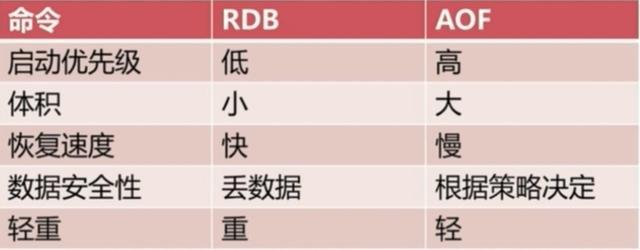

# 电子书

https://github.com/itdevbooks/pdf

# Java基础

https://github.com/rocLv/OnJava8


​	java代码执行主要流程：

​	编译：生成class文件。

​	类加载：加载class文件到虚拟机

​	类执行：JVM为每个新创建的线程都分配一个线程栈。


## JDK & JRE 


​	JDK：java development kit （**java开发工具**），JDK主要包含三部分

​	第一部分就是Java运行时环境，JVM。

​	第二部分就是Java的基础类库，这个类库的数量还是非常可观的。

​	第三部分就是Java的开发工具，它们都是辅助你更好的使用Java的利器。

​	JRE：java runtime environment （**java运行时环境**），运行在JVM上。


##  虚拟机 &编译 &执行

​	虚拟机的主要任务是装载class文件并执行其中的字节码。

​	JDK中javac.exe就是编译Java源码并生成字节码的；java.exe时执行字节码的。


## 异常

​	发现错误的理想时机是在编译阶段，也就是在你试图运行程序之前。**异常只能在运行时期抛出；但是应该尽可能早的被检查出来，即尽量在编译时期检查出来。**检查型异常便是编译阶段检查出来。

​	Error  JAVA虚拟机内部错误，运行时由Java虚拟机抛出。

​	检查型异常  编译时期检查出来，运行时抛出。主要是文件找不到问题。

​	运行时异常  运行时才检查出来并抛出。

​	

​	c语言等 编译器编译生成机器码供计算机执行；Java编译生成字节码供Java虚拟机执行。尽可能早的发现错误，即编译时期就发现错误，这类错误称之为检查型异常；它们编译时期就被检查出来，在运行时期才被抛出。


NoClassDefFoundError和ClassNotfoundException

​		都发生在JVM在classpath下找不到所需的类时。	

​	ClassNotfoundException是在编译时JVM加载不到类或者找不到类导致的； 发生在代码中主动加载类或者反射，编译时期就会对其进行检查。

​	而NoClassDefError是在运行时JVM加载不到类或者找不到类。主要是jar包没有添加到classpath中、jar包版本不对等。

------

​	为什么不把除数为0等 运行时异常处理为受检异常。

​	文件找不到之类的异常不依赖于代码内容，可以直接在编译时期通过系统调用判断文件是否存在。而除数为0之类的异常需要根据变量来判断，而变量的值在编译时期未知。

------


## 注解

### 四大元注解

@Target       描述注解的适用范围

@Retention    描述注解的生命周期 SOURCE CLASS RUNTIME

@Inherited    说明子类可以继承父类的**类注解**

@Documented   说明该注解将被包含在javadoc


​	@Inherited 只是可控制 对类名上注解是否可以被继承。不能控制方法上的注解是否可以被继承。

​	**也就是说重写了方法，要想注解生效，只能自行加上注解。**


## 类加载


## 访问控制权限


------

​	注意类中的default与接口中default不一样，接口中的default表示是默认实现，而类中的default是访问权限。

为什么接口中的方法都是共有的？

------


## 锁

### 常见锁

​	按照获取锁的方式可以分为悲观锁和乐观锁。

#### 乐观锁

​	乐观锁认为自己在使用数据时**不会有别的线程修改数据**，所以不会添加锁，只是在更新数据的时候去判断之前有没有别的线程更新了这个数据。如果这个数据没有被更新，当前线程将自己修改的数据成功写入。如果数据已经被其他线程更新，则根据不同的实现方式执行不同的操作（例如报错或者自动重试）。

​	乐观锁在Java中是通过使用无锁编程来实现，最常采用的是CAS算法。Java原子类中的递增操作就通过CAS自旋实现的。

#### 悲观锁

​	悲观锁认为自己在使用数据的时候**一定有别的线程来修改数据**，因此在获取数据的时候会先加锁，确保数据不会被别的线程修改。

​	偏向锁是指一段同步代码一直被一个线程所访问，那么该线程会自动获取锁，降低获取锁的代价。

#### 自旋锁

​	CAS自旋等待虽然避免了线程切换的开销，但它要占用处理器时间。如果锁被占用的时间很短，自旋等待的效果就会非常好。反之，如果锁被占用的时间很长，那么自旋的线程只会白浪费处理器资源。所以，自旋等待的时间必须要有一定的限度，如果自旋超过了限定次数（默认是10次，可以更改）没有成功获得锁，就应当挂起线程。

​	自适应自旋锁就是自适应设置自旋次数，对于某个锁，自旋很少成功获得过，那在以后尝试获取这个锁时将可能省略掉自旋过程，直接阻塞线程，避免浪费处理器资源。

​	自旋锁会产生**ABA**问题，就是别的线程将数据的值修改了多次恢复到之前的值。可以通过加version字段解决。

#### **重量级锁**

​	通过**获取互斥量来获取锁**，获取失败则阻塞并等待唤醒。重量级锁是一种悲观锁。

#### 读写锁

​	写锁是独占锁，读锁是共享锁。


### 锁升级


​	**无锁**：通过**自旋修改数据**。

​	**偏向锁**：引入偏向锁是为了在无多线程竞争的情况下尽量减少不必要的轻量级锁执行路径，因为轻量级锁的获取及释放依赖多次CAS原子指令，而偏向锁只需要在置换ThreadID的时候依赖一次CAS原子指令即可。线程不会主动释放偏向锁。

​	**轻量级锁**：当偏向锁的时候，数据被另外的线程所访问，偏向锁就会升级为轻量级锁，其他线程会通过**自旋获取锁**，不会阻塞，从而提高性能。

​	**重量级锁**：通过获取互斥量来获取锁，获取失败则阻塞并等待唤醒。


### 总结

​	乐观锁和悲观锁只是一种思想，具体有多种实现。Java中无锁、偏向锁、轻量级锁、原子操作都是乐观锁，都是基于CAS实现的。而重量级锁则是悲观锁的一种实现方式。


## IO

### IO控制方式

#### 程序查询

​	程序查询方式也称为程序轮询方式，该方式采用用户程序直接控制主机与外部设备之间输入/输出操作。CPU必须不停地循环测试I/O设备的状态端口，当发现设备处于准备好(Ready)状态时，CPU就可以与I/O设备进行数据存取操作。即应用程序**主动查询、自行处理**。

#### 中断

​	当I/O设备结束(完成、特殊或异常)时，就会向CPU发出**中断请求信号**，CPU收到信号就可以采取相应措施。当某个进程要启动某个设备时，CPU就向相应的设备控制器发出一条设备I/O启动指令，然后CPU又返回做原来的工作。

#### DMA

​	DMA方式也称为直接主存存取方式，其思想是：允许主存储器和I/O设备之间通过“DMA控制器(DMAC)”直接进行批量数据交换，除了在数据传输开始和结束时，整个过程无须CPU的干预。

#### 通道

​	通道(Channel)也称为外围设备处理器、输入输出处理机，是相对于CPU而言的。是一个处理器。也能执行指令和由指令的程序，只不过通道执行的指令是与外部设备相关的指令。是一种实现主存与I/O设备进行直接数据交换的控制方式。


### Java IO方式

#### BIO

​	服务器为每一个客户端连接启动一个线程，读写必须阻塞在一个线程，一直到操作完成。无缓冲区，单向流。适用于小型且固定的网络架构。

#### NIO


#### AIO


​	

# Servlet

​	Servlet 是 Server Applet 的缩写，译为“服务器端小程序”，是一种使用 Java 语言来开发动态网站的技术。

​	Servlet 只是一套 Java Web 开发的规范，或者说是一套 Java Web 开发的技术标准。只有规范并不能做任何事情，必须要有人去实现它。目前常见的实现了 Servlet 规范的产品包括 Tomcat、Weblogic、Jetty、Jboss、WebSphere 等，它们都被称为“Servlet 容器”。Servlet 容器用来管理程序员编写的 Servlet 类。

## Servlet生命周期


## HTTP报文格式

### HTTP请求报文格式


```http
POST /index.html HTTP/1.1
HOST: www.XXX.com
User-Agent: Mozilla/5.0(Windows NT 6.1;rv:15.0) Firefox/15.0

Username=admin&password=admin
```

### HTTP响应报文格式


```http
HTTP/1.1 200 OK
Content-Encoding: gzip
Content-Type: text/html;charset=utf-8

<!DOCTYPE html>
<html lang="en">
<head>
    <meta charset="UTF-8" />
    <title>Document</title>
</head>
<body>
    <p>this is http response</p>
</body>
</html>	
```

### 主要字段

​	**请求行**记录**请求的基本信息**。由请求方法字段、**URL字段**和HTTP协议版本字段3个字段组成,它们用空格分隔。响应头中有状态信息。

​	**请求头**记录**浏览器中**默认的或者缓存的信息。由关键字/值对组成，每行一对，关键字和值用英文冒号“:”分隔。如请求头中的**Cookie**、响应头中的 响应实体的 内容类型**Content-Type**、编码方式Content-Encoding等。

​	**空行**位于最后一个请求头之后，发送回车符和换行符，通知服务器以下不再有请求头。

​	**请求体**记录请求的**用户输入**的基本信息。仅用在POST方法，因为GET方法没有这一字段。POST方法适用于需要客户填写表单的场合。而响应体就是返回的页面信息。

​	**状态码**

| 分类 | 分类描述                                       |
| :--- | :--------------------------------------------- |
| 1**  | 信息，服务器收到请求，需要请求者继续执行操作   |
| 2**  | 成功，操作被成功接收并处理                     |
| 3**  | 重定向，需要进一步的操作以完成请求             |
| 4**  | 客户端错误，请求包含语法错误或无法完成请求     |
| 5**  | 服务器错误，服务器在处理请求的过程中发生了错误 |


## Servlet三大域对象

​	域对象的作用：获取数据（Request）、保存数据（Session）、共享数据（Application）。


## Request和Response

Servlet处理HTTP请求流程


1. Servlet 容器接收到来自客户端的 HTTP 请求后，容器会针对该请求分别创建一个 HttpServletRequest 对象和 HttpServletReponse 对象。

2. 容器将 HttpServletRequest 对象和 HttpServletReponse 对象以参数的形式传入 service() 方法内，并调用该方法。

3. 在 service() 方法中 Servlet 通过 HttpServletRequest 对象获取客户端信息以及请求的相关信息。

4. 对 HTTP 请求进行处理。

5. 请求处理完成后，将响应信息封装到 HttpServletReponse 对象中。

6. Servlet 容器将响应信息返回给客户端。

7. 当 Servlet 容器将响应信息返回给客户端后，HttpServletRequest 对象和 HttpServletReponse 对象被销毁。

   HttpServletRequest 对象用于封装 HTTP 请求信息，简称request对象；而HttpServletReponse 对象用于封装 HTTP 响应信息，简称response对象。


### HttpServletRequest

​	Servlet 容器会针对每次请求创建一个 request对象，并把它作为参数传递给 Servlet 的 service 方法。

​	HTTP 请求消息分为请求行、请求消息头和请求消息体三部分，所以 HttpServletRequest 接口中定义了获取请求行、请求头和请求消息体的相关方法。

#### 获取 form 表单的数据

​	在实际开发中，经常需要获取用户提交的表单数据，例如用户名和密码等。为了方便获取表单中的请求参数，ServletRequest 定义了一系列获取请求参数的方法，如下表所示。

| 返回值类型  | 方法声明                         | 功能描述                                                     |
| ----------- | -------------------------------- | ------------------------------------------------------------ |
| String      | getParameter(String name)        | 返回指定参数名的参数值。                                     |
| String [ ]  | getParameterValues (String name) | 以字符串数组的形式返回指定参数名的所有参数值（HTTP 请求中可以有多个相同参数名的参数）。 |
| Enumeration | getParameterNames()              | 以枚举集合的形式返回请求中所有参数名。                       |
| Map         | getParameterMap()                | 用于将请求中的所有参数名和参数值装入一个 Map 对象中返回。    |


### HttpServletResponse

​	Servlet 容器会针对每次请求创建一个 response 对象，并把它作为参数传递给 Servlet 的 service 方法。Servlet 处理请求后，会将响应信息封装到 response 对象中，并由容器解析后返回给客户端。

​	 HTTP 响应消息由响应行、响应头、消息体三部分组成，所以 HttpServletResponse 接口中定义了向客户端发送响应状态码、响应头、响应体的方法。


#### 响应体相关的方法

​	由于在 HTTP 响应消息中，大量的数据都是通过响应消息体传递的。因此 ServletResponse 遵循以 I/O 流传递大量数据的设计理念，在发送响应消息体时，定义了两个与输出流相关的方法。

| 返回值类型          | 方法              | 描述                     |
| ------------------- | ----------------- | ------------------------ |
| ServletOutputStream | getOutputStream() | 用于获取字节输出流对象。 |
| PrintWriter         | getWriter()       | 用于获取字符输出流对象。 |

> 注意：getOutputStream() 和 getWriter() 方法互相排斥，不可同时使用，否则会发生 IllegalStateException 异常。


## 请求转发和重定向

### 请求转发

​	请求转发属于服务器行为。容器接收请求后，Servlet 会先对请求做一些预处理，然后将请求传递给其他 Web 资源，来完成包括生成响应在内的后续工作。

#### RequestDispatcher .forward()

​	javax.servlet 包中定义了一个 RequestDispatcher 接口，RequestDispatcher 对象由 Servlet 容器创建，用于封装由路径所标识的 Web 资源。利用 RequestDispatcher 对象可以把请求转发给其他的 Web 资源。

Servlet 可以通过 2 种方式获得 RequestDispatcher 对象：

1. 调用 ServletContext 的 getRequestDispatcher(String path) 方法，参数 path 指定目标资源的路径，必须为绝对路径；
2. 调用 ServletRequest 的 getRequestDispatcher(String path) 方法，参数 path 指定目标资源的路径，可以为绝对路径，也可以为相对路径。

> 绝对路径是指以符号“/”开头的路径，“/”表示当前 Web 应用的根目录。相对路径是指相对当前 Web 资源的路径，不以符号“/”开头。

RequestDispatcher 接口中提供了以下方法。


| 返回值类型 | 方法                                                     | 功能描述                                                     |
| ---------- | -------------------------------------------------------- | ------------------------------------------------------------ |
| void       | forward(ServletRequest request,ServletResponse response) | 用于将请求转发给另一个 Web 资源。该方法必须在响应提交给客户端之前被调用，否则将抛出 IllegalStateException 异常 |
| void       | include(ServletRequest request,ServletResponse response) | 用于将其他的资源作为当前响应内容包含进来                     |

#### 请求转发的工作原理

在 Servlet 中，通常使用 forward() 方法将当前请求转发给其他的 Web 资源进行处理。请求转发的工作原理如下图所示。


### 重定向

​	重定向属于客户端行为。服务器在收到客户端请求后，会通知客户端浏览器重新向另外一个 URL 发送请求，这称为请求重定向。它本质上是两次 HTTP 请求，对应两个 request 对象和两个 response 对象。

#### response.sendRedirect()

HttpServletResponse 接口中的 sendRedirect() 方法用于实现重定向。

| 返回值类型 | 方法                          | 描述                                                         |
| ---------- | ----------------------------- | ------------------------------------------------------------ |
| void       | sendRedirect(String location) | 向浏览器返回状态码为 302 的响应结果，让浏览器访问新的 URL。若指定的 URL 是相对路径，Servlet 容器会将相对路径转换为绝对路径。参数 location 表示重定向的URL。 |

#### 重定向的工作流程


1. 用户在浏览器中输入 URL，请求访问服务器端的 Web 资源。
2. 服务器端的 Web 资源返回一个状态码为 302 的响应信息，该响应的含义为：通知浏览器再次发送请求，访问另一个 Web 资源（在响应信息中提供了另一个资源的 URL）。
3. 当浏览器接收到响应后，立即自动访问另一个指定的 Web 资源。
4. 另一 Web 资源将请求处理完成后，由容器把响应信息返回给浏览器进行展示。

### 转发和重定向的区别

转发和重定向都能实现页面的跳转，但是两者也存在以下区别。

| 区别                                  | 转发               | 重定向             |
| ------------------------------------- | ------------------ | ------------------ |
| 浏览器地址栏 URL 是否发生改变         | 否                 | 是                 |
| 是否支持跨域跳转                      | 否                 | 是                 |
| 请求与响应的次数                      | 一次请求和一次响应 | 两次请求和两次响应 |
| 是否共享 request 对象和 response 对象 | 是                 | 否                 |
| 是否能通过 request 域对象传递数据     | 是                 | 否                 |
| 速度                                  | 相对要快           | 相对要慢           |
| 行为类型                              | 服务器行为         | 客户端行为         |


## Cookie和Session

​	HTTP（超文本传输协议）是一个基于请求与响应模式的无状态协议。

无状态主要指 2 点：

1. 协议对于事务处理没有记忆能力，服务器不能自动维护用户的上下文信息，无法保存用户状态；

2. 每次请求都是独立的，不会受到前面请求的影响，也不会影响后面的请求。


   当浏览器发送 HTTP 请求到服务器时，服务器会响应客户端的请求，但当同一个浏览器再次发送请求到该服务器时，服务器并不知道它就是刚才那个浏览器，即 HTTP 协议的请求无法保存用户状态。

通常情况下，用户通过浏览器访问 Web 应用时，服务器都需要保存和跟踪用户的状态。例如，用户在某购物网站结算商品时，Web 服务器必须根据请求用户的身份，找到该用户所购买的商品。由于 HTTP 协议是无协议的，无法保存和跟踪用户状态，所以需要其他的方案来解决问此题，它就是会话技术。

### Cookie

​	Cookie 属于客户端会话技术，它是服务器发送给浏览器的小段文本信息，存储在客户端浏览器的内存中或硬盘上。当浏览器保存了 Cookie 后，每次访问服务器，都会在 HTTP 请求头中将这个 Cookie 回传给服务器。Cookie分为两种：会话级别 Cookie（默认）：Cookie 保存到浏览器的内存中，浏览器关闭则 Cookie 失效。持久的 Cookie：Cookie 以文本文件的形式保存到硬盘上。

#### Cookie 的工作流程

Cookie 是基于 HTTP 协议实现的，工作流程如下。


1. 客户端浏览器访问服务器时，服务器通过在 HTTP 响应中增加 Set-Cookie 字段，将数据信息发送给浏览器。
2. 浏览器将 Cookie 保存在内存中或硬盘上。
3. 再次请求该服务器时，浏览器通过在 HTTP 请求消息中增加 Cookie 请求头字段，将 Cookie 回传给 Web 服务器。服务器根据 Cookie 信息跟踪客户端的状态。

#### Cookie 的缺点

Cookie 虽然可以解决服务器跟踪用户状态的问题，但是它具有以下缺点：

- 在 HTTP 请求中，Cookie 是明文传递的，容易泄露用户信息，安全性不高。
- 浏览器可以禁用 Cookie，一旦被禁用，Cookie 将无法正常工作。
- Cookie 对象中只能设置文本（字符串）信息。
- 客户端浏览器保存 Cookie 的数量和长度是有限制的。

### Session

​	Session 是服务器端会话技术。当浏览器访问 Web 服务器的资源时，服务器可以为每个用户**浏览器**创建一个 Session 对象，每个浏览器独占一个 Session 对象。

​	由于每个浏览器独占一个 Session，所以用户在访问服务器的资源时，可以把数据保存在各自的 Session 中。当用户再次访问该服务器中的其它资源时，其它资源可以从 Session 中取出数据，为用户服务。

#### Session 的工作原理

​	Session 虽然属于服务端会话技术，但是它的实现离不开客户端浏览器和 Cookie 的支持，其工作原理如下：


1. 当客户端第一次请求会话对象时，服务器会创建一个 Session 对象，并为该 Session 对象分配一个唯一的 SessionID（用来标识这个 Session 对象）；
2. 服务器将 SessionID 以 Cookie（Cookie 名称为：“JSESSIONID”，值为 SessionID 的值）的形式发送给客户端浏览器；
3. 客户端浏览器再次发送 HTTP 请求时，会将携带 SessionID 的 Cookie 随请求一起发送给服务器；
4. 服务器从请求中读取 SessionID，然后根据 SessionID 找到对应的 Session 对象。

注意：

- 流程中的 Cookie 是容器自动生成的，它的 maxAge 属性取值为 -1，表示仅当前浏览器有效。
- 浏览器关闭时，对应的 Session 并没有失效，但此时与此 Session 对应的 Cookie 已失效，导致浏览器无法再通过 Cookie 获取服务器端的 Session 对象。
- 同一浏览器的不同窗口共享同一 Session 对象，但不同浏览器窗口之间不能共享 Session 对象。


#### Session 对象创建

Session 对象在容器第一次调用 request.getSession() 方法时创建。

> 值得注意的是，当客户端访问的 Web 资源是 HTML，CSS，图片等静态资源时，服务器不会创建 Session 对象。

#### Session 对象销毁

Session 对象在如下 3 种情况下会被销毁：

- Session 过期；
- 调用 session.invalidate() 方法，手动销毁 Session；
- 服务器关闭或者应用被卸载。

#### Session 域对象

Session 对象也是一种域对象，它可以对属性进行操作，进而实现会话中请求之间的数据通讯和数据共享。

### Session 与 Cookie 对比

​	Session 和 Cookie 都属于会话技术，都能帮助服务器保存和跟踪用户状态，但两者也存在差异，如下表。


| 不同点                 | Cookie                                                       | Session                                                      |
| ---------------------- | ------------------------------------------------------------ | ------------------------------------------------------------ |
| 存储位置不同           | Cookie 将数据存放在客户端浏览器内存中或硬盘上。              | Session 将数据存储在服务器端。                               |
| 大小和数量限制不同     | 浏览器对 Cookie 的大小和数量有限制。                         | Session 的大小和数量一般不受限制。                           |
| 存放数据类型不同       | Cookie 中保存的是字符串。                                    | Session 中保存的是对象。                                     |
| 安全性不同             | Cookie 明文传递，安全性低，他人可以分析存放在本地的 Cookie 并进行 Cookie 欺骗。 | Session 存在服务器端，安全性较高。                           |
| 对服务器造成的压力不同 | Cookie 保存在客户端，不占用服务器资源。                      | Session 保存在服务端，每一个用户独占一个 Session。若并发访问的用户十分多，就会占用大量服务端资源。 |
| 跨域支持上不同         | Cookie 支持跨域名访问。                                      | Session 不支持跨域名访问。                                   |


# Spring 

## Spring IOC

### Spring提供两种IOC容器

**BeanFactory和ApplicationContext**；ApplicationContext是BeanFactory的子接口。二者都是通过XML文件配置加载bean的。

二者的主要区别在于 **注入属性的检查时机** 不同，BeanFactory在第一次使用getBean方法时，而ApplicationContext在初始化时。因此实际开发中通常使用ApplicationContext，而只有在系统资源较少时才考虑使用BeanFactory。

```java
BeanFactory beanFactory=new XmlBeanFactory(new FileSystemResource("D://applicationContext.xml"));
```


```java
ApplicationContext applicationContext=new ClassPathXmlApplicationCoantext("D://applicationContext.xml");
```


### Spring DI（依赖注入）的实现方式

**构造方法和set方法注入**：即自行创建和参数获取两种方式。


### Spring Bean

​	构建应用程序的主干，由Spring IOC 管理的对象成为bean。Bean及其之间的依赖关系反映在IOC容器使用的“配置元数据”中。Spring的核心机制依赖注入，就是组件的实例化不再由程序完成，而是转交给Spring容器完成，在需要时注入到应用程序中，从而对组件之间的依赖关系进行了解耦。这一切都离不开配置文件中使用的<bean>元素。Spring配置文件支持xml和properties两种格式。通常使用xml作为配置文件。

```java
<?xml version="1.0" encoding="UTF-8"?>
<beans xmlns="http://www.springframework.org/schema/beans"
    xmlns:xsi="http://www.w3.org/2001/XMLSchema-instance" xmlns:p="http://www.springframework.org/schema/p"
    xsi:schemaLocation="http://www.springframework.org/schema/beans
    http://www.springframework.org/schema/beans/spring-beans-3.2.xsd">
    <!-- 使用id属性定义person1，其对应的实现类为com.mengma.person1 -->
    <bean id="person1" class="com.mengma.damain.Person1" />
    <!--使用name属性定义person2，其对应的实现类为com.mengma.domain.Person2-->
    <bean name="Person2" class="com.mengma.domain.Person2"/>
</beans>
```

<bean>的重要属性：

| 属性名称            | 描述                                                         |
| ------------------- | ------------------------------------------------------------ |
| **id**              | 是一个 Bean 的唯一标识符，Spring 容器对 Bean 的配置和管理都通过该属性完成 |
| **name**            | Spring 容器同样可以通过此属性对容器中的 Bean 进行配置和管理，name 属性中可以为 Bean 指定多个名称，每个名称之间用逗号或分号隔开 |
| **class**           | 该属性指定了 Bean 的具体实现类，它必须是一个完整的类名，使用类的全限定名 |
| **scope**           | 用于设定 Bean 实例的作用域，其属性值有 singleton（单例）、prototype（原型）、request、session 和 global Session。其默认值是 singleton |
| **constructor-arg** | <bean>元素的子元素，可以使用此元素传入构造参数进行实例化。该元素的 index 属性指定构造参数的序号（从 0 开始），type 属性指定构造参数的类型 |
| **property**        | <bean>元素的子元素，用于调用 Bean 实例中的 Set 方法完成属性赋值，从而完成依赖注入。该元素的 name 属性指定 Bean 实例中的相应属性名 |
| **ref**             | <property> 和 <constructor-arg> 等元素的子元索，该元素中的 bean 属性用于指定对 Bean 工厂中某个 Bean 实例的引用 |
| **value**           | <property> 和 <constractor-arg> 等元素的子元素，用于直接指定一个常量值 |
| list                | 用于封装 List 或数组类型的依赖注入                           |
| set                 | 用于封装 Set 类型属性的依赖注入                              |
| map                 | 用于封装 Map 类型属性的依赖注入                              |
| entry               | <map> 元素的子元素，用于设置一个键值对。其 key 属性指定字符串类型的键值，ref 或 value 子元素指定其值 |

​	bean的属性配置又称为bean的**元数据配置**。

### Bean作用域

Spring 容器在初始化一个 Bean 的实例时，同时会指定该实例的作用域。Spring3 为 Bean 定义了五种作用域，具体如下。

#### 1）singleton

​	单例模式，使用 singleton 定义的 Bean 在 Spring 容器中只有一个实例，这也是 Bean 默认的作用域。

#### 2）prototype

​	原型模式，每次通过 Spring 容器获取 prototype 定义的 Bean 时，容器都将创建一个新的 Bean 实例。

#### 3）request

​	在一次 HTTP 请求中，容器会返回该 Bean 的同一个实例。而对不同的 HTTP 请求，会返回不同的实例，该作用域仅在当前 HTTP Request 内有效。

#### 4）session

​	在一次 HTTP Session 中，容器会返回该 Bean 的同一个实例。而对不同的 HTTP 请求，会返回不同的实例，该作用域仅在当前 HTTP Session 内有效。

#### 5）global Session

​	在一个全局的 HTTP Session 中，容器会返回该 Bean 的同一个实例。该作用域仅在使用 portlet context 时有效。

### Bean实例化方式

​		spring中实例化bean有三种方式：构造器实例化、静态工厂实例化、实例工厂方式。

**构造器实例化**：

```java
//实体类
package com.mengma.instance.constructor;
public class Person1 {
}
```

```xml
//Spring配置文件
<?xml version="1.0" encoding="UTF-8"?>
<beans xmlns="http://www.springframework.org/schema/beans"
    xmlns:xsi="http://www.w3.org/2001/XMLSchema-instance" xmlns:p="http://www.springframework.org/schema/p"
    xsi:schemaLocation="http://www.springframework.org/schema/beans
    http://www.springframework.org/schema/beans/spring-beans-3.2.xsd">
    <bean id="person1" class="com.mengma.instance.constructor.Person1" />
</beans>

```

```java
//测试类
package com.mengma.instance.constructor;
import org.junit.Test;
import org.springframework.context.ApplicationContext;
import org.springframework.context.support.ClassPathXmlApplicationContext;
public class InstanceTest1 {
    @Test
    public void test() {
        // 定义Spring配置文件的路径
        String xmlPath = "com/mengma/instance/constructor/ApplicationContext.xml";
        // 初始化Spring容器，加载配置文件，并对bean进行实例化
        ApplicationContext applicationContext = new ClassPathXmlApplicationContext(
                xmlPath);
        // 通过容器获取id为person1的实例
        System.out.println(applicationContext.getBean("person1"));
    }
}
```

​		定义了 Spring 配置文件的路径，然后 Spring 容器会加载配置文件。**在加载的同时，Spring 容器会通过实现类 Person1 中默认的无参构造函数对 Bean 进行实例化。使用最多的一种方式。**

**创建静态工厂类**

```java
package com.mengma.instance.static_factory;
public class Person2 {
}
```

```java
package com.mengma.instance.static_factory;
public class MyBeanFactory {
    // 创建Bean实例的静态工厂方法
    public static Person2 createBean() {
        return new Person2();
    }
}
```

```xml
<?xml version="1.0" encoding="UTF-8"?>
<beans xmlns="http://www.springframework.org/schema/beans"
    xmlns:xsi="http://www.w3.org/2001/XMLSchema-instance" xmlns:p="http://www.springframework.org/schema/p"
    xsi:schemaLocation="http://www.springframework.org/schema/beans
    http://www.springframework.org/schema/beans/spring-beans-3.2.xsd">
    <bean id="person2" class="com.mengma.instance.static_factory.MyBeanFactory"
        factory-method="createBean" />
</beans>
```

```java
package com.mengma.instance.static_factory;
import org.junit.Test;
import org.springframework.context.ApplicationContext;
import org.springframework.context.support.ClassPathXmlApplicationContext;
public class InstanceTest2 {
    @Test
    public void test() {
        // 定义Spring配置文件的路径
        String xmlPath = "com/mengma/instance/static_factory/applicationContext.xml"; // 初始化Spring容器，加载配置文件，并对bean进行实例化
        ApplicationContext applicationContext = new ClassPathXmlApplicationContext(
                xmlPath);
        // 通过容器获取id为person2实例
        System.out.println(applicationContext.getBean("person2"));
    }
}
```

​	xml中 class 属性指定了其对应的工厂实现类为 MyBeanFactory，而 factory-method 属性用于告诉 Spring 容器调用工厂类中的 createBean() 方法获取 Bean 的实例。

**实例化工厂**

​	工厂类不再使用静态方法创建Bean实例，而是直接在成员方法中创建bean实例。

```java
//实体类
package com.mengma.instance.factory;
public class Person3 {
}
```

```java
package com.mengma.instance.factory;
public class MyBeanFactory {
    public MyBeanFactory() {
        System.out.println("person3工厂实例化中");
    }
    // 创建Bean的方法
    public Person3 createBean() {
        return new Person3();
    }
}
```

```xml
<?xml version="1.0" encoding="UTF-8"?>
<beans xmlns="http://www.springframework.org/schema/beans"
    xmlns:xsi="http://www.w3.org/2001/XMLSchema-instance" xmlns:p="http://www.springframework.org/schema/p"
    xsi:schemaLocation="http://www.springframework.org/schema/beans
    http://www.springframework.org/schema/beans/spring-beans-3.2.xsd">
    <!-- 配置实例工厂 -->
    <bean id="myBeanFactory" class="com.mengma.instance.factory.MyBeanFactory" />
    <!-- factory-bean属性指定一个实例工厂，factory-method属性确定使用工厂中的哪个方法 -->
    <bean id="person3" factory-bean="myBeanFactory" factory-method="createBean" />
</beans>
```


### Bean生命周期


​	实例化->DI设置属性->初始化->单例模式则spring管理bean，原型模式则调用者管理bean

### Bean装配方式

​	Bean的装配也就是Bean的依赖注入方式。主要有基于XML方式和纯Java方式。

#### 基于XML装配

主要是set方法装配和构造方法装配、注解（Annotation）方式、自动（AutoWrite）装配方式。

##### set方法和构造方法

​	使用构造方法注入时，在xml中使用<bean>元素的子元素<constructor-arg>标签定义构造方法的参数。

​	使用set方法注入时，在xml中使用<bean>元素的子元素<properties>元素为每个属性设置值。

```xml
<?xml version="1.0" encoding="UTF-8"?>
<beans xmlns="http://www.springframework.org/schema/beans"
    xmlns:xsi="http://www.w3.org/2001/XMLSchema-instance" xmlns:p="http://www.springframework.org/schema/p"
    xsi:schemaLocation="http://www.springframework.org/schema/beans
    http://www.springframework.org/schema/beans/spring-beans-3.2.xsd">
    <!-- 使用set方法方式装配Person实例 property对应set方法-->
    <bean id="person1" class="com.mengma.assembly.Person">
        <property name="name" value="zhangsan" />
        <property name="age" value="20" />
    </bean>
    <!-- 使用构造方法装配Person实例 constructor-arg对应构造方法，index对应参数的顺序-->
    <bean id="person2" class="com.mengma.assembly.Person">
        <constructor-arg index="0" value="lisi" />
        <constructor-arg index="1" value="21" />
    </bean>
</beans>
```

##### 注解装配

​	尽管使用xml文件可以实现Bean的装配，但是如果应用中Bean的数量太多，会导致xml文件过于臃肿，从而给维护和升级带来一定的困难。可以通过@scope注解设置bean作用域。

```xml
<?xml version="1.0" encoding="UTF-8"?>
<beans xmlns="http://www.springframework.org/schema/beans"
    xmlns:xsi="http://www.w3.org/2001/XMLSchema-instance"
    xmlns:aop="http://www.springframework.org/schema/aop"
    xmlns:p="http://www.springframework.org/schema/p"
    xmlns:tx="http://www.springframework.org/schema/tx"
    xmlns:context="http://www.springframework.org/schema/context"
    xsi:schemaLocation="
            http://www.springframework.org/schema/beans
            http://www.springframework.org/schema/beans/spring-beans-2.5.xsd
            http://www.springframework.org/schema/aop
            http://www.springframework.org/schema/aop/spring-aop-2.5.xsd
            http://www.springframework.org/schema/tx
            http://www.springframework.org/schema/tx/spring-tx-2.5.xsd
            http://www.springframework.org/schema/context
            http://www.springframework.org/schema/context/spring-context.xsd">
    <!--使用context命名空间，通知spring扫描指定目录，进行注解的解析-->
    <context:component-scan base-package="com.mengma.annotation"/>
</beans>
```


##### 自动装配

​	自动装配就是指Spring容器可以自动装配（**autowire**）相互协作的Bean之间的关联方式，将一个Bean注入到其他的Property中。

```xml
<?xml version="1.0" encoding="UTF-8"?>
<beans xmlns="http://www.springframework.org/schema/beans"
    xmlns:xsi="http://www.w3.org/2001/XMLSchema-instance" 
    xmlns:aop="http://www.springframework.org/schema/aop"
    xmlns:p="http://www.springframework.org/schema/p" 
    xmlns:tx="http://www.springframework.org/schema/tx"
    xmlns:context="http://www.springframework.org/schema/context"
    xsi:schemaLocation="  
            http://www.springframework.org/schema/beans 
            http://www.springframework.org/schema/beans/spring-beans-2.5.xsd  
            http://www.springframework.org/schema/aop 
            http://www.springframework.org/schema/aop/spring-aop-2.5.xsd  
            http://www.springframework.org/schema/tx 
            http://www.springframework.org/schema/tx/spring-tx-2.5.xsd
            http://www.springframework.org/schema/context
            http://www.springframework.org/schema/context/spring-context.xsd">
    <bean id="personDao" class="com.mengma.annotation.PersonDaoImpl" />
    <bean id="personService" class="com.mengma.annotation.PersonServiceImpl"
        autowire="byName" />
    <bean id="personAction" class="com.mengma.annotation.PersonAction"
        autowire="byName" />
</beans>
```

​	上述配置文件中，personService和personAction的<bean>元素中除了id和class外，还有autowrite属性，并将属性值设置为byName，即按属性名称自动装配。

aotowrite属性值可以为：

| 名称        | 说明                                                         |
| ----------- | ------------------------------------------------------------ |
| **byName**  | **根据 Property 的 name 自动装配，如果一个 Bean 的 name 和另一个 Bean 中的 Property 的 name 相同，则自动装配这个 Bean 到 Property 中。** |
| **byType**  | **根据 Property 的数据类型（Type）自动装配，如果一个 Bean 的数据类型兼容另一个 Bean 中 Property 的数据类型，则自动装配。** |
| constructor | 根据构造方法的参数的数据类型，进行 byType 模式的自动装配。   |
| autodetect  | 如果发现默认的构造方法，则用 constructor 模式，否则用 byType 模式。 |
| no          | 默认情况下，不使用自动装配，Bean 依赖必须通过 ref 元素定义。 |


#### 纯Java方式装配

下面两种方式等价

```java
@Configuration
public class MockConfiguration {
    @Bean
    public MockService mockService() {
        return new MockServiceImpl(dependencyService());
    }
    @Bean
    public DependencyService dependencyService() {
        return new DependencyServiceImpl();
    }
}
```


```xml
<bean id="mockService" class="..MockServiceImpl">    
    <property name="dependencyService" ref="dependencyService" /></bean>
<bean id="dependencyService" class="DependencyServiceImpl" /> 
```


### Spring IOC容器依赖注入流程

**Spring IOC容器的依赖注入工作可以分为两个阶段**：

1. 构建收集注册bean阶段：通过XML或者Java代码的方式定义一些bean, 然后通过手动组装（XML)文件中（Bean装配方式1 xml），或者让容器基于某些机制自动扫描的形式（Bean装配方式2 注解），将这些**bean定义收集到IOC容器**中。
2. 分析组装阶段：第一阶段完成后IOC容器中充斥着一个个独立的Bean，他们之间没有任何关系，但实际上他们之间是有**依赖关系**的，这一阶段的作用就是：当IOC容器发现bean1依赖于bean2时，就将bean2注入给bean1，知道所有bean依赖都注入完成。


## AOP

​	面向切面编程（AOP）类似于OOP也是一种编程模式。Spring AOP的使用**减少了系统间的重复代码，达到了模块间松耦合的目的**。它将业务逻辑的各个部分分隔开，是程序员在编写业务代码时能够专心于核心业务，从而提高开发效率。

​	AOP采取横向抽取机制取代了传统的纵向继承机制，减少系统间的重复代码。

​	过滤器、拦截器、监听器都属于面向切面编程的具体实现。

​	例如传统OOP中 通过一个类Access 对一个资源resource进行加锁解锁控制，要访问这个资源就需要继承Access类，而java只支持单继承（解决多继承中函数冲突问题），导致另外一个父类需要重复写入Access中的方法。而AOP可以将这一模块横向提取出来，提高代码复用，降低耦合。主要应用于日志管理、权限控制、异常处理等方面（百度百科举例)。

​	


### Spring AOP

#### 术语

​	横切关注点：跨越应用程序多个模块的方法和功能。即与业务逻辑无关的，但是需要关注的部分。如：日志，安全，缓存，事务等**公共功能**。

**目标**（Target）：被通知对象，即被代理类。

代理（Proxy）：向目标对象应用通知之后创建的对象，即·通过Log类和目标类生成的代理类。

**切入点**（PointCut）：切面通知 执行的 位置。

连接点（joinPoint）：与切入点匹配的执行点。

**切面**（ASPECT）：横切关注点 被模块化的特殊对象，他是一个类，如Log类。

**通知**：又叫增强，分为前置通知、后置通知、异常通知、返回通知、环绕通知。

​	作用于业务层代码（函数）前后。

​	前置增强@Before：在业务代码执行前

​	后置增强@After：方法结束后（无论是正常执行完，还是抛出异常)

​	返回增强@AfterReturning: 正确返回后

​	环绕增强@Around ：目标方法执行前后增强

​	异常抛出增强@AfterThrowing：目标方法抛出异常后增强


#### 实例

```java
@Aspect//声明一个切面类
@Component//注入给spring
public class LoginLogAspect {

	//方法1
    @Pointcut("execution(public * com.test.sg.service.impl.LoginServiceImpl.login(..))")
    public void login() {}
    @AfterThrowing("login()")
    public void loginFail(JoinPoint joinPoint) {
        // fail
        // 从切点获取方法的参数
        Object[] args = joinPoint.getArgs();
    }
    
    
    //方法2  常用，直接给出包全名
    public void regist(){}
    @AfterReturning("execution(public * com.test.sg.service.impl.LoginServiceImpl.regist(..))")
    public void loginSuccess(JoinPoint joinPoint) {
        // success
        // 从切点获取方法的参数
        Object[] args = joinPoint.getArgs();
    }
}

```


​	execution表明连接点（被增强方法）的位置，以 *  号开头，最后面的*表示匹配目标（被代理类）任意方法，(..)表示任意参数。


### 过滤器

作用时机：

​	服务启动

​	服务结束

​	每个请求

作用：

* 过滤器是servlet中最实用的技术之一，可以用来过滤掉不符合要求的请求，通常用作session校验，判断用户权限，如果不符合条件，则会被拦截到特殊的地址或者基于特殊的响应。
  
* 它是JavaEE的标准，依赖于servlet，生命周期也与容器一致
* 因此可以其在注销时释放资源或者数据入库
* 基于回调函数实现，无法注入成为IOC容器的bean

* 配置方式（见项目）：
* 1. 直接使用@WebFilter。
* 2. 在webConfig配置类中注册。

* init 方法：在容器中创建当前过滤器的时候自动调用
* destroy 方法：在容器中销毁当前过滤器的时候自动调用
* doFilter 方法：过滤的具体操作

* 总结：过滤器属于JavaEE，基于回调函数实现
* 回调函数通过接口来实现

### 拦截器

作用时机：

​	作用域controller函数前后，或者MVC渲染之后。

​	controller执行之前

​	controller执行之后，但是在渲染之前

​	渲染之后


**过滤器与拦截器区别**：

所属范畴不同：过滤器属于Servlet，拦截器属于SpringMVC

实现方式不同：过滤器基于回调函数，拦截器基于反射机制

作用时机不同：过滤器作用于每个请求执行前或者服务开始与结束时,拦截器作用于MVC两个阶段前中后

作用范围不同：过滤器适用于所有请求，拦截器只适用于SpringMVC的action。

​	使用过滤器对Web资源进行保护，使用拦截器对方法调用进行保护。


### 监听器

​	可作用于整个服务期间

​	是指专门用于对其他对象身上发生的事件或状态改变进行监听和相应处理的对象，当被监视的对象发生变化时，立即采取相应的行动。

用途：统计在线人数，累计访问人数等。

### 代理模式与回调函数

​	

回调函数举例：

```java
interface Callback {
    void execute(String session);//被调函数
}
//主调类
class Host {
    private String mySession = "I'm session";
    //主调函数，将接口作为参数，可以传入接口的任意实现类。
    public void method (Callback callback) {
        System.out.println("before");
        callback.execute(mySession);//同步回调
        new Thread(()->{//异步回调
            callback.execute(mySession);
        }).start();
        System.out.println("after");
    }
}
//被调类,实现接口
class Guest implements Callback{

    @Override
    public void execute(String session) {
        System.out.println(session);
    }
}

public class Test {
    public static void main(String[] args) {
        new Host().method(new Guest());
    }
}
```


代理模式举例：


```java
package proxy;


//代理类与被代理类实现同一个接口
interface DoSomething {
	void doIt();
}
//被代理类（目标）
class Model implements DoSomething {
	@Override
	public void doIt() {
		System.out.println("do it");
	}
}
 
//代理类（切面）
class Proxy implements DoSomething {
	//代理类拥有接口（可传入被代理类）的引用
	private DoSomething doSomething;
	public Proxy (DoSomething doSomething) {
		this.doSomething = doSomething;
	}
    public void setTarget(DoSomething doSomething) {
		this.doSomething = doSomething;
	}
	
    //方法增强（通知）
	@Override
	public void doIt() {
		System.out.println("before");
		doSomething.doIt();
		System.out.println("after");
	}
}


public class Test {
	public static void main(String[] args) {
		DoSomething doSomething = new Model();
		doSomething = new Proxy(doSomething);
		doSomething.doIt();
	}
}
```

回调函数与代理模式关系：

相同点：

​	都是AOP思想的实现。

不同点：

​	代理模式基于接口时，代理类和被代理类**都实现相同的接口**，代理类中拥有接口（**被代理类）的引用**。

​	而回调函数中，**只有被调类需要实现接口**（接口中的回调方法），主调类中**主调方法的参数是接口**，实际上传入的是被调类。

​	

​	个人认为：两者侧重点不同，代理模式主要是为了实现提取公共业务，对每个业务进行逻辑增强。而回调函数主要是可以实现异步处理。


## 事务

​	事务是用来确保数据的完整性和一致性。

### ACID

- 原子性（Atomicity）：一个事务是一个不可分割的工作单位，事务中包括的动作要么都做要么都不做。
- 一致性（Consistency）：事务必须保证数据库从一个一致性状态变到另一个一致性状态，一致性和原子性是密切相关的。
- 隔离性（Isolation）：一个事务的执行不能被其它事务干扰，即一个事务内部的操作及使用的数据对并发的其它事务是隔离的，并发执行的各个事务之间不能互相打扰。
- 持久性（Durability）：持久性也称为永久性，指一个事务一旦提交，它对数据库中数据的改变就是永久性的，后面的其它操作和故障都不应该对其有任何影响。


### Spring中的事务

Spring 的事务管理有 2 种方式：

1. 传统的**编程式事务**管理，即通过编写代码实现的事务管理；
2. 基于 AOP 技术实现的**声明式事务**管理。


#### 事务管理接口

​	PlatformTransactionManager、TransactionDefinition 和 TransactionStatus 是事务的 3 个核心接口。

##### PlatformTransactionManager接口

​	PlatformTransactionManager 接口用于管理事务。

```java
public interface PlatformTransactionManager {
    TransactionStatus getTransaction(TransactionDefinition definition) throws TransactionException;
    //用于获取事务的状态
    void commit(TransactionStatus status) throws TransactionException;
    //用于提交事务
    void rollback(TransactionStatus status) throws TransactionException;
    //用于回滚事务
}
```

​	Spring 将 xml 中配置的事务信息封装到对象 TransactionDefinition 中，然后通过事务管理器的 getTransaction() 方法获得事务的状态（TransactionStatus），并对事务进行下一步的操作。


##### TransactionDefinition接口

​	TransactionDefinition 接口用于获取事务相关信息。

```java
public interface TransactionDefinition {
    int getPropagationBehavior();
    int getIsolationLevel();//获取事务隔离级别
    String getName();//获取事务名称
    int getTimeout();//获取事务的超时时间
    boolean isReadOnly();//事务是否只读
}
```

##### TransactionStatus接口

TransactionStatus 接口提供了一些简单的方法来控制事务的执行和查询事务的状态，接口定义如下。

```java
public interface TransactionStatus extends SavepointManager {
    boolean isNewTransaction();//是否是新事物
    boolean hasSavepoint();//是否存在保存点
    void setRollbackOnly();//设置事务回滚
    boolean isRollbackOnly();//是否回滚
    boolean isCompleted();//是否完成
}
```


#### 编程式事务管理

​	编程式事务管理是通过编写代码实现的事务管理，灵活性高，但难以维护。

​	1） DAO层引入获取PlatformTransactionManager的bean。

​	2）try{PTM.commit();}catch(Exception e){PTM.rollback();throw e;}


```java
public class UserDaoImpl implements UserDao {
    private JdbcTemplate jdbcTemplate;
    private UserDao userDao;
    private PlatformTransactionManager transactionManager;
    @Override
    public void saveUser(User user) {
        TransactionDefinition def = new DefaultTransactionDefinition();
        // getTransaction()用于启动事务，返回TransactionStatus实例对象
        TransactionStatus status = transactionManager.getTransaction(def);
        try {
            this.jdbcTemplate.update("INSERT INTO USER(NAME,age) VALUES (?,?)", user.getName(), user.getAge());
            transactionManager.commit(status);
            System.out.println("commit!");
        } catch (Exception e) {
            System.out.println("Error in creating record, rolling back");
            transactionManager.rollback(status);
            throw e;
        }
    }
}
```

```xml
 <bean id="transactionManager"
        class="org.springframework.jdbc.datasource.DataSourceTransactionManager">
        <property name="dataSource" ref="dataSource" />
    </bean>
    <bean id="userdao" class="net.biancheng.UserDaoImpl">
        <property name="jdbcTemplate" ref="jdbcTemplate" />
        <property name="transactionManager" ref="transactionManager" />
    </bean>
```


#### 声明式事务管理

​	Spring 声明式事务管理在底层采用了 AOP 技术，其最大的优点在于无须通过编程的方式管理事务，只需要在配置文件中进行相关的规则声明，就可以将事务规则应用到业务逻辑中。

Spring 实现声明式事务管理主要有 2 种方式：

- 基于 XML 方式的声明式事务管理。

- 通过 Annotation 注解方式的事务管理。

  显然声明式事务管理要优于编程式事务管理。


##### XML形式

```java
public class UserDaoImpl implements UserDao {
    private JdbcTemplate jdbcTemplate;
    private UserDao userDao;
    private PlatformTransactionManager transactionManager;
    @Override
    @Override
    public void saveUser(User user) {
        try {
            this.jdbcTemplate.update("INSERT INTO USER(NAME,age) VALUES (?,?)", user.getName(), user.getAge());
            throw new RuntimeException("simulate Error condition");
        } catch (Exception e) {
            System.out.println("Error in creating record, rolling back");
            throw e;
        }
    }
}
```

```xml
<!-- 编写通知：对事务进行增强（通知），需要编写切入点和具体执行事务的细节 -->
    <tx:advice id="txAdvice"
        transaction-manager="transactionManager">
        <tx:attributes>
             <!-- 给切入点方法添加事务详情，name表示方法名称，*表示任意方法名称，propagation用于设置传播行为，read-only表示隔离级别，是否只读 -->
            <tx:method name="*" propagation="SUPPORTS" readOnly = "false"/>
        </tx:attributes>
    </tx:advice>
    <!-- aop编写，让Spring自动对目标生成代理，需要使用AspectJ的表达式 -->
    <aop:config>
        <!-- 切入点，execution 定义的表达式表示net.biencheng包下的所有类所有方法都应用该是事务 -->
        <aop:pointcut id="createOperation"
            expression="execution(* net.biancheng.*.*(..))" />
       
        <aop:advisor advice-ref="txAdvice"
            pointcut-ref="createOperation" />
    </aop:config>
    <bean id="transactionManager"
        class="org.springframework.jdbc.datasource.DataSourceTransactionManager">
        <property name="dataSource" ref="dataSource" />
    </bean>
    <bean id="jdbcTemplate"
        class="org.springframework.jdbc.core.JdbcTemplate">
        <property name="dataSource" ref="dataSource" />
    </bean>
    <bean id="userdao" class="net.biancheng.UserDaoImpl">
        <property name="dataSource" ref="dataSource" />
        <property name="jdbcTemplate" ref="jdbcTemplate" />
    </bean>
```


##### 注解形式

​	**Spring中的@Transactional基于AOP的异常增强机制。**

注意事项：

​	**只能应用在Public方法上。**

​	**同一个类中一个方法调用另一个有事务注解的方法，注解失效。**

​	**不推荐在接口中使用。**

------

**为什么只能作用在public上？**

​	**从Java 方法属性访问权限控制和AOP实现原理来解释。**@Transactional基于AOP的异常增强机制，而AOP基于动态代理。生成的代理类与被代理类不在一个包下；因为切入点一般在业务层的包里面，而切面在切面的包里面。比方说service中的一个业务接口，在项目的service包里面，而生成的代理类在spring框架的aspect包里面。代理类需要访问被代理类的方法，若无访问权限，则无法实现代理。


**为什么同一个类中一个方法调用另一个有事务注解的方法，注解失效？**

​	从动态代理角度解释。因为spring事务是基于动态代理的AOP实现，方法调用是 被代理类中类的内部调用，而不是通过生成的代理类来调用。


**为什么不推荐在接口中使用？**

​	**继承方法不能继承方法上的注解，@Inherite只是相对于类上的注解而言。**接口中抽象方法前加注解是无效的；如果方法有默认实现的话，子类如果重写了接口中的这个方法必须再次加上注解（mybatisPlus源码）。


**为什么spring的业务层和mapper层都需要接口**？AOP	


为什么接口中的方法都是共有的？

AOP实现原理？	动态代理。

AOP术语，目标与切面，增强与切入点，增强分类？

属性方法四种作用域？

​	privite只能在本类中访问，default只能在本包内访问，protected只能在包内和包外的子类，public哪儿都能访问。

------

1） 在Spring容器中注册驱动。

```xml
<tx:annotation-driven transaction-manager="txManager"/>
```

2） 在需要使用事务的业务或者方法上**添加注解@Transactional。该注解只能应用在Public方法上。**


@Transactional常用属性说明如下：

- propagation：设置事务的传播行为；

- isolation：设置事务的隔离级别；

  ​	**DEFAULT；默认隔离级别，使用底层数据库默认的隔离级别**

  ​	READ_UNCOMMITTED；读未提交

  ​	READ_COMMITTED；读已提交

  ​	REPEATABLE_READ；可重复读

  ​	SERIALIZABLE；可串行化

- rollbackFor: 因什么而回滚。默认是RuntimeException.class，即运行时异常才回滚。因此，在需要进行文件处理时必须加上 rollBackFor = Exception.class。

| 属性名        | 说明                                                         |
| ------------- | ------------------------------------------------------------ |
| name          | 当在配置文件中有多个 TransactionManager , 可以用该属性指定选择哪个事务管理器。 |
| propagation   | 事务的传播行为，默认值为 REQUIRED。                          |
| isolation     | 事务的隔离度，默认值采用 DEFAULT。                           |
| timeout       | 事务的超时时间，默认值为-1。如果超过该时间限制但事务还没有完成，则自动回滚事务。 |
| readOnly      | 指定事务是否为只读事务，默认值为 false；为了忽略那些不需要事务的方法，比如读取数据，可以设置 readOnly 为 true。 |
| rollbackFor   | 用于指定能够触发事务回滚的异常类型，如果有多个异常类型需要指定，各类型之间可以通过逗号分隔。 |
| noRollbackFor | 抛出 noRollbackFor 指定的异常类型，不回滚事务。              |


```java
@Transactional(propagation = Propagation.REQUIRED, isolation = Isolation.DEFAULT, readOnly = false)
public class UserDaoImpl implements UserDao {
    private JdbcTemplate jdbcTemplate;
    private UserDao userDao;
    @Override
    public void saveUser(User user) {
        try {
            this.jdbcTemplate.update("INSERT INTO USER(NAME,age) VALUES (?,?)", user.getName(), user.getAge());
            this.jdbcTemplate.update("INSERT INTO USER(NAME,age) VALUES (?,?)", "google", 16);
            throw new RuntimeException("simulate Error condition");
        } catch (Exception e) {
            System.out.println("Error in creating record, rolling back");
            throw e;
        }
    }
}
```


```xml
    <!-- 配置事务管理器 -->
    <bean id="transactionManager"
        class="org.springframework.jdbc.datasource.DataSourceTransactionManager">
        <property name="dataSource" ref="dataSource" />
    </bean>

    <bean id="jdbcTemplate"
        class="org.springframework.jdbc.core.JdbcTemplate">
        <property name="dataSource" ref="dataSource" />
    </bean>

    <bean id="userdao" class="net.biancheng.UserDaoImpl">
        <property name="dataSource" ref="dataSource" />
        <property name="jdbcTemplate" ref="jdbcTemplate" />
    </bean>

    <!-- 注册事务管理驱动 -->
    <tx:annotation-driven
        transaction-manager="transactionManager" />
```


## Spring 多线程

​	Spring通过任务执行器（TaskExecutor）来实现多线程和并发编程。使用ThreadPoolTaskExecutor可实现一个基于线程池的TaskExecutor。而实际开发中任务一般是非阻碍的，即异步的，所以我们要在配置类中通过@EnableAsync开启对异步任务的支持，并通过在实际执行的Bean的方法中使用@Async注解声明其是一个异步任务。

​	1. 配置线程池参数，利用@EnableAsync注解开启异步任务支持。

​	2. 使用@Async注解声明一个异步任务。

```java
//线程池配置类
import java.util.concurrent.Executor;

import org.springframework.aop.interceptor.AsyncUncaughtExceptionHandler;
import org.springframework.context.annotation.ComponentScan;
import org.springframework.context.annotation.Configuration;
import org.springframework.scheduling.annotation.AsyncConfigurer;
import org.springframework.scheduling.annotation.EnableAsync;
import org.springframework.scheduling.concurrent.ThreadPoolTaskExecutor;

/**
 * @Description: 配置类实现AsyncConfigurer接口，并重写getAsyncExecutor方法，并返回一个ThreadPoolTaskExecutor，
 * 这样我们就获得一个基于线程池TaskExecutor
 */
@Configuration
@ComponentScan("com.only.mate.springboot.multithreading")
@EnableAsync//利用@EnableAsync注解开启异步任务支持
public class CustomMultiThreadingConfig implements AsyncConfigurer{

    @Override
    public Executor getAsyncExecutor() {
        ThreadPoolTaskExecutor taskExecutor = new ThreadPoolTaskExecutor();
        taskExecutor.setCorePoolSize(5);
        taskExecutor.setMaxPoolSize(10);
        taskExecutor.setQueueCapacity(25);
        taskExecutor.initialize();
        return taskExecutor;
    }

    @Override
    public AsyncUncaughtExceptionHandler getAsyncUncaughtExceptionHandler() {
        return AsyncConfigurer.super.getAsyncUncaughtExceptionHandler();
    }
    
}
```


```java
//service层
import org.slf4j.Logger;
import org.slf4j.LoggerFactory;
import org.springframework.scheduling.annotation.Async;
import org.springframework.stereotype.Service;

/**
 * @Description: 创建线程任务服务
 */
@Service
public class CustomMultiThreadingService {
    private Logger logger = LoggerFactory.getLogger(CustomMultiThreadingService.class);
    /**
     * @Description:通过@Async注解表明该方法是一个异步方法，
     * 如果注解在类级别上，则表明该类所有的方法都是异步方法，而这里的方法自动被注入使用ThreadPoolTaskExecutor作为TaskExecutor
     */
    @Async
    public void executeAysncTask1(Integer i){
        logger.info("CustomMultiThreadingService ==> executeAysncTask1 method: 执行异步任务{} ", i);
    }
    
    /**
     * @Description:通过@Async注解表明该方法是一个异步方法，
     * 如果注解在类级别上，则表明该类所有的方法都是异步方法，而这里的方法自动被注入使用ThreadPoolTaskExecutor作为TaskExecutor
     */
    @Async
    public void executeAsyncTask2(Integer i){
        logger.info("CustomMultiThreadingService ==> executeAsyncTask2 method: 执行异步任务{} ", i);
    }
}
```


```java
//controller层
import org.springframework.beans.factory.annotation.Autowired;
import org.springframework.stereotype.Controller;
import org.springframework.web.bind.annotation.RequestMapping;
import org.springframework.web.bind.annotation.ResponseBody;

import com.only.mate.springboot.multithreading.CustomMultiThreadingService;

/**
 * @Description:自定义多线程Controller
 */
@Controller
@RequestMapping(value="/multithreading")
public class CustomMultiThreadingController {
    @Autowired
    private CustomMultiThreadingService customMultiThreadingService;
    
    @ResponseBody
    @RequestMapping(value="/dotask")
    public String doTask() {
        for (int i=0;i<10;i++){
            customMultiThreadingService.executeAysncTask1(i);
            customMultiThreadingService.executeAsyncTask2(i);
        }
        
        return "success";
    }
}
```

## MultiPart

```java
MultipartHttpServletRequest multipartRequest = (MultipartHttpServletRequest) request;
Map<String, MultipartFile> fileMap = multipartRequest.getFileMap();//获取多个文件
for (Map.Entry<String, MultipartFile> entity : fileMap.entrySet()) {
	MultipartFile file = entity.getValue();// 获取上传文件对象
	ImportParams params = new ImportParams();
    ...
}
```

## 缓存

​	和Spring对事务管理的支持一样，Spring对Cache的支持也有基于注解和基于XML配置两种方式。

​	一般作用在业务层。

常用注解形式。要在Springboot中使用缓存需要以下几步:

   第一步： 导入spring-boot-starter-cache模块

   第二步： @EnableCaching开启缓存

   第三步： 使用缓存注解


​	**@EnableCaching作用在配置类上。**在配置类(@Configuration)上使用@EnableCaching注解时，会触发一个post processor，这会扫描每一个spring bean，查看是否已经存在注解对应的缓存。如果找到了，就会自动创建一个代理拦截方法调用，使用缓存的bean执行处理。

​	**@Cacheable作用在一个方法或者类上**，当标记在一个方法上时表示该方法是支持缓存的，当标记在一个类上时则表示该类所有的方法都是支持缓存的。对于一个支持缓存的方法，Spring会在其被调用后将其返回值缓存起来，以保证**下次利用同样的参数来执行该方法时可以直接从缓存中获取结果，而不需要再次执行该方法**。需要注意的是**当一个支持缓存的方法在对象内部被调用时是不会触发缓存**功能的。

​	**@CachePut也是声明一个方法支持缓存功能。**与@Cacheable不同的是使用**@CachePut标注的方法在执行前不会去检查缓存中是否存在之前执行过的结果，而是每次都会执行该方法，并将执行结果以键值对的形式存入指定的缓存中。**

​	**@CacheEvict是用来标注在需要清除缓存元素的方法或类上的**。当标记在一个类上时表示其中所有的方法的执行都会触发缓存的清除操作。


**@Cacheable 适用于查询数据的方法，@CachePut 适用于更新数据的方法。@CacheEvict适用于删除数据的方法。**


# Spring MVC

## 简介

​	Spring MVC是Spring提供的一个灵活而强大的web框架。借助于注解，Spring MVC提供了几乎是POJO的开发模式，使得控制器的开发和测试更加简单。这些**控制器一般不直接处理请求，而是将请求委托给spring上下文中的其他的bean**，通过spring的依赖注入功能，这些bean被注入到控制器中。

​	Spring MVC主要由**DispatcherServlet、处理器映射、处理器（控制器）、视图解析器、视图** 五部分组成。其核心是处理器映射和视图解析器，前者负责选择出哪个控制器来处理哪个请求，后者负责结果渲染；通过这两个模块，spring MVC保证了 如何选择控制处理请求 和 如何选择视图展现输出 之间的松耦合。

## 流程图


## MVC工作流程

1. Http请求：客户端请求提交到DispatcherServlet
2. 寻找处理器：由DispatcherServlet控制器查询一个或者多个HandlerMapping，找到处理请求的Controller。
3. 调用处理器：DispatcherServlet将请求提交给对应的controller。
4. 调用业务代码对请求进行处理。
5. 获取处理结果：主要是 视图名 和 业务处理结果。
6. 处理视图映射：通过视图名定位到对应的视图，如index.html。
7. 将模型数据传给View显示：将数据渲染到视图上。
8. Http相应：将视图结果发送到客户浏览器。


## 主要功能模块

DispatcherServlet：前端控制器，所有的请求都经过它统一分发。

HandlerMapping： 处理器映射，将请求映射到Controller。

Controller：控制器，并发地为用户的请求做处理。

ViewResolver：视图解析器，将模型（处理的结果数据）渲染到视图（jsp、html等）上。


## 参数传递

### 控制器接受参数

​	SpringMVC接收请求参数的方式有很多种，有的适合get请求，有的适合post请求，有的两者都合适。主要有以下几种方式：

- 通过**实体类bean**接收请求参数。
- 通过处理方法的**形参**接收请求参数。
- 通过**HttpServletRequest**接收请求参数
- 通过@**PathVariable**接收URL中的请求参数
- 通过@**RequestParam**接收请求参数
- 通过@**ModelAttribute**接受请求参数

#### 实体类方式

​	通过实体类bean接收请求参数**适用于get和post提交的请求**方式。必须要求**实体类的属性名称与前端请求参数的名称**一致。

```java
@RequestMapping("/login")
public String login(User user, Model model) {
    if ("bianchengbang".equals(user.getName())
            && "123456".equals(user.getPwd())) {
       
        model.addAttribute("message", "登录成功");
        return "main"; // 登录成功，跳转到 main.jsp
    } else {
        model.addAttribute("message", "用户名或密码错误");
        return "login";
    }
}
```

#### 形参方式

​	通过处理方法的形参接收请求参数就是直接把表单参数写在控制器类相应方法的形参中，即形参名称与请求参数名称完全相同。该接收参数方式适用于 get 和 post 提交请求方式。

```java
@RequestMapping("/login")
public String login(String name, String pwd, Model model) {
    if ("bianchengbang".equals(user.getName())
            && "123456".equals(user.getPwd())) {
       
        model.addAttribute("message", "登录成功");
        return "main"; // 登录成功，跳转到 main.jsp
    } else {
        model.addAttribute("message", "用户名或密码错误");
        return "login";
    }
}
```

#### HttpServletRequest方式

​	适用于get和post提交的请求。addAttribute方法发送数据（可给前端页面也可以是请求转发的servlet），getParameter接收参数。

```java
@RequestMapping("/login")
public String login(HttpServletRequest request, Model model) {
    String name = request.getParameter("name");
    String pwd = request.getParameter("pwd");
   
    if ("bianchengbang".equals(name)
            && "123456".equals(pwd)) {
       
        model.addAttribute("message", "登录成功");
        return "main"; // 登录成功，跳转到 main.jsp
    } else {
        model.addAttribute("message", "用户名或密码错误");
        return "login";
    }
}
```


#### 通过@PathVariable接收URL中的请求参数

​	通过 @PathVariable 获取 URL 中的参数，示例代码如下。

```java
@RequestMapping("/login/{name}/{pwd}")public String login(@PathVariable String name, @PathVariable String pwd, Model model) {       if ("bianchengbang".equals(name)            && "123456".equals(pwd)) {               model.addAttribute("message", "登录成功");        return "main"; // 登录成功，跳转到 main.jsp    } else {        model.addAttribute("message", "用户名或密码错误");        return "login";    }}
```

​	在访问“http://localhost:8080/springMVCDemo02/user/register/bianchengbang/123456”路径时，上述代码会自动将 URL 中的模板变量 {name} 和 {pwd} 绑定到通过 @PathVariable 注解的同名参数上，即 name=bianchengbang、pwd=123456。


#### 通过@RequestParam接收请求参数

在方法入参处使用 @RequestParam 注解指定其对应的请求参数。@RequestParam 有以下三个参数：

- value：参数名
- required：是否必须，默认为 true，表示请求中必须包含对应的参数名，若不存在将抛出异常
- defaultValue：参数默认值


通过 @RequestParam 接收请求参数适用于 get 和 post 提交请求方式，示例代码如下。

```
纯文本复制
@RequestMapping("/login")public String login(@RequestParam String name, @RequestParam String pwd, Model model) {       if ("bianchengbang".equals(name)            && "123456".equals(pwd)) {               model.addAttribute("message", "登录成功");        return "main"; // 登录成功，跳转到 main.jsp    } else {        model.addAttribute("message", "用户名或密码错误");        return "login";    }}
```


#### 通过@ModelAttribute接收请求参数

@ModelAttribute 注解用于将多个请求参数封装到一个实体对象中，从而简化数据绑定流程，而且自动暴露为模型数据，在视图页面展示时使用。

而“通过实体 Bean 接收请求参数”中只是将多个请求参数封装到一个实体对象，并不能暴露为模型数据（需要使用 model.addAttribute 语句才能暴露为模型数据，数据绑定与模型数据展示后面教程中会讲解）。

通过 @ModelAttribute 注解接收请求参数适用于 get 和 post 提交请求方式，示例代码如下。

```
纯文本复制
@RequestMapping("/login")public String login(@ModelAttribute("user") User user, Model model) {       if ("bianchengbang".equals(name)            && "123456".equals(pwd)) {               model.addAttribute("message", "登录成功");        return "main"; // 登录成功，跳转到 main.jsp    } else {        model.addAttribute("message", "用户名或密码错误");        return "login";    }}
```


### 控制器发送参数

#### **通过Model来传参**

​	SpringMVC中的Model的addAttribute方法添加参数，而return返回的string代表了接收这些参数的前端页面。

```java
  @Controller
    @RequestMapping("mfc")
    public class FirstController {  	
    	@RequestMapping(value="fr")
    	public String secondRequest(Model model){
    		String key = "hello world";
    		model.addAttribute("key", key);
    		//此时没有定义变量的名字，默认就用这个参数的类型的名字做为变量的名字，不过首字母大写变小写
    		model.addAttribute("xxxxxxx");
    		return "show";
    	}
    }
```

#### 通过HttpServletRequest来传递

```java
  @Controller
    @RequestMapping("mfc")
    public class FirstController {
    
    	@RequestMapping(value="fr")
    	public String secondRequest(HttpServletRequest request,HttpSession session){
    		request.setAttribute("req", "通过request存放的参数");
    		//session.setAttribute("ses", "session中的数据");
    		return "show";
    	}
    }

```


## 同步请求和异步请求

### 同步请求

void ： 啥也不返回

String ：表示逻辑视图名

ModelAndView:该对象既有逻辑视图名，还可以携带去页面要展示的数据

同步请求：如何将controller层的数据携带到页面上。

　　　　1.使用ModelAndView作为方法的返回值类型

　　　　2.使用Map、Model、ModelMap、类型的参数 在前端页面用el表达式取值即可。

### 异步请求

返回异步请求的数据 ，几乎各种数据都可以异步返回

Map-------------------->转化之后成为 json对象

对象--------------------->转化为json对象

对象列表（对象List）   ------->转化后成为json数组


​	@responseBody注解的作用是将controller的方法返回的对象通过适当的转换器转换为指定的格式之后，写入到response对象的body区，通常用来返回JSON数据或者是XML数据。在使用此注解之后不会再走视图处理器，而是直接将数据写入到输入流中，他的效果等同于通过response对象输出指定格式的数据。

controller 如何返回json数据：

1.导入json的包

2.在controller加一个@responseBody注解

3.在springmvc.xml中配置<mvc:annotation-driven/>


## SpringMVC的请求转发和重定向

**请求转发：return "forward:/.."**

**重定向：return "redirect:/.."**


```java
package net.biancheng.controller;

import org.springframework.stereotype.Controller;
import org.springframework.web.bind.annotation.RequestMapping;

@Controller
@RequestMapping("/index")
public class IndexController {
    @RequestMapping("/login")
    public String login() {
        //转发到一个请求方法（同一个控制器类可以省略/index/）
        return "forward:/index/isLogin";
    }

    @RequestMapping("/isLogin")
    public String isLogin() {
        //重定向到一个请求方法
        return "redirect:/index/isRegister";
    }

    @RequestMapping("/isRegister")
    public String isRegister() {
        //转发到一个视图
        return "register";
    }
}
```


## 异步传输

前进后端分离：

​	后端：提供接口（controller中对应的action），提供数据，业务逻辑。

​	JSON：连接桥梁，是一种数据交换格式

​	前端：渲染数据，提供交互。

### DOM	

​	文档对象模型（Document Object Model，简称DOM）**,是一种处理HTML和XML文件的标准API**。DOM提供了对整个文档的访问模型，将文档作为一个树形结构，树的每个结点表示了一个HTML标签或标签内的文本项。DOM树结构精确地描述了HTML文档中标签间的相互关联性。将HTML或XML文档转化为DOM树的过程称为解析(parse)。HTML文档被解析后，转化为DOM树，因此对HTML文档的处理可以通过对DOM树的操作实现。DOM模型不仅描述了文档的结构，还定义了结点对象的行为，利用对象的方法和属性，可以方便地访问、修改、添加和删除DOM树的结点和内容 。


**js中DOM改变**

-> 回流(重排 reflow): 当页面中的结构发生改变(增加/删除元素, 位置发生改变...), 浏览器都需要重新的计算一遍最新的DOM结构, 重新的进行渲染
 -> 重绘:某一个元素的部分样式发生改变了, 浏览器只需要重新的渲染当前元素即可


### JSON

​	**JSON是JS对象的字符串表示法。**

**JSON格式**：

​	对象表示为键值对

​	数据由逗号分割

​	花括号保存对象

​	方括号保存数组

```json
{
	key1: value1,
	key2: value2,
	...
}
```

任何数据类型都可以用JSON表示，如：字符串，数字，对象，数组等等。	

例如：

```json
{
	"name": "中国",
    "age": 5000,
    "province": [
        {
            "name": "湖北",
            "city": {
                "name": "武汉",
                "position": "洞庭湖北部"
            }
        },
        
        {
            "name": "湖南",
            "city": {
                "name": "长沙",
                "position": "洞庭湖南部"
            }
        }
    ]
}
```

​	**JSON是JS对象的字符串表示法。**

```js
var obj = {a: "hello",b: "world"};
//JS对象，key可以加引号也可以不加
```

```js
var obj = JSON.parse('{"a": "Hello", "b": "world"}');
//JSON字符串转JS对象，使用JSON.parse()
var json = JSON.stringify({a: 'hello', b: 'world'});
//JS对象转JSON字符串，使用JSON.stringify()
```


### JSONP

​	JSONP全名叫做json with padding，就是把json对象用符合js语法的形式包裹起来以使其它网站可以请求得到，也**就是将json数据封装成js文件**。**jsonp只有在跨域获取数据才会用到。**


**同源请求**

```js
$.ajax({
    url:"persons.json",
    success:function(data){
　　　　console.log(data);
　　 　 //ToDo..
　 }
});
```


**跨域请求**

```js
$.ajax({
    url:"http://www.B.com/open.php?callback=?",
    dataType:"jsonp",
    success:function(data){
        console.log(data);
        //ToDo..
    }
});    

```

```php

//源服务器通过php代码生成JSONP
<?php
header('Content-type: application/javascript');
$jsonCallback = htmlspecialchars($_REQUEST ['callback']);    //获取请求者自定义的回调函数名
$jsonData ='{"name":"B","age":23}';    //待返回的json数据
echo $jsonCallback . "(" . $jsonData . ")";    //输出jsonp格式的数据，即一行函数调用语句
?>
```


## 跨域访问

### 跨域问题

​	浏览器限制（同源策略）、跨域（域名、端口、协议不一样）、XHR（XMLHttpRequest请求）。同时满足这三个条件才有可能产生跨域问题。

​	同源下的前后端数据交换格式可以使用json。但是因为同源策略的限定，json不可以跨域读取数据。html中像img、script、iframe这类可以指定src属性的标签有跨域获取别人网站上数据（图片，脚本，源文件其实都是数据）的能力。

#### 同源策略

​	同源策略（Same origin policy）是一种约定，它是浏览器最核心也最基本的安全功能，如果缺少了同源策略，则浏览器的正常功能可能都会受到影响。可以说 Web 是构建在同源策略基础之上的，**浏览器只是针对同源策略的一种实现。**

​	它的核心就在于它认为自任何站点装载的信赖内容是不安全的。当被浏览器半信半疑的脚本运行在沙箱时，它们应该**只被允许访问来自同一站点的资源**，而不是那些来自其它站点可能怀有恶意的资源。

​	**所谓同源是指：域名、协议、端口相同。**

同源策略又分为以下两种：

1. DOM 同源策略：禁止对不同源页面 DOM 进行操作。这里主要场景是 iframe 跨域的情况，不同域名的 iframe 是限制互相访问的。
2. XMLHttpRequest 同源策略：禁止使用 XHR 对象向不同源的服务器地址发起 HTTP 请求。

#### HttpRequest与XMLHttpRequest

​	标准的HttpRequest做出一个同步的调用，必须等待服务器端返回响应，然后对页面进行加载（一般会呈递一个新的页面）。XMLHttpRequest可以发送异步请求，也可发送同步请求，但不会进行页面重新加载。


### **避免发生跨域访问**

#### JSONP

​	通过JSONP方式可以**避免发生跨域访问**，因为JSOMP请求是通过script方式发送，而不是XHR方式，因此不会出现跨域问题。

​	利用`script` 、Img等标签不受浏览器同源策略的影响，允许跨域引用资源。

<script src="http://apps.bdimg.com/libs/jquery/2.1.4/jquery.min.js"></script>

##### 优点

- 使用简便，没有兼容性问题，目前最流行的一种跨域方法。

##### 缺点

- 只支持 GET 请求。
- 由于是从其它域中加载代码执行，因此如果其他域不安全，很可能会在响应中夹带一些恶意代码。
- 要确定 JSONP 请求是否失败并不容易。

### 产生跨域后解决

​	 从被调用方考虑，有三种情况可以解决跨域问题。分别是服务器代理，nginx配置和apache配置。

#### 服务器代理

​	浏览器有跨域限制，但是服务器不存在跨域问题，所以可以由服务器请求所要域的资源再返回给客户端。在spring框架中，使用@CrossOrigin注解就可以实现服务端跨域。

​	服务器实现需要注意两种情况，**简单请求和非简单请求。简单请求是先执行请求再验证，非简单请求是先验证再请求。**

##### 简单请求

​	 简单请求 主要用于get，head，post请求。请求header里面没有自定义头，Content-Type的值为以下几种 text/plain,multipart/form-data,application/x-www-form-urlencoded。

简单请求处理方案：在响应头中添加

```java
Access-Control-Allow-Origin="允许跨域的url";//即跨省域时，请求头Origin的值，所以一般是获取Origin的值。
Access-Control-Allow-Method="允许的方法";
```


##### 非简单请求

​	非简单请求主要用于 put,delect方法的ajax请求，发送json格式的ajax请求，带自定义头的ajax请求。

非简单请求处理方案：在响应头中添加

```java
Access-Control-Allow-Origin="允许跨域的url";//即跨域时，可以获取请求头Origin的值。
Access-Control-Allow-Method="允许的方法";
Access-Control-Request-Headers=“Content-Type;//自定义的header的key”。
```
带cookies的跨域解决：在响应头添加

```java
Access-Control-Allow-Credentials="true";//允许使用cookies
```

#### Spring 的@CrossOrigin注解

作用在Controller方法或者类上。

```java
@CrossOrigin(origins="http://www.a.com:8888",allowCredentials = "true")
```


## 前后端分离

​	传统的前后端不分离结构，都放在tomcat中。

### 传统结构


​	前后端分离模式，前端部署到Nginx，后端部署到tomcat。

### 前后端分离结构


### 补充

 	1. JSP与JS：**JS运行在客户端浏览器，而JSP运行在服务器。**JSP使用<%...%>标签，而JS使用<script>...</script>标签。**有JSP的系统，无论怎么部署，一定不是前后端分离。**
 	2. tomcat与JVM关系：tomcat是建立在JVM之上的，开启一个tomcat必然会自动开启一个JVM，多个应用可以部署到同一个tomcat里面。
 	3. tomcat里面的多个应用为什么不能相互调用呢，因为它们被类加载器隔离开了。


## 总结

​	简而言之，springmvc就是**选择处理器与渲染视图**两大功能。


# Spring Boot

## 微服务

​	早些年的服务实现和实施思路是将很多功能从开发到交付都打包成一个很大的服务单元（一般称为 Monolith），而**微服务实现和实施思路则更强调功能趋向单一，服务单元小型化和微型化。**

​	在开发层面，每个**微服务基本上都是各自独立的项目**（project），而对应各自独立项目的研发团队基本上也是独立对应，这样的结构保证了微服务的**并行研发**，并且各自快速迭代，不会因为所有研发都投入一个近乎单点的项目，从而造成开发阶段的瓶颈。开发阶段的独立，保证了微服务的研发可以高效进行。服务交付之后需要部署运行，对微服务来说，它们**部属运行期间也是各自独立的。**

​	加快研发、便于分布式部署、解耦。

## 新增注解


**@ComponentScan**   对应 XML 配置形式中的 <context：component-scan> 元素，用于配合一些元信息 Java Annotation，比如 @Component 和 @Repository 等，**将标注了这些元信息 Annotation 的 bean 定义类批量采集到 Spring 的 IoC 容器中。**我们可以通过 basePackages 等属性来细粒度地定制 @ComponentScan 自动扫描的范围，如果不指定，则默认 Spring 框架实现会从声明 @ComponentScan 所在类的 package 进行扫描。


**@PropertySource 与 @PropertySources** @PropertySource **用于从某些地方加载 *.properties 文件内容，并将其中的属性加载到 IoC 容器**中，便于填充一些 bean 定义属性的占位符（placeholder）。使用 Java 8 或者更高版本开发，那么可以并行声明多个 @PropertySource。使用低于 Java 8 版本的 Java 开发 Spring 应用，又想声明多个 @PropertySource，则需要借助 @PropertySources 的帮助

```java
@Configuration
@PropertySource("classpath:1.properties")
@PropertySource("classpath:2.properties")
@PropertySource("...")
public class XConfiguration{
    ...
}
```


```java
@PropertySources({ @PropertySource("classpath:1.properties"), @PropertySource("classpath:2.properties"), ...})
public class XConfiguration{
    ...
}
```

**@Import 与 @ImportResource**  将括号里面的类中定义的bean加载进IOC容器。相当于在 XML 形式的配置中，通过 <import resource="XXX.xml"/> 的形式**将多个分开的容器配置合到一个配置中**。在 JavaConfig 形式的配置中，则使用 @Import 这个 Annotation 完成同样目的。

@Import 只负责引入 JavaConfig 形式定义的 IoC 容器配置，如果有一些遗留的配置或者遗留系统需要以 XML 形式来配置（比如 dubbo 框架），我们依然可以通过 @ImportResource 将它们一起合并到当前 JavaConfig 配置的容器中。

```java
@Configuration
@Import(MockConfiguration.class)
public class XConfiguration {
    ...
}
```


@**ModelAttribute**

​	修饰方法时表示该方法在当前controller的所有方法执行前执行。修饰方法参数时表示该参数的值源于model中的同名属性。


## Spring Boot核心功能

### 独立运行的Spring项目

​	Spring Boot 可以以 jar 包的形式独立运行，运行一个 Spring Boot 项目只需通过 java–jar xx.jar 来运行。

### 内嵌Servlet容器

​	Spring Boot 可选择内嵌 Tomcat、Jetty 或者 Undertow，这样我们无须以 war 包形式部署项目。

### 提供启动器starter简化Maven配置

​	Spring 提供了一系列的 starter pom 来简化 Maven 的依赖加载，例如，当你使用了spring-boot-starter-web 时，会自动加入所有与Javaweb相关的jar包。

### 自动配置Spring

​	Spring Boot 会根据在类路径中的 jar 包、类，为 jar 包里的类自动配置 Bean，这样会极大地减少我们要使用的配置。当然，Spring Boot 只是考虑了大多数的开发场景，并不是所有的场景，若在实际开发中我们需要自动配置 Bean，而 Spring Boot 没有提供支持，则可以自定义自动配置。

### 准生产的应用监控

​	Spring boot 提供基于http,ssh,telnet对运行时的项目进行监控。

### 无代码生成和xml配置

​	spring boot 不是借助代码生成来实现的，而是通过注解来实现的，这是spring 4提供的新特性。Spring 4提倡使用Java配置和注解配置组合，而spring boot不需要任何xml配置即可实现spring的所有配置。


## Spring boot的优缺点

**优点**

快速构建项目

对主流开发框架的无配置集成

项目可以独立运行，无需外部依赖Servlet容器

提供运行时的应用监控

极大地提高了开发、部署效率

与云计算的天然集成


**缺点**

版本迭代速度很快，一些模块改动很大

由于不需要自己做配置，报错时很难定位

网上现成的解决方案比较少


## @SpringbootApplication

```java
@Target({ElementType.TYPE})//作用对象
@Retention(RetentionPolicy.RUNTIME)//作用时间
@Documented//被写入文档
@Inherited//可被继承
@SpringBootConfiguration
@EnableAutoConfiguration
@ComponentScan(
    excludeFilters = {@Filter(
    type = FilterType.CUSTOM,
    classes = {TypeExcludeFilter.class}
), @Filter(
    type = FilterType.CUSTOM,
    classes = {AutoConfigurationExcludeFilter.class}
)}
)
public @interface SpringBootApplication {
```

​	@SpringbootApplication里面包含了上述七个注解，其中前四个@Target、@Retention、@Document、@Inherited是四大元注解。后三个作用分别是：

​	@SpringbootConfiguration注解 主要是封装@Configuration注解，而@Configuration注解与@Bean注解结合实现bean的纯Java方式注入，其作用是表明当前类是一个bean的配置类。

​	**@EnableAutoConfiguration注解 启动自动导入配置选择器功能，这是SpringBoot实现自动配置的核心，基于@Import注解，将所有的符合自动装配条件的bean注入IOC容器。其中最重要的是@Import（EnableAutoConfigurationImportSelector.class），借助EnableAutoConfigurationImportSelector这个类，可以将可以将所有符合条件的@Configuration配置加载到IOC容器中。**


​	借助了Spring中的SpringFactoriesLoader。

​	SpringFactoriesLoader作用是获取jar包中的工厂类，然后为工厂类创建实例。


​	@ComponentScan注解 扫描包，注入包中的bean。


## SpringBoot执行流程

​	调用SpringApplication的run方法

​	创建IOC容器...


## 启动器

​	

### SpringBoot两大特点

1. 约定大于配置
2. 通过spring-boot-start-自动配置依赖模块。

启动器的原始依赖都在父项目中。

### spring-boot-starter-logging

​	导入此以来后可以直接使用log4j，log4j2，commons logging 等等多种日志。

### spring-boot-starter-web

​	使用 Spring MVC 构建 Web（包括 RESTful）应用程序。使用 Tomcat 作为默认的嵌入式容器。

### spring-boot-starter-jdbc


### spring-boot-starter-aop


### spring-boot-starter-security

​		安全是软件设计中一个重要的部分。它确保了只有被授权的用户才能够访问对应的资源。其中**认证（authentication）和授权（authorization）**是至关重要的两个部分。

​	认证：就是判断访问者**是否是一个合法用户**。

​	授权：就是对不同的访问者**授予不同资源的访问权限**。

​	Spring Security框架不但囊括了基本的认证和授权功能，而且还提供了加密解密、统一登陆等一系列相关支持。

#### 特点

1. 对身份验证和授权的全面和可扩展的支持
2. 防止会话固定，点击劫持，跨站点请求伪造等攻击
3. Servlet API集成
4. 可与Spring Web MVC集成

#### 使用步骤

##### 1. 引入依赖

```xml
<dependency>
    <groupId>org.springframework.boot</groupId>
    <artifactId>spring-boot-starter-web</artifactId>
</dependency>
<dependency>
    <groupId>org.springframework.boot</groupId>
    <artifactId>spring-boot-starter-security</artifactId>
</dependency>   
```

##### 2. SpringSecurity配置类

​	使用@EnableWebSecurity

​	实现WebSecurityConfigurerAdapter抽象类

​	实现configure方法

​	注入DaoAuthenticationProvider 的Bean

```java
@Configuration
@EnableWebSecurity
public class SpringSecurityConfig extends WebSecurityConfigurerAdapter {
    @Autowired
    private UserService userService;
    @Override
    protected void configure(HttpSecurity http) throws Exception {
        http.authorizeRequests()
                .antMatchers("/").permitAll()
                .anyRequest().authenticated()
                .and()
                .logout().permitAll()
                .and()
                .formLogin();
        http.csrf().disable();
    }
    
    @Bean
    public BCryptPasswordEncoder passwordEncoder(){
        return new BCryptPasswordEncoder();
    }

    @Bean
    public DaoAuthenticationProvider authenticationProvider(){
        DaoAuthenticationProvider auth = new DaoAuthenticationProvider();
        auth.setUserDetailsService(userService);
        auth.setPasswordEncoder(passwordEncoder());
        return auth;
    }

    @Override
    protected void configure(AuthenticationManagerBuilder auth) throws Exception {
        auth.authenticationProvider(authenticationProvider());
    }
}
```

@EnableWebSecurity作用是启动Spring Security功能，其作用原理是：

​	1） 加载WebSecurityConfiguration配置类，此配置类中注入了springSecurityFilterChain， 配置安全认证策略。

​	2） 加载AuthenticationConfiguration，此配置类中注入了AuthenticationManagerBuilder，配置认证信息。


**WebSecurityConfigurerAdater**抽象类中的三个configure方法：

​	1） 认证管理器配置：config(AuthenticationManagerBuilder auth)用来配置认证管理器AuthenticationManager。所有UserDetails相关的都归它管，包括PasswordEncoder密码机。**实现身份认证功能。**

​	2） 核心过滤器配置：config(WebSecurity web)用来配置WebSecurity，WebSecurity是基于Servlet Filter来配置springSecurityFilterChain。**配置拦截资源。**

​	3） 安全过滤链配置：configure(HttpSecurity http)用来配置HttpSecurity，构建一个安全过滤器链SecurityFilterChain。安全过滤器链最终被注入核心过滤器链。定义需要拦截的URL。**实现授权功能。**


**DaoAuthenticationProvidery**用于比较登录的用户的密码是否与数据库中对应的密码一致。使用的service类需要实现

```java

@Service
public class UserServiceImpl implements UserService {

    @Autowired
    private UserRepository userRepository;

    @Autowired
    private BCryptPasswordEncoder passwordEncoder;
    @Override
    public UserDetails loadUserByUsername(String email) throws UsernameNotFoundException {
        User user = userRepository.findByEmail(email);
        if (user == null){
            throw new UsernameNotFoundException("Invalid username or password.");
        }
        return new org.springframework.security.core.userdetails.User(user.getEmail(),
                user.getPassword(),
                mapRolesToAuthorities(user.getRoles()));
    }
}

```


### spring-boot-starter-actuator


# 注解集

## 创建bean

1. **@Component**  可以使用此注解描述 Spring 中的 Bean，但它是一个泛化的概念，仅仅表示一个组件（Bean），并且可以作用在任何层次。使用时只需将该注解标注在相应类上即可，默认单例。
2. **@Scope("prototype")** 作用域。
3. **@Repository**  用于将数据访问层（DAO层）的类标识为 Spring 中的 Bean，其功能与 @Component 相同，默认单例。
4. **@Service**  通常作用在业务层（Service 层），用于将业务层的类标识为 Spring 中的 Bean，其功能与 @Component 相同，默认单例。
5. **@Controller**  通常作用在控制层（如 [Struts2](http://c.biancheng.net/struts2/) 的 Action），用于将控制层的类标识为 Spring 中的 Bean，其功能与 @Component 相同,只不过默认为多例模式。
6. **@Configration**   表示该类的主要目的是作为 Bean 定义的来源。所有spring在xml中的配置都可以在标有@Configuration这个配置类中配置。
7. **@Bean**  向IOC容器中注册组件。与<bean/>作用一样，都是用于类的实例化，配置并初始化为Spring IOC容器里面的一个对象。在默认情况下是任何条件都会被注册。
8. @**Conditional**  有条件的注册组件，用在@Bean的前面，只有满足一定条件时才会注册。

## 加载bean

1. **@ComponentScan**   将扫描**包**下的所有组件（bean），将其注入到IOC容器中。对应 XML 配置形式中的 <context：component-scan> 元素，用于配合一些元信息 Java Annotation，比如 @Component 和 @Repository 等，**将标注了这些元信息 Annotation 的 bean 定义类批量采集到 Spring 的 IoC 容器中。**我们可以通过 basePackages 等属性来细粒度地定制 @ComponentScan 自动扫描的范围，如果不指定，则默认 Spring 框架实现会从声明 @ComponentScan 所在类的 package 进行扫描。
2. **@Import **  将括号里面的**类**中定义的bean加载到IOC容器。只负责引入 JavaConfig 形式定义的 IoC 容器配置。
3. **@ImportResource** 将XML形式定义的bean加载到 JavaConfig 形式定义的 IoC 容器。


## bean实例获取

1. **@Qualifier** 与 @Autowired 注解配合使用，会将默认的按 Bean 类型装配修改为按 Bean 的实例名称装配，Bean 的实例名称由 @Qualifier 注解的参数指定。
2. **@Autowired**  用于对 Bean 的属性变量、属性的 Set 方法及构造函数进行标注，配合对应的注解处理器完成 Bean 的自动配置工作。**默认按照 Bean 的类型**进行装配。
3. **@Resource**  其作用与 Autowired 一样。其区别在于 @Autowired 默认按照 Bean 类型装配，而 @Resource 默认按照 Bean 实例名称进行装配。@Resource 中有两个重要属性：name 和 type。Spring 将 name 属性解析为 Bean 实例名称，type 属性解析为 Bean 实例类型。如果指定 name 属性，则按实例名称进行装配；如果指定 type 属性，则按 Bean 类型进行装配。如果都不指定，则**先按 Bean 实例名称装配，如果不能匹配，则再按照 Bean 类型进行装配**；如果都无法匹配，则抛出 NoSuchBeanDefinitionException 异常。

## SpringMVC注解

### 映射请求

1. **@RequestMapping** Spring MVC 中使用 @RequestMapping 来**映射请求**，也就是通过它来指定控制器可以处理哪些URL请求。可被**@GetMapping、@PostMapping、@PutMapping、@DeleteMapping、@PatchMapping**注解替换，例如：@RequestMapping(value="/get/{id}",method=RequestMethod.GET)=@GetMapping("/get/{id}")。

### 参数传递

1. @**RequestParam** 可获取多个参数，POST,PUT中使用
2. @**PathVariable**
3. **@ModelAttribute** 修饰方法，表明该方法在当前Controller的所有响应方法前面执行。主要用来做一些权限校验等。
4. 
5. @**RequestBody** 用于将请求体中的数据绑定到方法的形参中，该注解应用在方法的形参上。。只适用于post方法，因为get方法没有请求体。
6. **@ResponseBody** 用于直接返回 return 对象，该注解应用在方法上。用于ajax异步传输。
7. **@RestController**  @Controller + @ResponseBody，主要是为了使 http 请求返回 json 或者xml格式数据，一般情况下都是使用这个注解。


## 异步任务

​	一般作用在业务层。

1. **@EnableAsync**  利用@EnableAsync注解开启异步任务支持。

2. **@Async** 通过@Async注解表明该方法是一个异步方法，如果注解在类级别上，则表明该类所有的方法都是异步方法，而这里的方法自动被注入使用ThreadPoolTaskExecutor作为TaskExecutor

   

## 缓存

​	**@EnableCaching作用在配置类上。**在配置类(@Configuration)上使用@EnableCaching注解时，会触发一个post processor，这会扫描每一个spring bean，查看是否已经存在注解对应的缓存。如果找到了，就会自动创建一个代理拦截方法调用，使用缓存的bean执行处理。

​	**@Cacheable作用在一个方法或者类上**，保证**下次利用同样的参数来执行该方法时可以直接从缓存中获取结果，而不需要再次执行该方法**。需要注意的是**当一个支持缓存的方法在对象内部被调用时是不会触发缓存**功能的。

​	**@CachePut也是声明一个方法支持缓存功能。**与@Cacheable不同的是使用**@CachePut标注的方法在执行前不会去检查缓存中是否存在之前执行过的结果，而是每次都会执行该方法，并将执行结果以键值对的形式存入指定的缓存中。**

​	**@CacheEvict是用来标注在需要清除缓存元素的方法或类上的**。当标记在一个类上时表示其中所有的方法的执行都会触发缓存的清除操作。


## Spring Security注解

1. **@Valid** 用于对象属性字段的规则检测。
2. **@ModelAttribute** 修饰方法，表明该方法在当前Controller的所有响应方法前面执行。主要用来做一些权限校验等。


1. **@PropertySource 与 @PropertySources** @PropertySource **用于从某些地方加载 *.properties 文件内容，并将其中的属性加载到 IoC 容器**中，便于填充一些 bean 定义属性的占位符（placeholder）。使用 Java 8 或者更高版本开发，那么可以并行声明多个 @PropertySource。使用低于 Java 8 版本的 Java 开发 Spring 应用，又想声明多个 @PropertySource，则需要借助 @PropertySources 的帮助。
2. **@SpringBootApplication**  SpringBoot应用启动类的注解，它主要包含@Configuration、@EnableAutoConfiguration、@ComponentScan三大注解。其中@Configuration就是JavaConfig形式的IOC配置类。
3. @**EnableAutoConfiguration** 


# 软件工程

## UML

​	统一建模语言(Unified Modeling Language，UML)是一种为面向对象系统的产品进行说明。

UML系统开发中有三个主要的模型： 

- **功能模型**：从用户的角度展示系统的功能，包括**用例图。** 
- **对象模型**：采用对象，属性，操作，关联等概念展示系统的结构和基础，包括**类图**、对象图。 
- **动态模型**：展现系统的内部行为。包括**时序图**，活动图，状态图。 


## 设计原则

### 	SOLID

​	是六大设计原则的简称，分别表示：

​	S即Single**,单一职责原则**：一个类只干一件事。

​	O即Open,**开闭原则**：扩展开放，修改关闭。

​	L可以是**里氏替换原则：**子类替换父类。

​	L还可以是Law，**迪米特法则**：实体不通信，则不调用（不依赖）。

​	I是Interface，**接口隔离原则**：不依赖于不需要的接口，依赖于最小的接口。

​	D是Dependence，**依赖倒转原则**：向上依赖，依赖于抽象。


​	多态是同一个行为具有多个不同表现形式或形态的能力。就是同一个接口，使用不同的实例而执行不同操作。

多态存在的三个必要条件

- 继承
- 重写
- 父类引用指向子类对象：**Parent p = new Child();**（里氏替换）


## 设计模式

### 单例模式

​	Spring中的Bean默认就是单例模式。所谓单例就是只有一个对象，因此一定不可能有public的构造方法。并且还能创建一个类的实例。因此单例模式的实现一定要做两件事：

 	1. 构造方法私有化
 	2. 创建一个实例
 	3. 通过一个get方法获取实例

构造方法私有化与get方法的代码不可能改变，能变的只有第二条。根据创建实例的时机不同可以分为懒汉模式和饿汉模式。

#### 饿汉模式

**无论用不用，直接创建对象。**具体实现方式有：

	1. 变量声明时就创建对象。（初始化阶段）
	2. 静态代码段创建对象。（初始化阶段）
	3. 静态内部类。也可以做到慢加载。（初始化阶段）
	4. 枚举。枚举的每个元素都是静态常量。（链接阶段）

```java
//3. 静态内部类
public class Singleton{
	public static class SingletonHolder{
        public static final Singleton instance = new Singleton();
    }
    
    private Singleton(){
        // 防止反射获取多个对象的漏洞
		if (null != instance) {
			throw new RuntimeException();
		}
    }
    public static final Singleton getInstance(){
        return SingletonHolder.instance;
    }
}
```

```java
//4. 枚举
public class Singleton{
	INSTANCE;
}
```


#### 懒汉模式

**需要用的时候才创建对象，即在get方法中创建对象。**具体实现方式有：

 	1. get方法判断变量为空时直接创建一个对象。（多线程不安全）
 	2. 对get方法直接加锁。（锁粒度太大）
 	3. 判断为空加锁并创建实例。（不安全）
 	4. 双检锁。（指令重排序）
 	5. 加volatile的双检锁，禁止指令重排序。


```java
//5. 加volatile的双检锁
public class Singleton{
    public volatile static final Singleton instance;
    
    private Singleton(){
        // 防止反射获取多个对象的漏洞
		if (null != instance) {
			throw new RuntimeException();
		}

    }
    public static final Singleton getInstance(){
        if(instance==null){
            syschronize(Singleton.Class){//注意是锁class对象，如果锁instance就与方法2一样粒度过大
                if(instance==null)
                    instance = new Sinleton();
            }
        }
        return SingletonHolder.instance;
    }
}
```


### 代理模式

​	代理类A帮被代理类B做事，隐藏被代理类的信息。分为静态代理和动态代理。在代理类中可以对被代理类进行逻辑增强。

#### 静态代理

​	代理类和被代理类实现了同一个接口，代理类持有被代理类的实例。

结构：

​	interface{func()}

​	role implements interface{实现func()}

​	proxy implements interface{实现func()}

优点：

​	可以使真是角色的操作更加纯粹，不必关注一些公共的业务（如：余额不足）。

​	公共功能交给你代理类，实现业务分工（逻辑增强）。

​	公共业务发生扩展时，方便集中管理。

缺点：

​	一个真实的角色就会产生一个代理角色，代码量翻倍。


#### 动态代理

​	动态代理和静态代理一样需要一个接口和一个被代理类。

​	代理类是自动动态生成的。

​	动态代理分为两大类：**基于接口的动态代理，基于类的动态代理。**

​		基于接口：JDK动态代理，被代理类实现一个接口，生成的代理类是这个**接口的实现类**。

​		基于类：cglib，生成的代理类是**被代理类的子类**。

​		基于java字节码：javasist

​	JDK的动态代理在java.lang.reflect包下，基于其中两个类来实现：

​		Proxy

​		InvocationHandler

动态代理的优点：

​	可以使真是角色的操作更加纯粹，不必关注一些公共的业务（如：余额不足）。

​	公共功能交给你代理类，实现业务分工（逻辑增强）。

​	公共业务发生扩展时，方便集中管理。

​	一个动态代理类代理的是一个1接口，一般是对应一类业务。

​	一个动态代理类可以代理多个类，只要这些类实现了同一个接口。


### 工厂模式

​	工厂模式属于创建型模式，它提供了一种创建对象的最佳方式。创建对象时不会对客户端暴露创建逻辑，并且是通过使用一个共同的接口来指向新创建的对象。就是**通过工厂可以构建同一类型的各种实例。**

#### 简单工厂模式

​	又分为静态工厂和实例化工厂。区别在于方法是静态方法还是成员方法。

​	构建不同类型实例的 核心都在于**public Shape getShape(String shapeType)**。通过传入的string决定要构造哪种类型的实例。

```java
//形状接口
public interface Shape {
   void draw();
}

class Rectangle implements Shape {
 
   @Override
   public void draw() {
      System.out.println("Inside Rectangle::draw() method.");
   }
}
class Square implements Shape {
 
   @Override
   public void draw() {
      System.out.println("Inside Square::draw() method.");
   }
}
class Circle implements Shape {
 
   @Override
   public void draw() {
      System.out.println("Inside Circle::draw() method.");
   }
}
```


```java
//形状工厂
public class ShapeFactory {
   //使用 getShape 方法获取形状类型的对象
   public Shape getShape(String shapeType){
      if(shapeType == null){
         return null;
      }        
      if(shapeType.equalsIgnoreCase("CIRCLE")){
         return new Circle();
      } else if(shapeType.equalsIgnoreCase("RECTANGLE")){
         return new Rectangle();
      } else if(shapeType.equalsIgnoreCase("SQUARE")){
         return new Square();
      }
      return null;
   }
}
```


#### 抽象工厂模式

​	抽象工厂模式（Abstract Factory Pattern）是围绕一个超级工厂创建其他工厂。该超级工厂又称为**其他工厂的工厂**。**工厂使用类，抽象工厂使用抽象类**。这种类型的设计模式属于创建型模式，它提供了一种创建对象的最佳方式。

**何时使用：**系统的产品有多于一个的产品族，而系统只消费其中某一族的产品。


##### 举例

1. 多种类型的接口及其实现类

```java
//颜色接口及其实现类，省略
//形状接口及其实现类，省略
```

2. 抽象工厂

```java
//抽象工厂——工厂的工厂，用抽象类
public abstract class AbstractFactory {
   public abstract Color getColor(String color);
   public abstract Shape getShape(String shape) ;
}
```

3. 各种类型的工厂继承抽象工厂

```java
//形状工厂实现抽象工厂
class ShapeFactory extends AbstractFactory {
   @Override
   public Shape getShape(String shapeType){
      if(shapeType == null){
         return null;
      }        
      if(shapeType.equalsIgnoreCase("CIRCLE")){
         return new Circle();
      } else if(shapeType.equalsIgnoreCase("RECTANGLE")){
         return new Rectangle();
      } else if(shapeType.equalsIgnoreCase("SQUARE")){
         return new Square();
      }
      return null;
   }
   @Override
   public Color getColor(String color) {
      return null;
   }
}
//颜色工厂实现抽象工厂
class ColorFactory extends AbstractFactory {
   @Override
   public Shape getShape(String shapeType){
      return null;
   }
   @Override
   public Color getColor(String color) {
      if(color == null){
         return null;
      }        
      if(color.equalsIgnoreCase("RED")){
         return new Red();
      } else if(color.equalsIgnoreCase("GREEN")){
         return new Green();
      } else if(color.equalsIgnoreCase("BLUE")){
         return new Blue();
      }
      return null;
   }
}
```

4. 工厂生成类

```java
public class FactoryProducer {
   public static AbstractFactory getFactory(String choice){
      if(choice.equalsIgnoreCase("SHAPE")){
         return new ShapeFactory();
      } else if(choice.equalsIgnoreCase("COLOR")){
         return new ColorFactory();
      }
      return null;
   }
}
```

5. 使用

```java
public class AbstractFactoryPatternDemo {
   public static void main(String[] args) {
      //获取形状工厂
      AbstractFactory shapeFactory = FactoryProducer.getFactory("SHAPE");
      //获取形状为 Circle 的对象
      Shape shape1 = shapeFactory.getShape("CIRCLE");
      //调用 Circle 的 draw 方法
      shape1.draw();
      //获取形状为 Rectangle 的对象
      Shape shape2 = shapeFactory.getShape("RECTANGLE");
      //调用 Rectangle 的 draw 方法
      shape2.draw();
      //获取形状为 Square 的对象
      Shape shape3 = shapeFactory.getShape("SQUARE");
      //调用 Square 的 draw 方法
      shape3.draw();
      //获取颜色工厂
      AbstractFactory colorFactory = FactoryProducer.getFactory("COLOR");
      //获取颜色为 Red 的对象
      Color color1 = colorFactory.getColor("RED");
      //调用 Red 的 fill 方法
      color1.fill();
      //获取颜色为 Green 的对象
      Color color2 = colorFactory.getColor("Green");
      //调用 Green 的 fill 方法
      color2.fill();
      //获取颜色为 Blue 的对象
      Color color3 = colorFactory.getColor("BLUE");
      //调用 Blue 的 fill 方法
      color3.fill();
   }
}
```


### 建造者模式

​	建造者模式（Builder Pattern）使用多个简单的对象一步一步构建成一个复杂的对象。这种类型的设计模式属于创建型模式，它提供了一种创建对象的最佳方式。

**主要解决：**主要解决在软件系统中，有时候面临着**"一个复杂对象"的创建工作**，其通常由各个部分的子对象用一定的算法构成；由于需求的变化，这个复杂对象的各个部分经常面临着剧烈的变化，但是将它们组合在一起的算法却相对稳定。


# 密码

​	密钥越长越安全，越短效率越高。	

## 对称非对称

​	对称加密：加密密钥与解密密钥一样，效率高。但是一般密码比较短，安全性不够。如DES、AES等

​	非对称加密：加密密钥与解密密钥不同，使用可以公开的公钥进行加密，使用私钥进行解密。其特点是效率低，但是安全性高。如RSA

​	**使用非对称密码算法的公钥对 对称密码算法的密钥进行加密**

（1） Alice需要在银行的网站做一笔交易，她的浏览器首先生成了一个随机数作为对称密钥。

（2） Alice的浏览器向银行的网站请求公钥。

（3） 银行将公钥发送给Alice。

（4） Alice的浏览器使用银行的公钥将自己的对称密钥加密。

（5） Alice的浏览器将加密后的对称密钥发送给银行。

（6） 银行使用私钥解密得到Alice浏览器的对称密钥。

（7） Alice与银行可以使用对称密钥来对沟通的内容进行加密与解密了。


## 可逆不可逆

**可逆密码算法：**可以通过密文解析出明文

​	对称密码算法和非对称密码算法都是可逆密码算法。

**不可逆密码算法：**不可能通过密文知道明文

​	种类：hash算法，散列算法，摘要算法

​	如：MD5、**SHA**系列、HMAC

​	主要用于密码加密。


## 数字签名

​	就是接收方能够验证 发送方信息 接受内容是否被篡改。

​	方法就是发送方 通过**私钥**对数据进行签名，将明文和密文一起发送，接收方能够通过公钥对密文和明文进行验签。


## 流程


​	一次性加盐OTP。

内网：前端通过RSA公钥对明文（密码+OTP一次性盐）进行加密。

​			后端通过RSA私钥对明文进行解密，验证并去除OTP，得到密文的原文，对其进行不可逆加密存入数据库（注册）或加密后与数据库对应字段值进行比对（登录）。

BCrypt

​	每次加密使用的盐都不相同，并且不存储盐。注册时加盐加密后将密文写到数据库中。

​	登录时，通过数据库中的密文 和 用户输入的密码明文去判断是否能再次生成原来的密文。


# Hibernate

​	Hibernate是一种ORM（Object Relative DataBase-Mapping）框架，在Java对象和关系型数据库之间建立某种映射关系，以实现直接存取Java对象。是JPA的一种实现方式。

​	JPA是Java Persistence API的简称，即Java持久层API，是描述对象——关系表的映射关系，并将运行期的实体对象持久化到数据库中。

​	Spring的data jpa是一个JPA数据访问抽象。也就是说Spring Data JPA不是一个实现或者JPA提供的程序，它只是一个抽象层，主要应用于简化各种持久层存储实现数据访问层所需的样板代码。其底层使用Hibernate来实现。


# MyBatis

​	**mybatis不区分大小写，但是查询语句里面的参数区分，因为查询语句由mysql引擎执行，而mysql可以设置为区分大小写。**	 

 	**utf8_genera_ci** 不区分大小写，ci为case insensitive的缩写，即大小写不敏感。
 	
 	 **utf8_general_cs** 区分大小写，cs为case sensitive的缩写，即大小写敏感。

​	MyBatis 前身为 IBatis，是一种**半自动化**的 ORM 实现。MyBatis 内部封装了 JDBC，简化了加载驱动、创建连接、创建 statement 等繁杂的过程，开发者只需要关注 SQL 语句本身。其封装性低于 Hibernate，但性能优秀、小巧、简单易学、应用广泛。

**MyBatis与Hibernate对比**

​	MyBatis 是一个小巧、方便、高效、简单、直接、半自动化的持久层框架，Hibernate 是一个强大、方便、高效、复杂、间接、全自动化的持久层框架。

## JDBC

​	JDBC允许用户访问任何形式的表格数据，尤其是存储在关系数据库中的数据。

**JDBC执行流程**

​	链接数据库

​	为数据库传递SQL

​	处理数据库响应并返回结果


**三层结构**


**JDBC 编程步骤**

```java
public class DbUtil {

    public static final String URL = "jdbc:mysql://localhost:3306/imooc";
    public static final String USER = "liulx";
    public static final String PASSWORD = "123456";

    public static void main(String[] args) throws Exception {
        //1.加载驱动程序
        Class.forName("com.mysql.jdbc.Driver");
        //2. 获得数据库连接
        Connection conn = DriverManager.getConnection(URL, USER, PASSWORD);
        //3.创建操作数据库对象
        Statement stmt = conn.createStatement();
        //4.SQL
        //5.执行SQL
        ResultSet rs = stmt.executeQuery("SELECT user_name, age FROM imooc_goddess");
        //6. 处理结果集
        while(rs.next()){
            System.out.println(rs.getString("user_name")+" 年龄："+rs.getInt("age"));
        }
        //7. 关闭资源
        if(rs != null) rs.close();          //释放结果集对象
		if(stat != null) stat.close();      //释放操作数据库对象
		if(conn != null) conn.close();      //释放连接数据库对象
}
```


## MyBatis核心对象

MyBatis有三个基本要素：

​	核心接口和类

​	MyBatis核心配置文件(mybatis-config.xml)

​	SQL映射文件(mapper.xml)


​	每个MyBatis应用程序都以一个SqlSessionFactory对象的实例为核心。


### SqlSessionFactoryBuilder

​	SqlSessionFactoryBuilder对象可以根据XML配置文件或者Configuration类来构建实例。

### SqlSessionFactory

​	通过SqlSessionFactoryBuilder获取SqlSessionFactory对象。SqlSessionFactoryBuilder在创建SqlSessionFactory后就被销毁。

### SqlSession

​	再通过SqlSessionFactory对象获取SqlSession实例，该实例中完全包含以数据库为背景的所有执行SQL操作的方法，用该实例可以直接执行已映射的SQL语句。

### 三者生命周期

​	SqlSessionFactoryBuilder在创建SqlSessionFactory后就被销毁。

​	SqlSessionFactory在整个应用程序期间都存在。

​	SqlSession生命周期和作用域：SqlSession 对应一次数据库会话。每次访问数据库时都需要创建 SqlSession 对象。

​	**Spring+mybatis里面每一个方法对应一个sqlSession。**


## MyBatis执行SQL方式

​	通过SqlSession发送SQL。

​	通过SqlSession获取Mapper接口，通过Mapper接口发送SQL。（spring中都用这种方式）。


## 配置文件

```xml
<?xml version="1.0" encoding="UTF-8"?>
<!DOCTYPE configuration PUBLIC "-//mybatis.org//DTD Config 3.0//EN"
"http://mybatis.org/dtd/mybatis-3-config.dtd">
<configuration>
    <settings>
        <setting name="logImpl" value="LOG4J" />
    </settings>
    <!-- 配置mybatis运行环境 -->
    <environments default="development">
        <environment id="development">
            <!-- 使用JDBC的事务管理 -->
            <transactionManager type="JDBC" />
            <dataSource type="POOLED">
                <!-- MySQL数据库驱动 -->
                <property name="driver" value="com.mysql.jdbc.Driver" />
                <!-- 连接数据库的URL -->
                <property name="url"
                    value="jdbc:mysql://localhost:3306/test?characterEncoding=utf8" />
                <property name="username" value="root" />
                <property name="password" value="root" />
            </dataSource>
        </environment>
    </environments>
    <!-- 将mapper文件加入到配置文件中 -->
    <mappers>
        <mapper resource="net/biancheng/mapper/WebsiteMapper.xml" />
    </mappers>
</configuration>
```


## 映射器（Mapper）

​	映射器是 MyBatis 中最重要的文件，文件中包含一组 SQL 语句（例如查询、添加、删除、修改），这些语句称为映射语句或映射 SQL 语句。

映射器由 Java 接口和 XML 文件（或注解）共同组成，它的作用如下。

- 定义参数类型
- 配置缓存

- 提供 SQL 语句和动态 SQL
- 定义查询结果和 POJO 的映射关系

映射器有以下两种实现方式。

- 通过 XML 文件方式实现，比如我们在 mybatis-config.xml 文件中描述的 XML 文件，用来生成 mapper。

- 通过注解的方式实现，使用 Configuration 对象注册 Mapper 接口。

  **所有XML方式都可以使用注解**


## #与$

| #{name}                              | ${name}  |
| ------------------------------------ | -------- |
| #字符串拼接，加引号                  | 参数替换 |
| 编译预处理                           |          |
| 安全                                 | 不       |
| 不可order by 和in（通过foreach解决） | 可以     |

## 参数

​	**使用@Param注解便可不设置parameterType**。

### 单参数

MyBatis的传入参数parameterType类型分三种

基础类型：int、string、long、Date;

复杂类型：实体类、集合等（JavaBean等）

Map类型：map

#### **基础类型**

```xml
<select id="findUserById" parameterType="java.lang.Long" resultType="User">    
        select * from user where  id = #{id};    
</select>  
```


#### 复杂类型

```xml
<select id="findUserListByIdList" parameterType="java.util.ArrayList" resultType="User">    
    select * from user user    
    <where>    
        user.ID in (    
          <foreach collection="list"  item="id" index="index" separator=",">   
             #{id}   
          </foreach>    
        )    
    </where>    
</select>
```

```xml
<select id="findUserListByIdList" parameterType="java.util.HashList" resultType="User">    
    select * from user user    
    <where>    
        user.ID in (    
           <foreach collection="array"  item="id" index="index"  separator=",">   
                #{id}   
           </foreach>    
        )    
    </where>    
</select>
```

```xml
<select id="findUserList" parameterType="User" resultType="java.lang.Integer">    
        SELECT COUNT(*) FROM USER user    
        <where>    
            <if test="code != null">     
                and user.CODE = #{code}     
            </if>    
            <if test="id != null">     
                and user.ID = #{id}     
            </if>    
            <if test="idList !=null ">    
                and user.ID in (    
                    <foreach  collection="idList" item="id" index="index" separator=",">   
                         #{id}   
                    </foreach>    
                )    
            </if>    
        </where>    
</select>
```


#### Map类型

```xml
<!--更新语句接收 Map 传递的参数-->
<update id="updateWebsiteByMap" parameterType="map">
    update website set name = #{name},url= #{url} where id = #{id}
</update>
```


### 多参数

####  **@Param**（参数较少时推荐）

public List<XXXBean> getXXXBeanList(@Param("id")String id, @Param("code")String code);  

```xml
<select id="getXXXBeanList" resultType="XXBean"> 　　
	select t.* from tableName where id = #{id} and name = #{code} 
</select> <!-- 由于是多参数那么就不能使用parameterType， 这里用@Param来指定哪一个 -->
```

#### 实体类（参数较多时推荐）

​	在参数过多的情况下，MyBatis 允许组织一个 JavaBean，通过简单的 setter 和 getter 方法设置参数，提高可读性。如下所示。

```xml
<!-- 根据name和url模糊查询网站信息 -->
<select id="selectWebsiteByAn" resultType="net.biancheng.po.Website">
    SELECT id,NAME,url FROM website
    WHERE name LIKE CONCAT ('%',#{name},'%')
    AND url LIKE CONCAT ('%',#{url},'%')
</select>
```


#### #｛i｝（不用）

public List<XXXBean> getXXXBeanList(String xxId, String xxCode)。

```xml
<select id="getXXXBeanList" resultType="XXBean">   <!-- 不需要写parameterType参数 -->
	select t.* from tableName where id = #{0} and name = #{1} 
</select> <!-- 由于是多参数那么就不能使用parameterType， 改用#｛index｝是第几个就用第几个的索引，索引从0开始 -->
```


#### Map封装多参数（不用）

public List<XXXBean> getXXXBeanList(HashMap map);  

```xml
<select id="getXXXBeanList" parameterType="hashmap" resultType="XXBean"> 　　
	select * from XXX where id=#{xxId} code = #{xxCode} 
</select> <!-- 其中hashmap是mybatis自己配置好的直接使用就行。map中key的名字是那个就在#{}使用那个 --> 
```

以上 3 种方式的区别如下。

- 使用 Map 传递参数会导致业务可读性的丧失，继而导致后续扩展和维护的困难，所以在实际应用中我们应该果断废弃该方式。
- 使用 @Param 注解传递参数会受到参数个数的影响。当 n≤5 时，它是最佳的传参方式，因为它更加直观；当 n>5 时，多个参数将给调用带来困难。
- 当参数个数大于 5 个时，建议使用 JavaBean 方式。


## 级联查询

​	级联关系是一个数据库实体的概念，有 3 种级联关系，分别是一对一级联、一对多级联以及多对多级联。

### 一对一

​	如学生信息表与学籍信息表。

**数据库表中相互持有对方主键**

```sql
CREATE TABLE `student` (
  `id` int(11) NOT NULL AUTO_INCREMENT,
  `name` varchar(20) CHARACTER SET utf8 COLLATE utf8_unicode_ci DEFAULT NULL,
  `sex` tinyint(4) DEFAULT NULL,
  `cardId` int(20) DEFAULT NULL,
...)

CREATE TABLE `studentcard` (
  `id` int(20) NOT NULL AUTO_INCREMENT,
  `studentId` int(20) DEFAULT NULL,
  `startDate` date DEFAULT NULL,
  `endDate` date DEFAULT NULL,
...)
```


**学生实体持有学籍实体的引用，而学籍实体持有学生实体的主键**

```java
public class Student {//学生信息实体
    private int id;//如身份证
    private String name;
    private int sex;
    private StudentCard studentCard;//学生有学籍信息
}
```

```java
package net.biancheng.po;
import java.util.Date;
public class StudentCard {//学籍信息实体
    private int id;//学号
    private int studentId;//学籍信息有对应的学生
    private Date startDate;
    private Date endDate;
}
```

一对一查询：返回值中用association对应实体对象

```xml
<resultMap type="net.biancheng.po.Student" id="cardAndStu2">
    <id property="id" column="id" />
    <result property="name" column="name" />
    <result property="sex" column="sex" />
    <!-- 一对一级联查询 -->
    <association property="studentCard"
        javaType="net.biancheng.po.StudentCard">
        <id property="id" column="id" />
        <result property="studentId" column="studentId" />
    </association>
</resultMap>
<select id="selectStuById2" parameterType="Integer"
    resultMap="cardAndStu2">
    SELECT s.*,sc.studentId FROM student s,studentCard sc
    WHERE
    s.cardId = sc.id AND s.id=#{id}
</select>
```


### 一对多

​	如用户表与订单表。

​	**订单表持有用户表的主键**

```sql
CREATE TABLE `order` (
  `id` int(11) NOT NULL AUTO_INCREMENT,
  `ordernum` int(25) DEFAULT NULL,
  `userId` int(11) DEFAULT NULL,
  ...)

DROP TABLE IF EXISTS `user`;

CREATE TABLE `user` (
  `id` int(11) NOT NULL AUTO_INCREMENT,
  `name` varchar(20) DEFAULT NULL,
  `pwd` varchar(20) DEFAULT NULL,
 	...)
```


**用户实体持有订单实体 对象的链表**

```java
package net.biancheng.po;
import java.util.List;
public class User {
    private int id;
    private String name;
    private String pwd;
    private List<Order> orderList;
}
```

```java
package net.biancheng.po;
public class Order {
    private int id;
    private int ordernum;
}
```


一对多关系：返回值中用collection对应实体链表

```xml
<!-- 一对多 根据id查询用户及其关联的订单信息 -->
<resultMap type="net.biancheng.po.User" id="userAndOrder2">
    <id property="id" column="id" />
    <result property="name" column="name" />
    <result property="pwd" column="pwd" />
    <!-- 一对多级联查询，ofType表示集合中的元素类型 -->
    <collection property="orderList"
        ofType="net.biancheng.po.Order">
        <id property="oId" column="oId" />
        <result property="ordernum" column="ordernum" />
    </collection>
</resultMap>
<select id="selectUserOrderById2" parameterType="Integer"
    resultMap="userAndOrder2">
    SELECT u.*,o.id as oId,o.ordernum FROM `user` u,`order` o
    WHERE
    u.id=o.`userId` AND u.id=#{id}
</select>
```


### 多对多

​	如订单表、商品表、商品_订单表。多对多关系时，**关系也会成为一个表。**实际应用中，由于多对多的关系比较复杂，会增加理解和关联的复杂度，所以应用较少。MyBatis 没有实现多对多级联，推荐**通过两个一对多级联替换多对多级联**，以降低关系的复杂度，简化程序。


**关系单独作为一个表**

```sql
CREATE TABLE `order` (
  `oid` int(11) NOT NULL AUTO_INCREMENT,
  `ordernum` int(25) DEFAULT NULL,
  `userId` int(11) DEFAULT NULL,
  ...)

CREATE TABLE `orders_detail` (
  `id` int(11) NOT NULL AUTO_INCREMENT,
  `orderId` int(11) DEFAULT NULL,
  `productId` int(11) DEFAULT NULL,
 ...)

CREATE TABLE `product` (
  `pid` int(11) NOT NULL AUTO_INCREMENT,
  `name` varchar(25) DEFAULT NULL,
  `price` double DEFAULT NULL,
    ...)
```


**订单实体与商品实体相互持有对方对象链表**

```java
package net.biancheng.po;
import java.util.List;
public class Order {
    private int oid;
    private int ordernum;
    private List<Product> products;
}
```

```java
package net.biancheng.po;
import java.util.List;
public class Product {
    private int pid;
    private String name;
    private Double price;
    // 多对多中的一个一对多
    private List<Order> orders;
}
```

多对多关系：返回值中用collection对应实体链表

```xml
<?xml version="1.0" encoding="UTF-8"?>
<!DOCTYPE mapper
PUBLIC "-//mybatis.org//DTD Mapper 3.0//EN"
"http://mybatis.org/dtd/mybatis-3-mapper.dtd">
<mapper namespace="net.biancheng.mapper.OrderMapper">
    <resultMap type="net.biancheng.po.Order" id="orderMap">
        <id property="oid" column="oid" />
        <result property="ordernum" column="ordernum" />

        <collection property="products"
            ofType="net.biancheng.po.Product">
            <id property="pid" column="pid" />
            <result property="name" column="name" />
            <result property="price" column="price" />
        </collection>
    </resultMap>

    <select id="selectAllOrdersAndProducts" parameterType="Integer"
        resultMap="orderMap">
        SELECT o.oid,o.`ordernum`,p.`pid`,p.`name`,p.`price` FROM
        `order` o
        INNER JOIN orders_detail od ON o.oid=od.`orderId`
        INNER JOIN
        product p
        ON p.pid = od.`productId`
    </select>
</mapper>
```


## 动态SQL

​	在 JDBC 或其它类似的框架中，开发人员通常需要手动拼接 SQL 语句。根据不同的条件拼接 SQL 语句是一件极其痛苦的工作。动态 SQL 大大减少了编写代码的工作量，更体现了 MyBatis 的灵活性、高度可配置性和可维护性，是 MyBatis 的强大特性之一。。

​	MyBatis 也可以在注解中配置 SQL，但是由于注解功能受限，且对于复杂的 SQL 语句来说可读性差，所以使用较少。

| 元素                                                         | 作用                              | 备注                    |
| ------------------------------------------------------------ | --------------------------------- | ----------------------- |
| [if](http://c.biancheng.net/mybatis/if.html)                 | 判断语句                          | 单条件分支判断          |
| [choose（when、otherwise）](http://c.biancheng.net/mybatis/choose-when-otherwise.html) | 相当于 Java 中的 switch case 语句 | 多条件分支判断          |
| [trim](http://c.biancheng.net/mybatis/trim.html)、[where](http://c.biancheng.net/mybatis/where.html) | 辅助元素                          | 用于处理一些SQL拼装问题 |
| [foreach](http://c.biancheng.net/mybatis/foreach.html)       | 循环语句                          | 在in语句等列举条件常用  |
| [bind](http://c.biancheng.net/mybatis/bind.html)             | 辅助元素                          | 拼接参数                |

### if

​	MyBatis if 类似于 Java 中的 if 语句，但是没有else语句对应。if是 MyBatis 中最常用的判断语句。使用 if 标签可以节省许多拼接 SQL 的工作，把精力集中在 XML 的维护上。

```xml
<if test="判断条件">
    SQL语句
</if>
```

例如 根据网页名称和url查询

```xml
<select id="selectAllWebsite" resultMap="myResult">
    select id,name,url from website
    <if test="name != null">
        where name like #{name}
    </if>
</select>
```

```sql
<select id="selectAllWebsite" resultMap="myResult">
    select id,name,url from website where 1=1
    <if test="name != null">
        AND name like #{name}
    </if>
    <if test="url!= null">
        AND url like #{url}
    </if>
</select>
```


### where

​	对于if多条件，加入“1=1”这样的条件又非常奇怪，所以 MyBatis 提供了 where 标签。

```xml
<where>
    <if test="判断条件">
        AND/OR ...
    </if>
</where>
```

​	where 会检索语句，它会将 where 后的第一个 SQL 条件语句的 AND 或者 OR 关键词去掉。

```xml
<select id="selectWebsite" resultType="net.biancheng.po.Website">
    select id,name,url from website
    <where>
        <if test="name != null">
            AND name like #{name}
        </if>
        <if test="url!= null">
            AND url like #{url}
        </if>
    </where>
</select>
```


### choose-when-otherwise

```sql
<mapper namespace="net.biancheng.mapper.WebsiteMapper">
    <select id="selectWebsite"
        parameterType="net.biancheng.po.Website"
        resultType="net.biancheng.po.Website">
        SELECT id,name,url,age,country
        FROM website WHERE 1=1
        <choose>
            <when test="name != null and name !=''">
                AND name LIKE CONCAT('%',#{name},'%')
            </when>
            <when test="url != null and url !=''">
                AND url LIKE CONCAT('%',#{url},'%')
            </when>
            <otherwise>
                AND age is not null
            </otherwise>
        </choose>
    </select>
</mapper>
```

### foreach

​	 Mybatis if、where、trim 等动态语句来处理一些简单的查询操作。对于一些 SQL 语句中含有 in 条件，需要迭代条件集合来生成的情况，可以使用 foreach 来实现 SQL 条件的迭代。

```xml
<foreach item="item" index="index" collection="list|array|map key" open="(" separator="," close=")">
    参数值
</foreach>
```


```xml
<select id="selectWebsite"
    parameterType="net.biancheng.po.Website"
    resultType="net.biancheng.po.Website">
    SELECT id,name,url,age,country
    FROM website WHERE age in
    <foreach item="age" index="index" collection="list" open="("
        separator="," close=")">
        #{age}
    </foreach>
</select>
```

foreach 标签主要有以下属性，说明如下。

- item：表示集合中每一个元素进行迭代时的别名。
- index：指定一个名字，表示在迭代过程中每次迭代到的位置。
- open：表示该语句以什么开始（既然是 in 条件语句，所以必然以`(`开始）。
- separator：表示在每次进行迭代之间以什么符号作为分隔符（既然是 in 条件语句，所以必然以`,`作为分隔符）。
- close：表示该语句以什么结束（既然是 in 条件语句，所以必然以`)`开始）。

### bind

​	每个数据库的**拼接函数或连接符号**都不同，例如 MySQL 的 concat 函数、Oracle 的连接符号“||”等。MyBatis 提供了 bind 标签来解决这一问题。

```xml
<select id="selectWebsite" resultType="net.biancheng.po.Website">
    SELECT id,name,url,age,country
    FROM website
    <trim prefix="where" prefixOverrides="and">
        <if test="name != null and name !=''">
            AND name LIKE CONCAT ('%',#{name},'%')
        </if>
        <if test="url!= null">
            AND url LIKE CONCAT ('%',#{url},'%')
        </if>
    </trim>
</select>
```

```xml
<select id="selectWebsite" resultType="net.biancheng.po.Website">
    <bind name="pattern_name" value="'%'+name+'%'" />
    <bind name="pattern_url" value="'%'+url+'%'" />
    SELECT id,name,url,age,country
    FROM website
    WHERE name like #{pattern_name}
    AND url like #{pattern_url}
</select>
```

bind 元素属性如下。

- value：对应传入实体类的某个字段，可以进行字符串拼接等特殊处理。
- name：给对应参数取的别名。

### trim

​	trim 一般用于去除 SQL 语句中多余的 AND 关键字、逗号`，`或者给 SQL 语句前拼接 where、set 等后缀，可用于选择性插入、更新、删除或者条件查询等操作。trim 语法格式如下。

```xml
<trim prefix="前缀" suffix="后缀" prefixOverrides="忽略前缀字符" suffixOverrides="忽略后缀字符">
    SQL语句
</trim>
```


```xml
<select id="selectWebsite" resultType="net.biancheng.po.Website">
    SELECT id,name,url,age,country
    FROM website
    <trim prefix="where" prefixOverrides="and">
        <if test="name != null and name !=''">
            AND name LIKE CONCAT ('%',#{name},'%')
        </if>
        <if test="url!= null">
            AND url like concat ('%',#{url},'%')
        </if>
    </trim>
</select>
```


## 分页查询

​	MyBatis 的分页功能是**基于内存的分页**，即先查询出所有记录，再按起始位置和页面容量取出结果。

​	增加 limit 关键字，通过设置起始位置（from）和页面容量（pageSize），用于实现分页查询。

------

​	**基于拦截器实现。（用户点击查询）首次查询取出所有记录，mybatis将结果缓存，并返回一页结果；后续查询时（用户点击下一页），拦截器拦截请求后直接查询缓存。**

------


```xml
<select id="selectWebsite" resultType="net.biancheng.po.Website">
    SELECT id,name,url,age,country
    FROM website
    <trim prefix="where" prefixOverrides="and">
        <if test="site.name != null and site.name !=''">
            AND name LIKE CONCAT ('%',#{site.name},'%')
        </if>
        <if test="site.url!= null and site.url !=''">
            AND url LIKE CONCAT ('%',#{site.url},'%')
        </if>
        ORDER BY id limit #{from},#{pageSize}
    </trim>
</select>
```


## 缓存

​	MyBatis 提供了一级缓存和二级缓存的支持。默认情况下，MyBatis 只开启一级缓存。

​	**Spring+mybatis里面每一个方法对应一个sqlSession。**

### 一级缓存

​	一级缓存是基于 PerpetualCache（MyBatis自带）的 HashMap 本地缓存，**作用范围为 session 域**内。当 session flush（刷新）或者 close（关闭）之后，该 session 中所有的 cache（缓存）就会被清空。

​	**mybatis与spring整合后，一级缓存就失去作用。**

### 二级缓存

​	**二级缓存是全局缓存**，作用域超出 session 范围之外，可以被所有 SqlSession 共享。

​	

​	一级缓存缓存的是 SQL 语句，**二级缓存缓存的是结果对象**。


# Mybatis-Plus

https://mp.baomidou.com/guide/crud-interface.html#service-crud-%E6%8E%A5%E5%8F%A3

​	MyBatis-Plus（简称 MP）是一个 MyBatis 的增强工具，在 MyBatis 的基础上**只做增强不做改变**，为简化开发、提高效率而生。

​	**sql执行失败时向上抛出异常。批量操作时都有事务@Transactional。**

------

​	为什么是抛出异常呢，而不是返回true或者false呢？

​	因为异常可以携带信息，比如多少行发生错误。

------


## 注解

@TableName   表名

@TableId   主键

@TableField   字段

@Version   乐观锁注解版本号

## 核心功能

### 代码生成器

​	AutoGenerator 是 MyBatis-Plus 的代码生成器，通过 AutoGenerator 可以快速**生成 Entity、Mapper、Mapper XML、Service、Controller 等各个模块的代码**，极大的提升了开发效率。


## Service

​	通用 Service CRUD 封装IService接口，进一步封装 CRUD 采用 `get 查询单行` `remove 删除` `list 查询集合` `page 分页` 前缀命名方式区分 `Mapper` 层避免混淆。


### save

```java
// 插入一条记录（选择字段，策略插入）
boolean save(T entity);
// 插入（批量）
boolean saveBatch(Collection<T> entityList);
// 插入（批量），每次插入batchSize条
boolean saveBatch(Collection<T> entityList, int batchSize);
```


有则改没则增

```java
// TableId 注解存在更新记录，否插入一条记录
boolean saveOrUpdate(T entity);
// 根据updateWrapper尝试更新，否继续执行saveOrUpdate(T)方法
boolean saveOrUpdate(T entity, Wrapper<T> updateWrapper);
// 批量修改插入
boolean saveOrUpdateBatch(Collection<T> entityList);
// 批量修改插入
boolean saveOrUpdateBatch(Collection<T> entityList, int batchSize);
```


### remove

```java
// 根据 entity 条件，删除记录
boolean remove(Wrapper<T> queryWrapper);
// 根据 ID 删除
boolean removeById(Serializable id);
// 根据 columnMap 条件，删除记录
boolean removeByMap(Map<String, Object> columnMap);
// 删除（根据ID 批量删除）
boolean removeByIds(Collection<? extends Serializable> idList);
```


### update

```java
// 根据 UpdateWrapper 条件，更新记录 需要设置sqlset
boolean update(Wrapper<T> updateWrapper);
// 根据 whereWrapper 条件，更新记录
boolean update(T updateEntity, Wrapper<T> whereWrapper);
// 根据 ID 选择修改
boolean updateById(T entity);
// 根据ID 批量更新
boolean updateBatchById(Collection<T> entityList);
// 根据ID 批量更新
boolean updateBatchById(Collection<T> entityList, int batchSize);
```

链式修改

```java
// 链式更改 普通
UpdateChainWrapper<T> update();
// 链式更改 lambda 式。注意：不支持 Kotlin 
LambdaUpdateChainWrapper<T> lambdaUpdate();

// 示例：
update().eq("column", value).remove();
lambdaUpdate().eq(Entity::getId, value).update(entity);
```


### get

#### 查一条

```java
// 根据 ID 查询
T getById(Serializable id);
// 根据 Wrapper，查询一条记录。结果集，如果是多个会抛出异常，随机取一条加上限制条件 wrapper.last("LIMIT 1")
T getOne(Wrapper<T> queryWrapper);
// 根据 Wrapper，查询一条记录
T getOne(Wrapper<T> queryWrapper, boolean throwEx);
// 根据 Wrapper，查询一条记录
Map<String, Object> getMap(Wrapper<T> queryWrapper);
// 根据 Wrapper，查询一条记录
<V> V getObj(Wrapper<T> queryWrapper, Function<? super Object, V> mapper);
```

#### 查多条

```java
// 查询所有
List<T> list();
// 查询列表
List<T> list(Wrapper<T> queryWrapper);
// 查询（根据ID 批量查询）
Collection<T> listByIds(Collection<? extends Serializable> idList);
// 查询（根据 columnMap 条件）
Collection<T> listByMap(Map<String, Object> columnMap);
// 查询所有列表
List<Map<String, Object>> listMaps();
// 查询列表
List<Map<String, Object>> listMaps(Wrapper<T> queryWrapper);
// 查询全部记录
List<Object> listObjs();
// 查询全部记录
<V> List<V> listObjs(Function<? super Object, V> mapper);
// 根据 Wrapper 条件，查询全部记录
List<Object> listObjs(Wrapper<T> queryWrapper);
// 根据 Wrapper 条件，查询全部记录
<V> List<V> listObjs(Wrapper<T> queryWrapper, Function<? super Object, V> mapper);
```

#### 分页查

```java
// 无条件分页查询
IPage<T> page(IPage<T> page);
// 条件分页查询
IPage<T> page(IPage<T> page, Wrapper<T> queryWrapper);
// 无条件分页查询
IPage<Map<String, Object>> pageMaps(IPage<T> page);
// 条件分页查询
IPage<Map<String, Object>> pageMaps(IPage<T> page, Wrapper<T> queryWrapper);
```

查条数

```java
// 查询总记录数
int count();
// 根据 Wrapper 条件，查询总记录数
int count(Wrapper<T> queryWrapper);
```


链式查询

```java
// 链式查询 普通
QueryChainWrapper<T> query();
// 链式查询 lambda 式。注意：不支持 Kotlin
LambdaQueryChainWrapper<T> lambdaQuery(); 

// 示例：
query().eq("column", value).one();
lambdaQuery().eq(Entity::getId, value).list();
```

链式更改

```java
// 链式更改 普通
UpdateChainWrapper<T> update();
// 链式更改 lambda 式。注意：不支持 Kotlin 
LambdaUpdateChainWrapper<T> lambdaUpdate();

// 示例：
update().eq("column", value).remove();
lambdaUpdate().eq(Entity::getId, value).update(entity);
```


## Mapper

### Insert

```java
// 插入一条记录
int insert(T entity);
```


### Delete

```java
// 根据 entity 条件，删除记录
int delete(@Param(Constants.WRAPPER) Wrapper<T> wrapper);
// 删除（根据ID 批量删除）
int deleteBatchIds(@Param(Constants.COLLECTION) Collection<? extends Serializable> idList);
// 根据 ID 删除
int deleteById(Serializable id);
// 根据 columnMap 条件，删除记录
int deleteByMap(@Param(Constants.COLUMN_MAP) Map<String, Object> columnMap);
```


### Update

```java
// 根据 whereWrapper 条件，更新记录
int update(@Param(Constants.ENTITY) T updateEntity, @Param(Constants.WRAPPER) Wrapper<T> whereWrapper);
// 根据 ID 修改
int updateById(@Param(Constants.ENTITY) T entity);
```


## 条件构造器

### AbstractWrapper

​	是QueryWrapper(LambdaQueryWrapper) 和UpdateWrapper(LambdaUpdateWrapper) 的父类用于生成 sql 的 where 条件, entity 属性也用于生成 sql 的 where 条件。
​	注意: entity 生成的 where 条件与 使用各个 api 生成的 where 条件**没有任何关联行为**。

### QueryWrapper与LambdaQueryWrapper

```java
QueryWrapper<Entity> queryWrapper = new QueryWrapper<>();
QueryWrapper<Entity> queryWrapper1 = 
```


### UpdateWrapper与LambdaUpdateWrapper


### 常用方法


## batch

处理源码

```java
public static <E> boolean executeBatch(Class<?> entityClass, Log log, Collection<E> list, int batchSize, BiConsumer<SqlSession, E> consumer) {
    Assert.isFalse(batchSize < 1, "batchSize must not be less than one", new Object[0]);
    return !CollectionUtils.isEmpty(list) && executeBatch(entityClass, log, (sqlSession) -> {
        int size = list.size();
        int i = 1;
		
        for(Iterator var6 = list.iterator(); var6.hasNext(); ++i) {
            E element = var6.next();
            consumer.accept(sqlSession, element);
            if (i % batchSize == 0 || i == size) {
                sqlSession.flushStatements();
            }
        }

    });
}
```


## 分页查询

​	常用的插件：IPage，PageHelper

IPage分页查询是通过拦截器来实现的，每回

```java
//Spring boot方式
@Configuration
@MapperScan("com.luna.demo.*.mapper*")
public class MybatisPlusConfig {
    // 最新版
    @Bean
    public MybatisPlusInterceptor mybatisPlusInterceptor() {
        MybatisPlusInterceptor interceptor = new MybatisPlusInterceptor();
        interceptor.addInnerInterceptor(new PaginationInnerInterceptor(DbType.H2));
        return interceptor;
    }
}
```


```java
public interface SysUserService extends IService<SysUser> {
    JSONObject selectSysUserPage(String name, Integer page, Integer size);

    JSONObject selectSysUserMapsPage(String name, Integer page, Integer size);
}
```


```java
@Service
public class SysUserServiceImpl extends ServiceImpl<SysUserMapper, SysUser>
        implements SysUserService {
    @Autowired
    private SysUserMapper sysUserMapper;

    // 分页查询 selectPage()
    @Override
    public JSONObject selectSysUserPage(String name, Integer page, Integer size) {
        JSONObject object = new JSONObject();
        LambdaQueryWrapper<SysUser> sysUserLambdaQueryWrapper = Wrappers.lambdaQuery();
        sysUserLambdaQueryWrapper.like(SysUser::getName, name);//设置查询条件
        Page<SysUser> userPage = new Page<>(page, size);//页面id,页面大小
        Page<SysUser> pages = sysUserMapper.selectPage(userPage, sysUserLambdaQueryWrapper);//获取页面
        object.put("当前页码", pages.getCurrent());
        object.put("当前页码", pages.getOrders());
        object.put("当前页的记录数据", pages.getRecords());
        object.put("当前页的记录条数", pages.getSize());
        object.put("总记录条数", pages.getTotal());
        object.put("总页数", pages.getPages());
        return object;
    }

    // 分页查询 selectMapsPage()
    @Override
    public JSONObject selectSysUserMapsPage(String name, Integer page, Integer size) {
        JSONObject object = new JSONObject();
        LambdaQueryWrapper<SysUser> sysUserLambdaQueryWrapper = Wrappers.lambdaQuery();
        sysUserLambdaQueryWrapper.like(SysUser::getName, name);
        Page<Map<String, Object>> mapPage = new Page<>(page, size, false);
        Page<Map<String, Object>> mapPage1 = sysUserMapper.selectMapsPage(mapPage, sysUserLambdaQueryWrapper);
        object.put("当前页码", mapPage1.getCurrent());
        object.put("当前页码", mapPage1.getOrders());
        object.put("当前页的记录数据", mapPage1.getRecords());
        object.put("当前页的记录条数", mapPage1.getSize());
        object.put("总记录条数", mapPage1.getTotal());
        object.put("总页数", mapPage1.getPages());
        return object;
    }
}
```


```java
@RestController
@Slf4j
@RequestMapping("/CURD1")
public class SysUserController {
    @Autowired
    private SysUserService sysUserService;

    //分页
    @RequestMapping("/page")
    public JSONObject pageDemo(@RequestParam(value = "page", defaultValue = "1") int page, @RequestParam(value = "size", defaultValue = "2") int size, String name) {
        return sysUserService.selectSysUserPage(name,page,size);
    }

    //分页
    @RequestMapping("/mappage")
    public JSONObject pageMapDemo(@RequestParam(value = "page", defaultValue = "1") int page, @RequestParam(value = "size", defaultValue = "2") int size, String name) {
        return sysUserService.selectSysUserMapsPage(name, page, size);
    }
}
```


# Redis

​	命令行使用

redis-server.exe --service-install redis.windows-6389.conf --service-name redis6389 --loglevel verbose 安装服务

redis-server.exe --service-start --service-name redis6389 启动服务
redis-server.exe --service-stop --service-name redis6389 停止服务
redis-server.exe --service-uninstall–service-name redis6389 卸载服务

redis-cli -h 127.0.0.1 -p 6389

redis-cli -h 127.0.0.1 -p 6379

## 简介

​	**Redis 是一种基于内存的数据库，不仅可以作为一种缓存工具，还能提供一定的持久化功能，它是一种键值型数据库。**

其优点主要有：**响应速度快、支持多种数据结构、操作都是原子的、MultiUtility工具等。**

​	**redis6.0之前是其核心模块是单线程处理的**，因为当时开发者认为K-V模式**瓶颈不在CPU，而在于网络I/O和内存**。但是随着高并发的来临，Redis6.0才引入多线程。


### **Redis特性**

​	**响应速度快**

​	**支持六种数据类型**

​	**操作都是原子的**

​	**多用途工具**（如缓存、消息队列、分布式锁等等）


**Redis支持的数据结构**

​	Redis支持String，List，Set，Hash，Sorted set，HyperLogLog六种数据结构。

​	注意Java万物皆对象，而Redis中没有对象概念，主要使用String，因此需要将Java对象编码成String再将String解码成Java对象。

| 数据类型            | 数据类型存储的值                                             | 说 明                                                        |
| ------------------- | ------------------------------------------------------------ | ------------------------------------------------------------ |
| STRING（字符串）    | 可以是保存字符串、整数和浮点数                               | 可以对字符串进行操作，比如增加字符或者求子串：如果是整数或者浮点数，可以实现计算，比如自增等 |
| LIST（列表）        | 它是一个链表，它的每一个节点都包含一个字符串                 | Redis 支持从链表的两端插入或者弹出节点，或者通过偏移对它进行裁剪；还可以读取一个或者多个节点，根据条件删除或者查找节点等 |
| SET（集合）         | 它是一个收集器，但是是无序的，在它里而每一个元素都是一个字符串，而且是独一无二，各不相同的 | 可以新增、读取、删除单个元素：检测一个元素是否在集合中；计算它和其他集合的交集、并集和差集等；随机从集合中读取元素 |
| HASH（哈希散列表）  | 它类似于 [Java](http://c.biancheng.net/java/) 语言中的 Map，是一个键值对应的无序列表 | 可以増、删、査、改单个键值对，也可以获取所有的键值对         |
| ZSET（有序集合）    | 它是一个有序的集合，可以包含字符 串、整数、浮点数、分值（score），元素 的排序是依据分值的大小来决定的 | 可以增、删、査、改元素，根据分值的范围或者成员 來获取对应的元索 |
| HyperLogLog（基数） | 它的作用是计算重复的值，以确定存储的数量                     | 只提供基数的运算，不提供返回的功能                           |


## 命令行操作

​	

```c
cd /d  D:\REDIS\Redis-x64-3.2.100
redis-server.exe redis.windows.conf //临时开启服务

redis-cli.exe //进入服务
redis-cli -p 6389  //进入特定端口的redis服务
shutdown  //关闭服务
exit  //退出服务

redis-server.exe --service-install redis.windows-6389.conf --service-name redis6389 --loglevel verbose //安装服务
redis-server.exe --service-start --service-name redis6389 //启动服务
redis-server.exe --service-stop --service-name redis6389 //停止服务
redis-server.exe --service-uninstall–service-name redis6389 //卸载服务
    
    
//在lenovo电脑上已经新建了两个redis服务  redis和redis6389
cd /d  D:\REDIS\Redis-x64-3.2.100 
redis-server.exe --service-start --service-name redis//开启了6379端口的redis
redis-cli -p 6379
    
redis-server.exe --service-start --service-name redis6389//开启了6389端口的redis
redis-cli -p 6389
```


多个端口redis配置：https://blog.csdn.net/liuqinen/article/details/103993134


## Spring中使用Redis

​	使用Redis需要配置RedisTemplate，通过RedisTemplate来操作Redis。

###  配置连接池


```xml
<bean id="poolConfig" class="redis.clients.jedis.JedisPoolConfig">
    <!-- 最大空闲数 -->
    <property name="maxIdle" value="50" />
    <!-- 最大连接数 -->
    <property name="maxTotal" value="100" />
    <!-- 最大等待时间 -->
    <property name="maxWaitMillis" value="20000" />
</bean>
```


### 配置连接工厂

​	在使用 Spring 提供的 RedisTemplate 之前需要配置 Spring 所提供的连接工厂，在 Spring Data Redis 方案中它提供了 4 种工厂模型。

- JredisConnectionFactory。
- JedisConnectionFactory。
- LettuceConnectionFactory。
- SrpConnectionFactory。

```xml
<bean id="connectionFactory"
    class="org.springframework.data.redis.connection.jedis.JedisConnectionFactory">
    <property name="hostName" value="localhost" />
    <property name="port" value="6379" />
    <!--<property name="password" value="password"/> -->
    <property name="poolConfig" ref="poolConfig" />
</bean>
```

- hostName，代表的是服务器，默认值是 localhost，所以如果是本机可以不配置它。
- port，代表的是接口端口，默认值是 6379，所以可以使用默认的 Redis 端口，也可以不配置它。
- password，代表的是密码，在需要密码连接 Redis 的场合需要配置它。
- poolConfig，是连接池配置对象，可以设置连接池的属性。


### 配置序列化

​	 Java 对象存入 Redis时，往往需要将对象序列化（转换成String），然后使用 Redis 进行存储，而取回时，在通过反序列化转变为 Java 对象，Spring 模板中提供了封装的方案，在它内部提供了 RedisSerializer 接口。


Spring 中提供了以下几种实现 RedisSerializer 接口的序列化器。

- GenericJackson2JsonRedisSerializer，通用的使用 Json2.jar 的包，将 Redis 对象的序列化器。
- Jackson2JsonRedisSerializer<T>，通过 Jackson2.jar 包提供的序列化进行转换（由于版本太旧，Spring 不推荐使用）。
- JdkSerializationRedisSerializer<T>，使用 JDK 的序列化器进行转化。
- OxmSerializer，使用 Spring O/X 对象 Object 和 XML 相互转换。
- StringRedisSerializer，使用字符串进行序列化。
- GenericToStringSerializer，通过通用的字符串序列化进行相互转换。

```xml
<bean id="jdkSerializationRedisSerializer"
    class="org.springframework.data.redis.serializer.JdkSerializationRedisSerializer" />
<bean id="stringRedisSerializer"
    class="org.springframework.data.redis.serializer.StringRedisSerializer" />
```


### 配置RedisTemplate

​	通过RedisTemplate操作Redis。连接池里面注入了连接工厂，而RedisTemplate里面注入的连接池和k-v的序列化；前面的所有配置都是为了配置RedisTemplate的。

```xml
<bean id="redisTemplate" class="org.springframework.data.redis.core.RedisTemplate">
    <property name="connectionFactory" ref="connectionFactory" />
    <property name="keySerializer" ref="stringRedisSerializer" />
    <property name="valueSerializer" ref="jdkSerializationRedisSerializer" />
</bean>
```


### 角色类声明

​	需要将这个类的对象存储到redis中。

```java
package com.pojo;
import java.io.Serializable;
public class Role implements Serializable {
    /**
     * 注意，对象要可序列化，需要实现Serializable接口，往往要重写serialVersionUID
     */
    private static final long serialVersionUID = 3447499459461375642L;

    private long id;
    private String roleName;
    private String note;
    //省略setter和getter方法
}
```


### 使用实例

```java
ApplicationContext applicationContext = new ClassPathXmlApplicationContext("applicationContext.xml");
RedisTemplate redisTemplate = applicationContext.getBean(RedisTemplate.class);
Role role = new Role();
role.setId(1L);
role.setRoleName("role_name_1");
role.setNote ("note_l");
redisTemplate.opsForValue().set("role_1", role);
Role role1 = (Role) redisTemplate.opsForValue().get ("role_1");
System.out.println(role1.getRoleName());
```

​	

​	注意，以上的使用都是基于 RedisTemplate、基于连接池的操作，换句话说，并不能保证每次使用 RedisTemplate 是操作同一个对 Redis 的连接。比如set 和 get 方法，**它可能就来自于同一个 Redis 连接池的不同 Redis 的连接**（？）。

​	**为了使得所有的操作都来自于同一个连接，可以使用 SessionCallback** 或者 RedisCallback 这两个接口，而 RedisCallback 是比较底层的封装，其使用不是很友好，所以更多的时候会使用 SessionCallback 这个接口，**通过这个接口就可以把多个命令放入到同一个 Redis 连接中去执行**，代码如下所示，它主要是实现了上面代码中的功能。

```java
package redisDemo;

import org.springframework.context.ApplicationContext;
import org.springframework.context.support.ClassPathXmlApplicationContext;
import org.springframework.dao.DataAccessException;
import org.springframework.data.redis.core.RedisOperations;
import org.springframework.data.redis.core.RedisTemplate;
import org.springframework.data.redis.core.SessionCallback;

import com.pojo.Role;

public class Test {
    public static void main(String[] args) {
        ApplicationContext applicationContext = new ClassPathXmlApplicationContext("applicationContext.xml");
        RedisTemplate<String, Role> redisTemplate = applicationContext.getBean(RedisTemplate.class);
        Role role = new Role();
        role.setId(1L);
        role.setRoleName("role_name_1");
        role.setNote("role_note_1");
        Role savedRole = (Role) redisTemplate.execute((ops)->{
            ops.boundValueOps("role_1").set(role);
            return (Role) ops.boundValueOps("role_1").get();
		});
        /*SessionCallback callBack = new SessionCallback<Role>() {
            @Override
            public Role execute(RedisOperations ops) throws DataAccessException {
                ops.boundValueOps("role_1").set(role);
                return (Role) ops.boundValueOps("role_1").get();
            }
        };
        Role savedRole = (Role) redisTemplate.execute(callBack);*/
        
        System.out.println(savedRole.getId());
    }
}
```

​	这样 set 和 get 命令就能够保证在同一个连接池的同一个 Redis 连接进行操作。由于前后使用的都是同一个连接，因此对于资源损耗就比较小，在使用 Redis 操作多个命令或者使用事务时也会常常用到它。


## 在springboot中使用

### 导入配置

pom.xml中导入依赖

```xml
<!--Redis-->
<dependency>
    <groupId>org.springframework.boot</groupId>
    <artifactId>spring-boot-starter-data-redis</artifactId>
</dependency>
```

应用模块配置文件

```properties
# Redis服务器连接端口
spring.redis.port=6379
# Redis服务器地址
spring.redis.host=127.0.0.1
# Redis数据库索引（默认为0）
spring.redis.database=0
# Redis服务器连接密码（默认为空）
spring.redis.password=
# 连接池最大连接数（使用负值表示没有限制）
spring.redis.jedis.pool.max-active=8
# 连接池最大阻塞等待时间（使用负值表示没有限制）
spring.redis.jedis.pool.max-wait=-1ms
# 连接池中的最大空闲连接
spring.redis.jedis.pool.max-idle=8
# 连接池中的最小空闲连接
spring.redis.jedis.pool.min-idle=0
# 连接超时时间（毫秒）
spring.redis.timeout=5000ms

```

首先注入RedisTemplate。

```java
@Autowired
private RedisTemplate redisTemplate;
```


### RedisTemplate的通用方法

​	key

```java
//    删除key
public void delete(String key){
    redisTemplate.delete(key);
}
//    删除多个key
public void deleteKey (String ...keys){
    redisTemplate.delete(keys);
}
//    判断key是否存在
public boolean hasKey(String key){
    return redisTemplate.hasKey(key);
}
```

有效期——expire

```java
//设置key的失效时间
public void expire(String key,long time){
    redisTemplate.expire(key,time,TimeUnit.MINUTES);
}
//根据key获取过期时间
public long getExpire(String key){
    Long expire = redisTemplate.getExpire(key);
    return expire;
}
```

分布式锁

```java
    /**
     * 最终加强分布式锁
     * @param key key值
     * @return 是否获取到
     */
public boolean lock(String key) {
        String lock = LOCK_PREFIX + key;
        // 利用lambda表达式
        return (Boolean) redisTemplate.execute(new RedisCallback<Object>() {
            @Override
            public Object doInRedis(RedisConnection redisConnection) throws DataAccessException {
                long expireAt = System.currentTimeMillis() + LOCK_EXPIRE + 1;
                Boolean acquire = redisConnection.setNX(lock.getBytes(), String.valueOf(expireAt).getBytes());
                if (acquire) {
                    return true;
                } else {
                    byte[] value = redisConnection.get(lock.getBytes());
                    if (Objects.nonNull(value) && value.length > 0) {
                        long expireTime = Long.parseLong(new String(value));
                        if (expireTime < System.currentTimeMillis()) {
                            // 如果锁已经过期
                            byte[] oldValue = redisConnection.getSet(lock.getBytes(), String.valueOf(System.currentTimeMillis() + LOCK_EXPIRE + 1).getBytes());
                            // 防止死锁
                            return Long.parseLong(new String(oldValue)) < System.currentTimeMillis();
                        }
                    }
                }
                return false;
            }
        });
    }
```


#### String类型

##### 添加缓存

```java
//1、通过redisTemplate设置值
redisTemplate.boundValueOps("StringKey").set("StringValue");
redisTemplate.boundValueOps("StringKey").set("StringValue",1, TimeUnit.MINUTES);

//2、通过BoundValueOperations设置值
BoundValueOperations stringKey = redisTemplate.boundValueOps("StringKey");
stringKey.set("StringVaule");
stringKey.set("StringValue",1, TimeUnit.MINUTES);

//3、通过ValueOperations设置值
ValueOperations ops = redisTemplate.opsForValue();
ops.set("StringKey", "StringVaule");
ops.set("StringValue","StringVaule",1, TimeUnit.MINUTES);
```

##### 设置过期时间

```java
redisTemplate.boundValueOps("StringKey").expire(1,TimeUnit.MINUTES);
redisTemplate.expire("StringKey",1,TimeUnit.MINUTES);
```

##### 删除key

```java
Boolean result = redisTemplate.delete("StringKey");
```

##### 递增递减

```java
redisTemplate.boundValueOps("StringKey").increment(3L);
redisTemplate.boundValueOps("StringKey").increment(-3L);

```


#### Set类型...


## 事务

​	存在多个客户端同时向 Redis 系统发送命令的并发可能性，因此同一个数据，可能在不同的时刻被不同的线程所操纵，这样就出现了并发下的数据一致的问题。为了保证异性数据的安全性，Redis 为提供了事务方案。

​	Redis 读/写数据要比数据库快得多，如果使用 Redis 事务在某种场合下去替代数据库事务，则可以在保证数据一致性的同时，大幅度提高数据读/写的响应速度。

​	Redis 的事务是使用 **MULTI-EXEC** 的命令组合，使用它可以提供两个重要的保证：

- **隔离性**：事务是一个被隔离的操作，事务中的方法都会被 Redis 进行序列化并按顺序执行，事务在执行的过程中不会被其他客户端发生的命令所打断。
- **原子性**：事务是一个原子性的操作，它要么全部执行，要么就什么都不执行。

​	在一个 Redis 的**连接**中，更多时候使用Spring中**SessionCallback** 接口进行处理，在 Redis 中使用事务会经过 3 个过程：

- **开启事务**。
- **命令进入队列**。
- **执行事务**。


### Redis事务命令表

| 命 令                     | 说 明                                                        | 备 注                                                        |
| ------------------------- | ------------------------------------------------------------ | ------------------------------------------------------------ |
| multi                     | **开启事务**命令，之后的命令就进入队列，而不会马上被执行     | 在事务生存期间，所有的 Redis 关于数据结构的命令都会入队      |
| watch key1 [key2......]   | **监听某些键**，当被监听的键在事务执行前被修改，则事务会被回滚 | 使用**乐观锁**（CAS）                                        |
| unwatch key1 [key2......] | **取消监听**某些键                                           | ——                                                           |
| exec                      | **执行事务**，如果被监听的键没有被修改，则采用执行命令，否则就回滚命令 | 在执行事务队列存储的命令前，Redis 会检测被监听的键值对有没有发生变化，如果没有则执行命令, 否则就回滚事务 |
| discard                   | **回滚事务**                                                 | 回滚进入队列的事务命令，之后就不能再用 exec 命令提交了       |


### 创建事务

```c
C:\Users\zhongbl1>d:
D:\>cd D:\REDIS\Redis-x64-3.2.100
D:\REDIS\Redis-x64-3.2.100>redis-cli.exe
127.0.0.1:6379> multi
OK
127.0.0.1:6379> set key1 value1
QUEUED
127.0.0.1:6379> get key1
QUEUED
127.0.0.1:6379> exec
1) OK
2) "value1"
127.0.0.1:6379>
```

	1. 使用 multi 启动了 Redis 的事务
	2. 使用 set 和 get 命令，我们可以发现它并未马上执行，而是返回了一个“QUEUED”的结果。说明 Redis 将其放入队列中，并不会马上执行。
	3. 命令执行到 exec 的时候它就会把队列中的命令发送给 Redis 服务器，这样存储在队列中的命令就会被执行了，所以才会有“OK”和“value1”的输出返回。

```java
ApplicationContext applicationContext= new ClassPathXmlApplicationContext("applicationContext.xml");
RedisTemplate redisTemplate = applicationContext.getBean(RedisTemplate.class);
SessionCallback callBack = (SessionCallback) (RedisOperations ops)-> {
    ops.multi();
    ops.boundValueOps("key1").set("value1");
    //注意由于命令只是进入队列，而没有被执行，所以此处采用get命令，而value却返回为null
    String value = (String) ops.boundValueOps("key1").get();
    System.out.println ("事务执行过程中，命令入队列，而没有被执行，所以value为空： value="+value);
    //此时list会保存之前进入队列的所有命令的结果
    List list = ops.exec(); //执行事务
    //事务结束后，获取value1
    value = (String) redisTemplate.opsForValue().get("key1");
    return value;
};
//执行Redis的命令
String value = (String)redisTemplate.execute(callBack);
System.out.println(value);
```

​	注意在exec后面再获取结果。

### 事务回滚

​	redis对于事务故障处理分两种情况：命令错误和数据结构错误。

#### 命令错误

​	在命令入队列时就会报错。其前后命令都不执行。

```c
127.0.0.1:6379> get key1
(nil)
127.0.0.1:6379> get key2
(nil)
127.0.0.1:6379> multi
OK
127.0.0.1:6379> set key1 value1
QUEUED
127.0.0.1:6379> incr
(error) ERR wrong number of arguments for 'incr' command
127.0.0.1:6379> set key2 value2
QUEUED
127.0.0.1:6379> exec
(error) EXECABORT Transaction discarded because of previous errors.
127.0.0.1:6379> get key1
(nil)
127.0.0.1:6379> get key2
(nil)
```


#### 数据结构错误

​	exec 命令执行后，之前进入队列的命令就依次执行，当遇到 incr 时**发生命令操作的数据类型错误**，所以显示出了错误，而**其之前和之后的命令都会被正常执行**。

```c
127.0.0.1:6379> get key1
(nil)
127.0.0.1:6379> get key2
(nil)
127.0.0.1:6379> mutil
(error) ERR unknown command 'mutil'
127.0.0.1:6379> get key1
(nil)
127.0.0.1:6379> get key2
(nil)
127.0.0.1:6379> multi
OK
127.0.0.1:6379> set key1 value1
QUEUED
127.0.0.1:6379> incr key1
QUEUED
127.0.0.1:6379> set key2 value2
QUEUED
127.0.0.1:6379> exec
1) OK
2) (error) ERR value is not an integer or out of range
3) OK
127.0.0.1:6379> get key1
"value1"
127.0.0.1:6379> get key2
"value2"
```

​	Redis 之所以保持这样简易的事务，完全是为了保证移动互联网的核心问题——性能。

### 监控事务

​	在 Redis 中使用 watch 命令可以决定事务是执行还是回滚。一般而言，可以在 multi 命令之前使用 watch 命令监控某些键值对，然后使用 multi 命令开启事务，执行各类对数据结构进行操作的命令，这个时候这些命令就会进入队列。

​	当 Redis 使用 exec 命令执行事务的时候，它首先会去比对被 watch 命令所监控的键值对，如果没有发生变化，那么它会执行事务队列中的命令，提交事务；如果发生变化，那么它不会执行任何事务中的命令，而去事务回滚。无论事务是否回滚，Redis 都会去取消执行事务前的 watch 命令，这个过程如图 1 所示。


​	Redis 参考了多线程中使用的 **CAS**（比较与交换，Compare And Swap）去执行的。在数据高并发环境的操作中，我们把这样的一个机制称为**乐观锁**。


## 主从同步

​	读/写分离的前提是读操作远远比写操作频繁得多，如果把数据都存放在多台服务器上那么就可以从多台服务器中读取数据，从而消除了单台服务器的压力，读/写分离的技术已经广泛用于数据库中了。

### 主从同步基础概念

​	互联网系统一般是以主从架构为基础的，所谓主从架构设计的思路大概是：

- 在多台数据服务器中，只有一台主服务器，而**主服务器只负责写入数据，不负责让外部程序读取数据**。
- 存在多台从服务器，**从服务器不写入数据，只负责同步主服务器的数据，并让外部程序读取数据**。
- 主服务器在写入数据后，即刻**将写入数据的命令发送给从服务器**，从而使得主从数据同步。
- 应用程序可以随机读取某一台从服务器的数据，这样就分摊了读数据的压力。
- 当从服务器不能工作的时候，整个系统将不受影响；当主服务器不能工作的时候，可以方便地从从服务器中选举一台来当主服务器。


### Redis主从同步流程

​	新加从服务器或者从服务器重启时：


​	

1）无论如何要先保证主服务器的开启，开启主服务器后，从服务器通过命令或者重启配置项可以同步到主服务器。

2）当从服务器启动时，读取同步的配置，根据配置决定是否使用当前数据响应客户端，然后发送 SYNC 命令。

当主服务器接收到同步命令的时候，就会执行 bgsave 命令备份数据，但是主服务器并不会拒绝客户端的读/写，而是将来自客户端的写命令写入缓冲区。从服务器未收到主服务器备份的快照文件的时候，会根据其配置决定使用现有数据响应客户端或者拒绝。

3）当 bgsave 命令被主服务器执行完后，开始向从服务器发送备份文件，这个时候从服务器就会丢弃所有现有的数据，开始载入发送的快照文件。

4）当主服务器发送完备份文件后，从服务器就会执行这些写入命令。此时就会把 bgsave 执行之后的缓存区内的写命令也发送给从服务器，从服务完成备份文件解析，就开始像往常一样，接收命令，等待命令写入。

5）缓冲区的命令发送完成后，当主服务器执行一条写命令后，就同时往从服务器发送同步写入命令，从服务器就和主服务器保持一致了。而此时当从服务器完成主服务器发送的缓冲区命令后，就开始等待主服务器的命令了。

总结

​	主要就是两种情况：

​	**从服务器请求同步**，主要用于新加从服务器或者重启从服务器。

​	所有从服务器与主服务器同步后，**主服务器将每一条写指令分发给从服务器。**


## 发布-订阅


​	


​	建立了一个消息渠道，短信系统、邮件系统和微信系统都在监听这个渠道，一旦记账系统把交易消息发送到消息渠道，则**监听**这个渠道的各个系统就可以拿到这个消息，这样就能处理各自的任务了。

从上面的分析可以知道以下两点：

- 要有发送的消息渠道，让记账系统能够发送消息。
- 要有订阅者（短信、邮件、微信等系统）订阅这个渠道的消息。


## 垃圾回收

​	和 Java 虚拟机一样，当内存不足时 Redis 会触发自动垃圾回收的机制。	

​	如果 key 超时了，Redis 会回收 key 的存储空间吗？

​	Redis 的 key 超时不会被其自动回收，它只会标识哪些键值对超时了。

Redis 提供两种方式回收这些超时键值对，它们是定时回收和惰性回收。

- **定时回收**是指在确定的某个时间触发一段代码，回收超时的键值对。
- **惰性回收**则是当一个超时的键，被再次用 get 命令访问时，将触发 Redis 将其从内存中清空。

​	定时回收可以完全回收那些超时的键值对，但是缺点也很明显，如果这些键值对比较多，则 Redis 需要运行较长的时间，从而导致停顿。所以系统设计者一般会选择在没有业务发生的时刻触发 Redis 的定时回收，以便清理超时的键值对。

​	对于惰性回收而言，它的优势是可以指定回收超时的键值对，它的缺点是要执行一个莫名其妙的 get 操作，或者在某些时候，我们也难以判断哪些键值对已经超时。


## 持久化

​	由于Redis的数据都存放在内存中，如果没有配置持久化，redis重启后数据就全丢失了，于是需要开启redis的持久化功能，将数据保存到磁盘上，当redis重启后，可以从磁盘中恢复数据。redis提供两种方式进行持久化，一种是**RDB**持久化（**原理是将Reids在内存中的数据库记录定时dump到磁盘上的RDB持久化**），另外一种是**AOF**（append only file）持久化（**原理是将Reids的操作日志以追加的方式写入文件**）。那么这两种持久化方式有什么区别呢，改如何选择呢？

### RDB

​	RDB持久化是指**定时地将内存中的数据集快照写入磁盘**，实际操作过程是fork一个子进程，先将数据集写入临时文件，写入成功后，再替换之前的文件，用二进制压缩存储。


### AOF

​	AOF持久化以日志的形式记录服务器所处理的每一个写、删除操作，查询操作不会记录，以文本的方式记录，可以打开文件看到详细的操作记录。


### 二者结合

​	RDB每回写全部数据，是一个重量级操作，持久化速度慢，并且宕机的话会丢失上一次持久化之后的数据。但是数据恢复过程快。

​	AOF每回写操作日志，持久化速度很快，且不会丢失数据。但是数据恢复时很慢。	

二者结合：既可以解决数据丢失问题也可以解决数据恢复慢的问题。相当于数据库持久化中检查点与日志记录。




## 多路复用


## Redis Epoll


# MySQL

## 数据库设计

### ER图

​	

### 范式

​	主要就是消除属性的依赖关系。

#### 1范式

​	所有属性都是原子的

#### 2范式

​	消除了非主属性对码的部份依赖

#### 3范式

​	消除了非主属性对码的传递依赖

#### BCD范式

​	消除了主属性对码的部份依赖


## 数据库数据类型

整形，小数，日期，字符串...


## 存储引擎

InnoDB

MyISAM


## 数据库操作

表操作

数据操作


## 分页与游标

​	用户点击查询，假设后台数据库查询结果有一万条数据，不可能将一万条数据一次全部发送给前端，通过分页处理（如下一页页面每回显示20条），或者通过游标处理（如滑轮，mysql cursor只能用于储存过程）。

​	分页查询一次性查询数据库得到所有结果，根据Limit的from和size返回结果。


游标：在数据库中缓存查询结果。

```sql
create procedure proccessorders()
begin
    declare id int;
    declare name varchar(100) character set utf8;
    declare done int default 0;
    -- 声明游标
    declare mc cursor for select stuId,stuName from student where stuAge >19;
    declare continue handler for not found set done = 1;
    -- 打开游标
    open mc;
    -- 获取结果
    fetch mc into id,name;
    -- 这里是为了显示获取结果
    select id,name;
    -- 关闭游标
    close mc;
end //
```

------

​	游标说白了就是数据库自行设计的一个数据缓存和数据指针，游标在一次sql语句执行完就关闭了。可基于cursor实现分页查询。

​	


## 视图

​	MySQL 视图（View）是一种**虚拟存在的表**，同真实表一样，视图也由列和行构成，但视图并不实际存在于数据库中。行和列的数据来自于定义视图的查询中所使用的表，并且还是在**使用视图时动态生成的**。

​		**数据库中只存放了视图的定义，并没有存放视图中的数据。**视图经过定义以后，结构形式和表一样，可以进行查询、修改、更新和删除等操作。**一旦真实表中的数据发生改变，显示在视图中的数据也会发生改变。**视图一般用来查询而不用来更新。

​	视图可以从原有的表上选取对用户有用的信息，那些对用户没用，或者用户没有权限了解的信息，都可以直接屏蔽掉，作用类似于筛选。这样做既使应用**简单化**，也保证了系统的**安全**。

```sql
CREATE VIEW <视图名> AS <SELECT语句>
```

​	CHECK TABLE   检查表是否被改变

​	**WITH CHECK OPTION   检查插入的数据是否符合 WHERE 设置的条件**

​	WITH CASCADED CHECK OPTION  mysql检查所有依赖视图的规则。

​	WITH LOCAL CHECK OPTION   mysql只会检查当前视图的规则，并且不会检查底层视图的规则。

​	视图定义中允许使用 ORDER BY 语句。

​	视图定义中不能引用 TEMPORARY 表（临时表），不能创建 TEMPORARY 视图。

​	 如果视图中数据是来自于一个表时，修改视图中的数据，表数据会更新。而且修改表中数据时，对应视图也会更新。但是如果视图数据来源于两个表时，修改视图数据时会报错，无法修改。 但是**视图一般用来查询而不用来更新。**


## 索引

​	索引是一种特殊的数据库结构，由数据表中的一列或多列组合而成，可以用来快速查询数据表中有某一特定值的记录。基于B+树。

优点：

- 通过创建唯一索引可以保证数据库表中每一行数据的唯一性。
- 可以给所有的 MySQL 列类型设置索引。
- 可以**大大加快数据的查询速度**，这是使用索引最主要的原因。
- 在实现数据的参考完整性方面可以加速表与表之间的连接。
- 在使用分组和排序子句进行数据查询时也可以显著减少查询中分组和排序的时间

缺点：

- **创建和维护索引组要耗费时间**，并且随着数据量的增加所耗费的时间也会增加。
- 索引需要**占磁盘空间**，除了数据表占数据空间以外，每一个索引还要占一定的物理空间。如果有大量的索引，索引文件可能比数据文件更快达到最大文件尺寸。
- 当对表中的数据进行增加、删除和修改的时候，索引也要动态维护，这样就降低了数据的维护速度。


### 索引分类

主键索引

唯一索引

普通索引

组合索引


## 锁机制

​	MySQL 不同的存储引擎支持不同的锁机制，所有的存储引擎都以自己的方式显现了锁机制，服务器层完全不了解存储引擎中的锁实现：

- MyISAM 和 MEMORY 存储引擎采用的是表级锁（table-level locking）

- BDB 存储引擎采用的是页面锁（page-level locking），但也支持表级锁

- InnoDB 存储引擎既支持行级锁（row-level locking），也支持表级锁，但默认情况下是采用行级锁。

  默认情况下，表锁和行锁都是自动获得的， 不需要额外的命令。但是在有的情况下， 用户需要明确地进行锁表或者进行事务的控制， 以便确保整个事务的完整性，这样就需要使用事务控制和锁定语句来完成。

​	人们认为行级锁总会增加开销。但实际上，只有当实现本身会增加开销时，行级锁才会增加开销。InnoDB引擎不需要锁升级过程，因为一个锁和多个锁的开销是相同的。


### lock与latch

​    latch 一般称为问锁（轻量级的锁），因为其要求锁定的时间必须非常短。若持续的 时间长，则应用的性能会非常差。在InnoDB存储引擎中，latch 又可以分为 mutex (互斥量） 和rwlock (读写锁）。其目的是用来保证并发线程操作临界资源的正确性，并且通常没有死锁检测的机制。

​    lock的对象是事务，用来锁定的是数据库中的对象，如表、页、行。并且一般lock的对象仅在事务 commit或rollback后进行释放（不同事务隔离级别释放的时间可能不同）。此外，lock, 正如在大多数数据库中一样，是有死锁机制的。

### 锁类型

#### 行锁

InnoDB 存储引擎实现了如下两种标准的行级锁：

**共享锁**（S Lock), 允许事务读一行数据。

**排他锁**(X Lock), 允许事务删除或更新一行数据。

​	若将上锁的对象看成一棵树，那么对最下层的对象上锁，也就是**对最细粒度的对象进行上锁，那么首先需要对粗粒度的对象上锁**。


#### 表锁

 	InnoDB 存储引擎支持多粒度 (granular) 锁定， 这种锁定允许事务在行级上的 锁和表级上的锁同时存在。为了支待在不同粒度上进行加锁操作， InnoDB 存储引擎支持 一种额外的锁方式， 称之为**意向锁** 。意向锁是将锁定的对象分为多个层次， **意向锁意味着事务希望在更细粒度 (fine granularity) 上进行加锁**。**lnnoDB存储引擎意向锁即为表级别的锁**。设计目的主要是为了在一个事务中揭示下一行将被请求的锁类型。其支持两种意向锁：

**意向共享锁**OS Lock), 事务想要获得一张表中某几行的共享锁

**意向排他锁**(IXLock), 事务想要获得一张表中某几行的排他锁


​	**由于lnnoDB存储引擎支持的是行级别的锁，因此意向锁其实不会阻塞除全表扫以外的任何请求。**


####  一致性非锁定读

​    一致性的非锁定读 (consistent non locking read) 是指 lnnoDB 存储引擎通过行多版本控制 (multi versioning) 的方式来读取当前执行时间数据库中行的数据。 如果读取的行正在执行 DELETE 或 UPDATE操作， 这时读取操作不会因此去等待行上 锁的释放。 相反地， InnoDB 存储引擎会去读取行的一个快照数据（MVCC）。

​	 在事务隔离级别 READ COMMITTED 和 REPEATABLE READ (InnoDB 存储引擎的默认事务隔离级别）下， InnoDB 存储引擎使用非锁定的一致性读。 然而， 对于快照数据的定义却不相同。 在 **READ COMMITTED** 事务隔离级别下， 对于快照数据， 非一致性读总是读取被锁定行的**最新一份快照数据**（修改后）。 而在 **REPEATABLE READ** 事务隔离级别下， 对快照数据， 非一致性读总是**读取事务开始时的行数据版本**（修改前）。


### 行锁分类

InnoDB存储引擎有3种行锁的算法，其分别是： 

​	Record Lock: **记录锁**，单个行记录上的锁。

​	Gap Lock: **间隙锁**， 锁定一个范围， 但不包含记录本身。

​	Next-Key Lock : Gap Lock+Record Lock,**范围记录锁** 锁定一个范围， 并且锁定记录本身。

​    Record Lock 总是会去锁住索引记录， 如果 lnnoDB 存储引擎表在建立的时候没有设置任何一个索引， 那么这时 InnoDB 存储引擎会使用隐式的主键来进行锁定。

​    Next-Key Lock 是结合了 Gap Lock 和 Record Lock 的一种锁定算法， 在 Next-Key Lock 算法下， InnoDB 对于行的查询都是采用这种锁定算法。

​    采用 Next-Key Lock 的锁定技术称为 Next-Key Locking。 其设计的目的是为了解决幻影问题。 而利用这种锁定技术， 锁定的不是单个值， 而是一个范围， 是谓词锁 (predict lock) 的一种改进。 除了 next-key locking, 还有 previous-key locking 技术。


### 解决 Phantom Problem 

​    **在默认的事务隔离级别下， 即 REPEATABLE READ 下， InnoDB 存储引擎采用Next-Key Locking 机制来避免 Phantom Problem (幻像问题）。**

​    InnoDB存储引擎默认的事务隔离级别是REPEATABLE READ, 在该隔离级别下， 其采用Next-Key Locking的方式来加锁。 而在事务隔离级别READ COMMITTED 下， 其仅采用Record Lock。

### 锁升级

 	锁升级 (Lock Escalation) 是指将当前锁的粒度降低。 **InnoDB存储引擎不存在锁升级的问题。**因为其不是根据每个记录来产生行锁的，相反，其根据每个事务访问的**页对锁进行管理的**，采用的是位图的方式。因此不管一 个事务锁住页中一个记录还是多个记录，其开销通常都是一致 的。


## 事务

​	一组数据库命令要么都执行，要么都不执行，因此事务是一个不可分割的工作逻辑单元。

事务具有 4 个特性，即原子性（Atomicity）、一致性（Consistency）、隔离性（Isolation）和持久性（Durability），这 4 个特性通常简称为 ACID。

```sql
set session transaction isolation level read uncommitted；
start transaction;
...
commit;
```

| 隔离级别\数据问题 | 丢失修改 | 脏读 | 不可重复读 | 幻读 |
| :---------------: | -------- | ---- | ---------- | ---- |
|     读未提交      | 不会     | 会   | 会         | 会   |
|     读已提交      | 不会     | 不会 | 会         | 会   |
|     可重复读      | 不会     | 不会 | 不会       | 会   |
|      串行化       | 不会     | 不会 | 不会       | 不会 |


### 数据不一致性问题

丢失修改：一个事务写操作尚未生效（写到数据库），另外一个事务就开始读取并写入。解决：写锁，事务结束释放。

脏读：读取了其他事务已修改而未提交的数据。

不可重复读：一个事务读取同一个数据两次结果不一样。

幻影：针对插入操作而言，其它事务看不到当前事务对表中数据的插入。


### 隔离级别

https://www.jianshu.com/p/4e3edbedb9a8

​	设置事务隔离级别

```sql
set session transaction isolation level ...
```

```sql
set global transaction isolation level ...
```


#### 读未提交

**read  uncommitted；**

```sql
set session transaction isolation level read uncommitted；
start transaction;
update account set account=account+200 where id = 1;
rollback;
```

​	即便事务没有commit，其他用户也能获取修改后的数据。

​	注意：没有commit最终就不会被写入数据库。个人觉得会先写入数据库，如果没有commit的话，事务abort就会回滚。

​	//写锁，事务结束释放。

​	问题：脏读，不可重复读，幻影。


​	


#### 读已提交

**read  committed；**

```sql
set session transaction isolation level read uncommitted；
start transaction;
update account set account=account+200 where id = 1;
commit;
```

​	数据的修改只能在提交后才能被读取到。

​	//写锁，事务结束释放；读锁，读完释放。

​	问题：不可重复读，幻影。


#### 可重复读

**repeatable read;**

​	这是MySQL默认隔离级别。

```bash
set session transaction isolation level repeatable read;
start transaction;
```

​	保证了同一事务多次读取一条数据的结果是一样的。	

​	//写锁，事务结束释放；读锁，事务结束释放。

​	问题：幻影。


#### 串行化

​	并发调度等价于串行调度。


## 分表分库

​	用户量小时只用单机数据库就够了，随后面对越来越多的请求，我们将数据库的**写操作**和**读操作**进行分离， 使用多个从库副本（**Slaver Replication**）负责读，使用主库（**Master**）负责写， 从库从主库同步更新数据，保持数据一致。架构上就是数据库主从同步。 从库可以水平扩展，所以更多的读请求不成问题。

​	但是当用户量级上来后，写请求越来越多，该怎么办？加一个Master是不能解决问题的， 因为数据要保存一致性，写操作需要2个master之间同步，相当于是重复了，而且更加复杂。

​	这时就需要用到**分库分表（sharding），对写操作进行切分**。

​	解决方法：分散请求到多个服务器上； 其实用户请求和执行一个sql查询是本质是一样的，都是请求一个资源，只是用户请求还会经过网关，路由，http服务器等。

### 单库太大

​	单个数据库处理能力有限；单库所在服务器上磁盘空间不足；

​	单库上操作的IO瓶颈 解决方法：垂直切分成更多更小的库

### 单表太大

​	CRUD都成问题；索引膨胀，查询超时

​	解决方法：水平切分成多个数据集更小的表。

​	一般就是**垂直切分**和**水平切分**，这是一种结果集描述的切分方式，是物理空间上的切分。

​	单个库太大，这时我们要看是因为**表多而导致数据多**，还是因为**单张表里面的数据多**。如果是因为表多而数据多，使用垂直切分，**根据业务垂直切分成不同的库**。如果是因为单张表的数据量太大，这时要用水平切分，即**把表的数据按某种规则切分成多张表**，甚至多个库上的多张表。 

​	**分库分表的顺序应该是先垂直分，后水平分。** 因为垂直分更简单，更符合我们处理现实世界问题的方式。

### 垂直拆分

​	**垂直分表**也就是“大表拆小表”，**基于列字段进行的**。一般是表中的字段较多，将不常用的， 数据较大，长度较长（比如text类型字段）的拆分到“扩展表“。一般是针对那种几百列的大表，也避免查询时，数据量太大造成的“跨页”问题。**垂直分库**针对的是一个系统中的**不同业务**进行拆分，比如用户User一个库，商品Producet一个库，订单Order一个库。 切分后，要放在多个服务器上，而不是一个服务器上。

### 水平拆分

​	**水平分表**针对数据量巨大的单张表（比如订单表），按照某种规则（**RANGE**,**HASH取模**等），切分到多张表里面去。 但是这些表还是在同一个库中，所以**库级别的数据库操作还是有IO瓶颈**。不建议采用。

​	**水平分库分表**将单张表的数据切分到多个服务器上去，每个服务器具有相应的库与表，只是表中数据集合不同。 水平分库分表能够有效的缓解单机和单库的性能瓶颈和压力，突破IO、连接数、硬件资源等的瓶颈。


### 分库分表前的问题

任何问题都是太大或者太小的问题，我们这里面对的数据量太大的问题。


## MVCC

　MVCC（Multi-Version Concurrency Control，多版本并发控制）提供并发访问数据库时，对事务内读取的到的内存做处理，用来**避免写操作堵塞读操作的并发问题**。MVCC是通过保存数据在某个时间点的**快照**来进行控制的。使用MVCC就是允许同一个数据记录拥有多个不同的版本。然后在查询时通过添加相对应的约束条件，就可以获取用户想要的对应版本的数据。

​	举个例子，程序员A正在读数据库中某些内容，而程序员B正在给这些内容做修改（假设是在一个事务内修改，大概持续10s左右），A在这10s内 则可能看到一个不一致的数据，在B没有提交前，如何让A能够一直读到的数据都是一致的呢？

   有几种处理方法，第一种： **基于锁的并发控制**，程序员B开始修改数据时，给这些数据加上锁，程序员A这时再读，就发现读取不了，处于等待情况，只能等B操作完才能读数据，这保证A不会读到一个不一致的数据，但是这个**会影响程序的运行效率。**还有一种就是：**MVCC**，每个用户连接数据库时，看到的都是某一特定时刻的数据库快照，在B的事务没有提交之前，A始终读到的是某一特定时刻的数据库快照，不会读到B事务中的数据修改情况，直到B事务提交，才会读取B的修改内容。


## 数据备份

​	备份是以防万一的一种必要手段，在出现硬件损坏或非人为的因素而导致数据丢失时，可以使用备份恢复数据，以将损失降低到最小程度，因此备份是必须的。备份可以分为以下几个类型。

根据备份的方法（是否需要数据库离线）可以将备份分为：

- **热备**（Hot Backup）
- **冷备**（Cold Backup）
- **温备**（Warm Backup）

​	**热备份可以在数据库运行中直接备份**，对正在运行的数据库操作没有任何的影响，数据库的**读写操作可以正常执行**。这种方式在 MySQL 官方手册中称为 Online Backup（在线备份）。

​	**冷备份必须在数据库停止的情况下进行备份**，数据库的读写操作不能执行。这种备份最为简单，一般只需要复制相关的数据库物理文件即可。这种方式在 MySQL 官方手册中称为 Offline Backup（离线备份）。

​	**温备份同样是在数据库运行中进行的**，但是会对当前数据库的操作有所影响，备份时仅支持读操作，**不支持写操作。**

按照备份后文件的内容，热备份又可以分为：

- 逻辑备份
- 裸文件备份

​	在 MySQL 数据库中，逻辑备份是指备份出的文件内容是可读的，一般是文本内容。内容一般是由一条条 SQL 语句，或者是表内实际数据组成。如 mysqldump 和 SELECT * INTO OUTFILE 的方法。这类方法的好处是可以观察导出文件的内容，一般适用于数据库的升级、迁移等工作。但其缺点是恢复的时间较长。

​	裸文件备份是指复制数据库的物理文件，既可以在数据库运行中进行复制（如 ibbackup、xtrabackup 这类工具），也可以在数据库停止运行时直接复制数据文件。这类备份的恢复时间往往比逻辑备份短很多。


​	**mysqldump**是一个客户端的逻辑备份工具, 可以生成一个重现创建原始数据库和表的SQL语句, 可以支持所有的存储引擎。

```sql
mysqldump -u username -p dbname [tbname ...]> filename.sql
```

- username：表示用户名称；
- dbname：表示需要备份的数据库名称；
- tbname：表示数据库中需要备份的数据表，可以指定多个数据表。省略该参数时，会备份整个数据库；
- 右箭头“>”：用来告诉 mysqldump 将备份数据表的定义和数据写入备份文件；
- filename.sql：表示备份文件的名称，文件名前面可以加绝对路径。通常将数据库备份成一个后缀名为`.sql`的文件。

​	

------

​	1. mysql写操作先在内存中操作，等发生页面置换时才进行写磁盘。

​	2. mysql数据备份也是数据库原理里面的检查点与日志记录方式。

------


## 主从复制


## SQL执行流程


# 分布式系统

​	分布式：一个业务分拆多个子业务，部署在不同的服务器上。

​	集群：同一个业务，部署在多个服务器上。


​	分布式系统的目标是提升系统的**整体性能和吞吐量**另外还要尽量保证分布式系统的**容错性**。


## 基础理论


### CAP理论


​	CAP 理论指出对于一个分布式计算系统来说，不可能同时满足以下三点：

- **一致性（Consistency）**：在分布式环境中，一致性是指数据在多个**副本之间**是否能够保持一致的特性，等同于所有节点访问同一份最新的数据副本。在一致性的需求下，当一个系统在数据一致的状态下执行更新操作后，应该保证系统的数据仍然处于一致的状态。
- **可用性（Availability）：**每次请求**都能获取到正确的响应**，但是**不保证获取的数据为最新数据**（即数据可能会有短暂的不一致）。
- **分区容错性（Partition tolerance）：**分布式系统在遇到任何网络分区**故障**的时候，仍然需要能够保证对外提供满足一致性和可用性的服务（一个子系统发生故障不影响其他子系统），除非是整个网络环境都发生了故障。

​	在这三个基本需求中，最多只能同时满足其中的两项，P 是分布式系统必须的。因此只能在 CP 和 AP 中选择，即保证分区容错性后，只能选择一致性或者可用性。**zookeeper 保证的是 CP**，对比 spring cloud 系统中的注册中心 **eureka实现的是 AP**。

------

​	*（跳过）理解：一致性可以理解为每次请求获取的数据都是最新的；*

​				*而可用性就是保证每次请求都能拿到数据；*

​	*一致性与可用性不可兼得的：要保证一致性，则要更新每一个服务器中的副本，但是网络延时会导致更新速度较慢，甚至可能出现网络断开情况，要满足一致性则不能响应请求，即不可用；要满足可用性则无法满足一致性。*

​	*CA without P：如果不要求P（不允许分区），则C（强一致性）和A（可用性）是可以保证的。但放弃P的同时也就意味着放弃了系统的扩展性，也就是分布式节点受限，没办法部署子节点，这是违背分布式系统设计的初衷的。*

​	*CP without A：如果不要求A（可用），相当于每个请求都需要在服务器之间保持强一致，而P（分区）会导致同步时间无限延长(也就是等待数据同步完才能正常访问服务)，一旦发生网络故障或者消息丢失等情况，就要牺牲用户的体验，等待所有数据全部一致了之后再让用户访问系统。设计成CP的系统其实不少，最典型的就是分布式数据库，如Redis、HBase等。对于这些分布式数据库来说，数据的一致性是最基本的要求，因为如果连这个标准都达不到，那么直接采用关系型数据库就好，没必要再浪费资源来部署分布式数据库。*

 	*AP wihtout C：要高可用并允许分区，则需放弃一致性。一旦分区发生，节点之间可能会失去联系，为了高可用，每个节点只能用本地数据提供服务，而这样会导致全局数据的不一致性。典型的应用就如某米的抢购手机场景，可能前几秒你浏览商品的时候页面提示是有库存的，当你选择完商品准备下单的时候，系统提示你下单失败，商品已售完。这其实就是先在 A（可用性）方面保证系统可以正常的服务，然后在数据的一致性方面做了些牺牲，虽然多少会影响一些用户体验，但也不至于造成用户购物流程的严重阻塞。*


------


### 模式

#### 主从模式

​	主从模式（C/S)：master负责处理客户端写数据请求，并将数据更新传递给follower，follower负责处理客户端读取数据请求。（zookeeper）

#### 对等模式

​	对等模式(P2P)：没有主从之分，每台机器都可以用来读写。一般用作高容灾方案。（Eureka）


### BASE 理论

​	BASE 是 Basically Available(基本可用)、Soft-state(软状态) 和 Eventually Consistent(最终一致性) 三个短语的缩写。

- **基本可用：**在分布式系统出现故障，允许损失部分可用性（服务降级、页面降级）。
- **软状态：**允许分布式系统出现中间状态。而且中间状态不影响系统的可用性。这里的中间状态是指不同的 data replication（数据备份节点）之间的数据更新可以出现**延时的最终一致性。**
- **最终一致性：**data replications 经过一段时间达到一致性。


​	BASE 理论是对 CAP 中的一致性和可用性进行一个权衡的结果，理论的核心思想就是：我们无法做到强一致，但每个应用都可以根据自身的业务特点，采用适当的方式来使系统达到最终一致性。


### 心跳机制

#### 分布式系统存在的问题

- 各个模块（节点/服务）如何保证当前状态正常，如果让调用者知道服务还活着。部署多个相同服务时如何能调用服务正常的那个节点？
- 如何保证服务中的高可用？
- 分布式中系统容错怎么处理？
- 分布式的负载均衡时怎么做的？

#### 分布式之心跳机制

​	分布式系统架构中会有多个节点（node），有的时多个不同的节点服务，有的时多个一样的服务节点。这些节点分担着任务的运行、计算、或者程序逻辑的处理，如果一个节点出现了故障有时将使整个系统无法工作。

​	心跳机制就应运而生，**以固定的频率向其他节点汇报当前节点状态的方式，收到心跳后一般认为当前节点和网络拓扑是良好的**。在进行汇报时也携带上元数据等信息，方便管理中心进行管理。

#### 单方面传递心跳的弊端

​	若server收不到node1的心跳，则说明node1失去了联系，但是并不一定是出现故障，也有可能出现node1服务处于繁忙状态，导致心跳传输超时。也有可能是server于node1之间的网络链路出现故障或者闪断，所以这种单方面传递的心跳不是万能的。

#### 解决方案

1. 使用周期性检测心跳机制：server每隔s秒向各个node发送检测请求，设定一个超时时间，如果超过超时时间，则进入死亡列表。
2. 累计失效检测机制：在1 的基础之上，统计一定周期内节点的返回情况，以此来计算节点的死亡概率（超过超时次数/总检测次数）。对于死亡列表中的节点发起有限次数的重试，来做进一步判断。
3. 对于设定的概率进行比对如果达到设定的概率可以进行一个真实踢出局的操作。


## 注册中心

注册中心主要涉及到三大角色：

1. 服务提供者
2. 服务消费者
3. 注册中心

它们之间的关系大致如下：

1. 各个微服务在启动时，将自己的网络地址等信息注册到注册中心，注册中心存储这些数据。
2. 服务消费者从注册中心查询服务提供者的地址，并通过该地址调用服务提供者的接口。
3. 各个微服务与注册中心使用一定机制（例如心跳）通信。如果注册中心与某微服务长时间无法通信，就会注销该实例。
4. 微服务网络地址发送变化（例如实例增加或IP变动等）时，会重新注册到注册中心。这样，服务消费者就无需人工修改提供者的网络地址了。

​	

注册中心应具备以下功能：

1. **服务注册表**
   服务注册表是注册中心的核心，它用来记录各个微服务的信息，例如微服务的名称、IP、端口等。服务注册表提供查询API和管理API，查询API用于查询可用的微服务实例，管理API用于服务的注册与注销。
2. **服务注册与发现**
   服务注册是指微服务在启动时，将自己的信息注册到注册中心的过程。服务发现是指查询可用的微服务列表及网络地址的机制。
3. **服务检查**
   注册中心使用一定的机制定时检测已注册的服务，如发现某实例长时间无法访问，就会从服务注册表移除该实例。

​	Spring Cloud提供了多种注册中心的支持，例如**Eureka**、Consul和**ZooKeeper**等


## RPC

​	**RPC（Remote Procedure Call）远程过程调用**，简单的理解是一个节点请求另一个节点提供的服务。本地方法调用的函数体通过函数指针来指定。远程过程调用：方法在服务端，执行函数的函数体在远程机器上，如何告诉机器需要调用这个方法呢？

​	**RPC是基于Socket的，即工作在会话层。**gRPC框架是基于HTTP2.0协议实现的。

​	RPC协议假定某些传输协议的存在，如TCP或UDP，为通信程序之间携带信息数据。在OSI网络通信模型中，RPC跨越了传输层和应用层。RPC使得开发包括网络分布式多程序在内的应用程序更加容易。


​	

​	　rpc是远端过程调用，其调用协议通常包含：传输协议 和 序列化协议。

　　**传输协议**

　　比如著名的 grpc，它底层使用的是 http2 协议；还有 dubbo 一类的自定义报文的 tcp 协议。

　　**序列化协议**

　　例如基于文本编码的 json 协议；也有二进制编码的 protobuf、hession 等协议；还有针对 java 高性能、高吞吐量的 kryo 和 ftc 等序列化协议。

​	由于HTTP在应用层中完成，整个通信的代价较高，远程过程调用中直接基于TCP进行远程调用，**数据传输在传输层TCP层完成**，更适合对效率要求比较高的场景，RPC主要依赖于客户端和服务端之间建立Socket链接进行，底层实现比REST更复杂。

​	http相对于rpc代价高在哪里？为什么要使用自定义 tcp 协议的 rpc 做后端进程通信？

​	首先要 **否认** 一点 http 协议相较于 自定义tcp 报文协议，增加的开销在于连接的建立与断开。

　　第一、**http协议是支持连接池复用的**，也就是建立一定数量的连接不断开，并不会频繁的创建和销毁连接

　　第二、http也可以使用 protobuf 这种二进制编码协议对内容进行编码

　　因此二者即 http 和 rpc 最大的区别还是在**传输协议**上。rpc报头更短，数据传输效率更高。


## 单点登录

​	单点登录（Single Sign On），简称为 SSO，是目前比较流行的企业业务整合的解决方案之一。SSO 的定义是在多个应用系统中，用户只需要登录一次就可以访问所有相互信任的应用系统。


​	

------

了解：

​	CAS 是 Yale 大学发起的一个开源项目，旨在为 Web 应用系统提供一种可靠的单点登录方法，CAS 在 2004 年 12 月正式成为 JA-SIG 的一个项目。CAS 具有以下特点：

【1】开源的企业级单点登录解决方案。
【2】CAS Server 为需要独立部署的 Web 应用。这个CAS框架已经提供
【3】CAS Client 支持非常多的客户端(这里指单点登录系统中的各个 Web 应用)，包括Java, .Net, PHP, Perl, Apache, uPortal, Ruby 等。
	从结构上看，CAS 包含两个部分： CAS Server 和 CAS Client。CAS Server 需要独立部署，主要负责对用户的认证工作；CAS Client 负责处理对客户端受保护资源的访问请求，需要登录时，重定向到 CAS Server。下图是 CAS 最基本的协议过程：


​	

------


​	这个ticket必须要在每次请求时传递给服务端。ticket应该保存在请求头里，请求行（url不安全）、请求体（get方法没有请求体）都不可能。


### session

```java
public class LoginInterceptor implements HandlerInterceptor {

  @Override
  public void afterCompletion(HttpServletRequest request,
                HttpServletResponse response, Object obj, Exception err)
      throws Exception {
  }

  @Override
  public void postHandle(HttpServletRequest request, HttpServletResponse response,
              Object obj, ModelAndView mav) throws Exception {

  }

  @Override
  public boolean preHandle(HttpServletRequest request, HttpServletResponse response,Object obj) throws Exception {
    //获取session里的登录状态值
    String str = (String) request.getSession().getAttribute("isLogin");
    //如果登录状态不为空则返回true，返回true则会执行相应controller的方法
    if(str!=null){
      return true;
    }
    //如果登录状态为空则重定向到登录页面，并返回false，不执行原来controller的方法
    response.sendRedirect("/backend/loginPage");
    return false;
  }
}
```


```java
@Controller
@RequestMapping("/backend")
public class BackendController {

  @RequestMapping(value = "/loginPage", method = {RequestMethod.GET})
  public String loginPage(HttpServletRequest request,String account, String password){
    return "login";
  }

  @RequestMapping(value = "/login", method = {RequestMethod.POST})
  public String login(HttpServletRequest request,RedirectAttributes model, String account, String password){
    //验证账号密码，如果符合则改变session里的状态，并重定向到主页
    if ("jack".equals(account)&&"jack2017".equals(password)){
      request.getSession().setAttribute("isLogin","yes");
      return "redirect:IndexPage";
    }else {
      //密码错误则重定向回登录页，并返回错误，因为是重定向所要要用到RedirectAttributes
      model.addFlashAttribute("error","密码错误");
      return "redirect:loginPage";
    }
  }
  //登出，移除登录状态并重定向的登录页
  @RequestMapping(value = "/loginOut", method = {RequestMethod.GET})
  public String loginOut(HttpServletRequest request) {
    request.getSession().removeAttribute("isLogin");
    return "redirect:loginPage";
  }
  @RequestMapping(value = "/IndexPage", method = {RequestMethod.GET})
  public String IndexPage(HttpServletRequest request){
    return "Index";
  }

}
```


### cookie

```java
public class LoginInterceptor implements HandlerInterceptor {

  @Override
  public void afterCompletion(HttpServletRequest request,
                HttpServletResponse response, Object obj, Exception err)
      throws Exception {
  }

  @Override
  public void postHandle(HttpServletRequest request, HttpServletResponse response,
              Object obj, ModelAndView mav) throws Exception {

  }

  @Override
  public boolean preHandle(HttpServletRequest request, HttpServletResponse response,
               Object obj) throws Exception {
//    获取request的cookie
    Cookie[] cookies = request.getCookies();
    if (null==cookies) {
      System.out.println("没有cookie==============");
    } else {
//      遍历cookie如果找到登录状态则返回true执行原来controller的方法
      for(Cookie cookie : cookies){
        if(cookie.getName().equals("isLogin")){
          return true;
        }
      }
    }
//    没有找到登录状态则重定向到登录页，返回false，不执行原来controller的方法
    response.sendRedirect("/backend/loginPage");
    return false;
  }
}


```

```java
@Controller
@RequestMapping("/backend")
public class BackendController {

  @RequestMapping(value = "/loginPage", method = {RequestMethod.GET})
  public String loginPage(HttpServletRequest request, String account, String password) {
    return "login";
  }

  @RequestMapping(value = "/login", method = {RequestMethod.POST})
  public String login(HttpServletRequest request, HttpServletResponse response, RedirectAttributes model, String account, String password) {
    if ("edehou".equals(account) && "aidou2017".equals(password)) {
      Cookie cookie = new Cookie("isLogin", "yes");
      cookie.setMaxAge(30 * 60);// 设置为30min
      cookie.setPath("/");
      response.addCookie(cookie);
      return "redirect:IndexPage";
    } else {
      model.addFlashAttribute("error", "密码错误");
      return "redirect:loginPage";
    }
  }

  @RequestMapping(value = "/logOut", method = {RequestMethod.GET})
  public String loginOut(HttpServletRequest request, HttpServletResponse response) {
    Cookie[] cookies = request.getCookies();
    for (Cookie cookie : cookies) {
      if (cookie.getName().equals("isLogin")) {
        cookie.setValue(null);
        cookie.setMaxAge(0);// 立即销毁cookie
        cookie.setPath("/");
        response.addCookie(cookie);
        break;
      }
    }
    return "redirect:loginPage";
  }

  @RequestMapping(value = "/IndexPage", method = {RequestMethod.GET})
  public String IndexPage(HttpServletRequest request) {
    return "Index";
  }

}
```

​	传统session认证只适合单机服务器；若应用到分布式服务，要么需要Session共享，要么需要解决跨域问题。


### Token

​	Token与session类似，不同点session是一种会话机制，可以记录会话信息，而token是令牌，访问资源时所需的凭证。

​	Session存放在web容器里面；而token一般存放在redis里面。


​	Token、session身份认证都是让一台服务器来做的（认证中心）,需要解决跨域问题。

​	而cookie存在浏览器，每台服务器都可以拿来直接认证，但是不安全。


### JWT

​	Json web token (JWT), 是为了在网络应用环境间传递声明而执行的一种基于JSON的开放标准。它是一种特定格式的Token。

JWT由三个部分组成：

​	头部：加密算法，数据类型（JWT）

​	有效载荷：用户信息

​	签名：基于加密算法进行签名，一般RSA。

​	

**Token流程**


**JWT流程**


二者异同：

​	JWT：由认证中心生成；携带用户信息；不需要在服务器端存储；每台服务器都可以验证。

​	Token：由认证中心生成；不携带用户信息；需要在服务器端（授权中心）存储；认证中心进行验证。


### Oauth2

​	OAuth简单说就是一种授权的协议，只要**授权方和被授权方遵守**这个协议去写代码提供服务，那双方就是实现了OAuth模式。


​	允许第三方应用代表用户获得访问的权限。


## Zookeeper

​	Zookeeper是一个典型的**分布式数据一致性**的解决方案。分布式应用程序可以基于它实现诸如数据发布/订阅、负载均衡、命名服务、分布式协调/通知、集群管理、**Master 选举**、分布式锁和分布式队列等功能。**冗余服务实现高可用性。**

​	

### 基础理论

#### zookeeper 数据结构

​	zookkeeper 提供的名称空间非常类似于标准文件系统，key-value 的形式存储。名称 key 由斜线 **/** 分割的一系列路径元素，zookeeper 名称空间中的每个节点都是由一个路径标识。**规定同一个目录下只能有一个唯一文件名**。


### 数据同步

​	主要依赖 ZAB 协议来实现分布式数据一致性。ZAB 协议分为两部分：消息广播和崩溃恢复。基本思想是少数服从多数（大于一半）。

#### 消息广播

​	Zookeeper 使用单一的主进程 Leader 来接收和处理客户端所有事务请求，并采用 ZAB 协议的原子广播协议，将事务请求以 **Proposal 提议**广播到所有 Follower 节点，当集群中**有过半的Follower 服务器进行正确的 ACK 反馈**，那么Leader就会再次向所有的 Follower 服务器**发送commit** 消息，将此次提案进行提交。这个过程可以简称为 2pc 事务提交，整个流程可以参考下图，注意 Observer 节点只负责同步 Leader 数据，不参与 2PC 数据同步过程。


#### 崩溃恢复

​	在正常情况消息广播情况下能运行良好，但是一旦 **Leader 服务器出现崩溃**，或者由于网络原理导致 Leader 服务器失去了与过半 Follower 的通信，那么就会进入崩溃恢复模式，**需要选举出一个新的 Leader 服务器**。在这个过程中可能会出现两种数据不一致性的隐患，需要 ZAB 协议的特性进行避免。

- 1、Leader 服务器将消息 commit 发出后，立即崩溃
- 2、Leader 服务器刚提出 proposal 后，立即崩溃

ZAB 协议的恢复模式使用了以下策略：

- 1、选举 zxid 最大的节点作为新的 leader
- 2、新 leader 将事务日志中尚未提交的消息进行处理

#### Leader选举

​	leader 选举存在两个阶段，一个是服务器启动时 leader 选举，另一个是运行过程中 leader 服务器宕机。停止条件是有过半以上的server支持

​	在分析选举原理前，先介绍几个重要的参数。

- 服务器 ID(myid)：编号越大在选举算法中权重越大
- 事务 ID(zxid)：值越大说明数据越新，权重越大
- 逻辑时钟(epoch-logicalclock)：同一轮投票过程中的逻辑时钟值是相同的，每投完一次值会增加

**选举状态：**

- **LOOKING**: 竞选状态
- **FOLLOWING**: 随从状态，同步 leader 状态，参与投票
- **OBSERVING**: 观察状态，同步 leader 状态，不参与投票
- **LEADING**: 领导者状态

#### 选举流程


##### 服务器启动时的leader选举

​	流程同上，只不过启动时事务id是一样的，并且所有server都是LOOKING状态。

​	这里选取三台机器组成的集群为例。第一台服务器 server1启动时，无法进行 leader 选举，当第二台服务器 server2 启动时，两台机器可以相互通信，进入 leader 选举过程。

- （1）每台 server 发出一个投票，由于是初始情况，server1 和 server2 都将自己作为 leader 服务器进行投票，每次投票包含所推举的服务器myid、zxid、epoch，使用（myid，zxid）表示，此时 server1 投票为（1,0），server2 投票为（2,0），（自己也算一票），然后将各自投票发送给集群中其他机器。
- （2）接收来自各个服务器的投票。集群中的每个服务器收到投票后，首先判断该投票的有效性，如检查是否是本轮投票（epoch）、是否来自 LOOKING 状态的服务器。
- （3）分别处理投票。针对每一次投票，服务器都需要将其他服务器的投票和自己的投票进行对比，对比规则如下：
  - a. 优先比较 epoch
  - b. 检查 zxid，zxid 比较大的服务器优先作为 leader
  - c. 如果 zxid 相同，那么就比较 myid，myid 较大的服务器作为 leader 服务器
- （4）统计投票。每次投票后，服务器统计投票信息，判断是都有过半机器接收到相同的投票信息。server1、server2 都统计出集群中有两台机器接受了（2,0）的投票信息，此时已经选出了 server2 为 leader 节点。
- （5）改变服务器状态。一旦确定了 leader，每个服务器响应更新自己的状态，如果是 follower，那么就变更为 FOLLOWING，如果是 Leader，变更为 LEADING。此时 server3继续启动，直接加入变更自己为 FOLLOWING。


##### 运行过程中的 leader 选举

​	当集群中 leader 服务器出现宕机或者不可用情况时，整个集群无法对外提供服务，进入新一轮的 leader 选举。

​	流程也与上面一样，只不过此时的zxid可能不一样，而且有些主机可能处于OBSERVING状态。


### 分布式锁

​	**分布式锁应该具备的条件**：

​	在分布式系统环境下，一个**方法**在同一时间只能被一个机器的一个线程执行；
​	**高可用**的获取锁与释放锁；
​	**高性能**的获取锁与释放锁；
​	具备**可重入**特性；
​	具备锁失效机制，**防止死锁**；
​	具备**非阻塞锁**特性，即没有获取到锁将直接返回获取锁失败。

​	**分布式锁有三种实现方式：**

​	基于数据库实现分布式锁；
​	基于缓存（Redis等）实现分布式锁；
​	基于Zookeeper实现分布式锁；

#### 数据库实现

​	基于数据库的实现方式的核心思想是：在数据库中创建一个表，表中包含**方法名**等字段，并在**方法名字段上创建唯一索引**，想要执行某个方法，就使用这个方法名向表中插入数据，成功插入则获取锁，执行完成后删除对应的行数据释放锁。

​	使用基于数据库的这种实现方式很简单，但是对于分布式锁应该具备的条件来说，它有一些问题需要解决及优化：

​	不具备可重入的特性，因为同一个线程在释放锁之前，行数据一直存在，无法再次成功插入数据，所以，需要在表中新增一列，用于记录当前获取到锁的机器和线程信息，在再次获取锁的时候，先查询表中机器和线程信息是否和当前机器和线程相同，若相同则直接获取锁；

#### Redis实现

​	选用Redis实现分布式锁原因：

（1）Redis有很高的性能；
（2）Redis命令对此支持较好，实现起来比较方便

​	**使用命令介绍**：

（1）SETNX

SETNX key val：当且仅当key不存在时，set一个key为val的字符串，返回1；若key存在，则什么都不做，返回0。

​	**每个资源对应一个key。每个客户端对应一个val（如token），才能保证只能释放自己加的锁**。

（2）expire

expire key timeout：为key设置一个超时时间，单位为second，超过这个时间锁会自动释放，避免死锁。

（3）delete

delete key：删除key

在使用Redis实现分布式锁的时候，主要就会使用到这三个命令。

**实现思想：**

（1）获取锁的时候，使用setnx加锁，并使用expire命令为锁添加一个超时时间，超过该时间则自动释放锁，锁的value值为一个随机生成的UUID，通过此在释放锁的时候进行判断。

（2）获取锁的时候还设置一个获取的超时时间，若超过这个时间则放弃获取锁。

（3）释放锁的时候，通过UUID判断是不是该锁，若是该锁，则执行delete进行锁释放。


#### Zookeeper实现

​	ZooKeeper是一个为分布式应用提供一致性服务的开源组件，它内部是一个分层的文件系统目录树结构，**规定同一个目录下只能有一个唯一文件名**。基于ZooKeeper实现分布式锁的步骤如下：

（1）创建一个目录mylock；
（2）线程A想获取锁就在mylock目录下创建临时顺序节点；
（3）获取mylock目录下所有的子节点，然后获取比自己小的兄弟节点，如果不存在，则说明当前线程顺序号最小，获得锁；
（4）线程B获取所有节点，判断自己不是最小节点，设置监听比自己次小的节点；
（5）线程A处理完，删除自己的节点，线程B监听到变更事件，判断自己是不是最小的节点，如果是则获得锁。

优点：具备高可用、可重入、阻塞锁特性，可解决失效死锁问题。

缺点：因为需要频繁的创建和删除节点，性能上不如Redis方式。


### 负载均衡

​	这属于集群的范畴，集群中每个部件功能相同。用户是直连到 web 服务器（可以认为是一个分布式集群），如果这个服务器宕机了，那么用户自然也就没办法访问了。另外，如果同时有很多用户试图访问服务器，超过了其能处理的极限，就会出现加载速度缓慢或根本无法连接的情况。即单点故障情况。

​	因此需要设置多台执行相同功能的服务器，而如何将一个链接合理的分配给哪个服务器呢，这就需要**负载均衡器**。这是单点故障有可能出现在负载均衡器上，此时可以通过引入


​	负载均衡器的管理员能主要为下面四种主要类型的请求设置转发规则：

- HTTP
- HTTPS
- TCP
- UDP

**负载均衡器如何选择要转发的后端服务器？**

​	负载均衡器一般根据两个因素来决定要将请求转发到哪个服务器。首先，确保所选择的服务器能够对请求做出响应，然后根据预先配置的规则从**健康服务器池**（healthy pool）中进行选择。

​	因为，负载均衡器应当只选择能正常做出响应的后端服务器，因此就需要有一种**判断后端服务器是否「健康」的方法**。为了监视后台服务器的运行状况，运行状态检查服务会定期尝试使用转发规则定义的协议和端口去连接后端服务器。如果，服务器无法通过健康检查，就会从池中剔除，保证流量不会被转发到该服务器，直到其再次通过健康检查为止。

**负载均衡算法**

负载均衡算法决定了后端的哪些健康服务器会被选中。几个常用的算法：

- **Round Robin（轮询）：**为第一个请求选择列表中的第一个服务器，然后按顺序向下移动列表直到结尾，然后循环。
- **Least Connections（最小连接）：**优先选择连接数最少的服务器，在普遍会话较长的情况下推荐使用。
- **Source：**根据请求源的 IP 的散列（hash）来选择要转发的服务器。这种方式可以一定程度上保证特定用户能连接到相同的服务器。


## 消息系统

### 消息系统

​	一个消息系统负责将数据从一个应用传递到另外一个应用，应用只需关注于数据，无需关注数据在两个或多个应用间是如何传递的。**分布式消息传递基于可靠的消息队列，在客户端应用和消息系统之间异步传递消息。**

​	消息系统按照消息传递模式可分为点对点模式和发布-订阅模式（Kafka）。

#### 点对点模式

​	在点对点消息系统中，消息持久化到一个队列中。此时，将有一个或多个消费者消费队列中的数据。但是一条消息只能被消费一次。当一个消费者消费了队列中的某条数据之后，该条数据则从消息队列中删除。该模式即使有多个消费者同时消费数据，也能保证数据处理的顺序。


​	此模式下生产者发送一条消息，只有一个消费者能够接收到（1对1）。

#### 发布-订阅模式

​	在发布-订阅消息系统中，消息被持久化到一个topic中。与点对点消息系统不同的是，消费者可以订阅一个或多个topic，消费者可以消费该topic中所有的数据，同一条数据可以被多个消费者消费，数据被消费后不会立马删除。在发布-订阅消息系统中，消息的生产者称为发布者，消费者称为订阅者。


​	发布者发送消息到Topic，所有订阅了该Topic的订阅者才会看到消息（多对多）。


### 常用Message Queue

#### RabbitMQ

​	RabbitMQ是使用Erlang编写的一个开源的消息队列，本身支持很多的协议：AMQP，XMPP, SMTP, STOMP，也正因如此，它非常重量级，更适合于企业级的开发。同时实现了Broker构架，这意味着消息在发送给客户端时先在中心队列排队。对路由，负载均衡或者数据持久化都有很好的支持。

#### Redis

​	Redis是一个基于Key-Value对的NoSQL数据库，开发维护很活跃。虽然它是一个Key-Value数据库存储系统，但它本身支持MQ功能，所以完全可以当做一个轻量级的队列服务来使用。对于RabbitMQ和Redis的入队和出队操作，各执行100万次，每10万次记录一次执行时间。测试数据分为128Bytes、512Bytes、1K和10K四个不同大小的数据。实验表明：入队时，当数据比较小时Redis的性能要高于RabbitMQ，而如果数据大小超过了10K，Redis则慢的无法忍受；出队时，无论数据大小，Redis都表现出非常好的性能，而RabbitMQ的出队性能则远低于Redis。

#### ZeroMQ

​	**ZeroMQ号称最快的消息队列系统**，尤其针对大吞吐量的需求场景。ZeroMQ能够实现RabbitMQ不擅长的高级/复杂的队列，但是开发人员需要自己组合多种技术框架，技术上的复杂度是对这MQ能够应用成功的挑战。ZeroMQ具有一个独特的非中间件的模式，你不需要安装和运行一个消息服务器或中间件，因为你的应用程序将扮演这个服务器角色。你只需要简单的引用ZeroMQ程序库，可以使用NuGet安装，然后你就可以愉快的在应用程序之间发送消息了。但是ZeroMQ仅提供非持久性的队列，也就是说如果宕机，数据将会丢失。其中，Twitter的Storm 0.9.0以前的版本中默认使用ZeroMQ作为数据流的传输（Storm从0.9版本开始同时支持ZeroMQ和Netty作为传输模块）。

#### ActiveMQ

​	ActiveMQ是Apache下的一个子项目。 类似于ZeroMQ，它能够以代理人和点对点的技术实现队列。同时类似于RabbitMQ，它少量代码就可以高效地实现高级应用场景。


#### Kafka/Jafka

​	Kafka是Apache下的一个子项目，是一个高性能跨语言分布式发布/订阅消息队列系统，而Jafka是在Kafka之上孵化而来的，即Kafka的一个升级版。具有以下特性：快速持久化，可以在O(1)的系统开销下进行消息持久化；高吞吐，在一台普通的服务器上既可以达到10W/s的吞吐速率；完全的分布式系统，Broker、Producer、Consumer都原生自动支持分布式，自动实现负载均衡；支持Hadoop数据并行加载，对于像Hadoop的一样的日志数据和离线分析系统，但又要求实时处理的限制，这是一个可行的解决方案。Kafka通过Hadoop的并行加载机制统一了在线和离线的消息处理。Apache Kafka相对于ActiveMQ是一个非常轻量级的消息系统，除了性能非常好之外，还是一个工作良好的分布式系统。

### Kafka

​	Kafka是一个分布式、支持分区的（partition）、多副本的（replica），基于zookeeper协调的**分布式消息系统**，它的最大的特性就是可以实时的处理大量数据以满足各种需求场景：比如基于hadoop的批处理系统、低延迟的实时系统、storm/Spark流式处理引擎，web/nginx日志、访问日志，消息服务等等.

​	**顺序写磁盘效率比随机写内存还要高**是Kafka高吞吐率的一个很重要的保证.

#### 优点

​	高吞吐量、低延迟：kafka每秒可以处理几十万条消息，它的延迟最低只有几毫秒，每个topic可以分多个partition, consumer group 对partition进行consume操作。

​	可扩展性：kafka集群支持热扩展

​	持久性、可靠性：消息被持久化到本地磁盘，并且支持数据备份防止数据丢失

​	容错性：允许集群中节点失败（若副本数量为n,则允许n-1个节点失败）

​	高并发：支持数千个客户端同时读写


#### Kafka组成


​	一条消息（Topic）可以由多个生产者（producer）制作，一条消息分为多个部分（Partition），分布式集群有多个服务器节点（broker）。服务器节点分为一个主站和多个从站，

##### topic与partition

​	topic中的数据分割为一个或多个partition。每个topic至少有一个partition。每个partition中的数据使用多个segment文件存储。partition中的数据是有序的，不同partition间的数据丢失了数据的顺序。如果topic有多个partition，消费数据时就不能保证数据的顺序。在需要严格保证消息的消费顺序的场景下，需要将partition数目设为1。

##### partition与topic

​	如果某topic有N个partition，集群有(N+M)个broker，那么其中有N个broker存储该topic的一个partition，剩下的M个broker不存储该topic的partition数据。

​	如果某topic有N个partition，集群中broker数目少于N个，那么一个broker存储该topic的一个或多个partition。在实际生产环境中，尽量避免这种情况的发生，这种情况容易导致Kafka集群**数据不均衡。**

##### Leader与Follower

​	Follower跟随Leader，所有写请求都通过Leader路由，数据变更会广播给所有Follower，Follower与Leader保持数据同步。如果Leader失效，则从Follower中选举出一个新的Leader。当Follower与Leader挂掉、卡住或者同步太慢，leader会把这个follower从“in sync replicas”（ISR）列表中删除，重新创建一个Follower。


## K8S

​	K8S是一个开源的**容器集群管理系统**，可以实现容器集群的自动化部署，自动扩缩容，维护等功能。

​	Docker是一个开源的**应用容器**引擎，开发者可以打包他们的应用及依赖到一个可移植的容器中，发布到流行的Linux机器上，也可以实现虚拟化。

### Docker

​		Docker 是一个开源的应用容器引擎，让开发者可以打包他们的应用以及依赖包到一个可移植的镜像中，然后发布到任何流行的 Linux或Windows 机器上，也可以实现虚拟化。容器是完全使用沙箱机制，相互之间不会有任何接口。

​	Docker 容器通过 Docker 镜像来创建。容器与镜像的关系类似于面向对象编程中的对象与类。

| Docker | 面向对象 |
| ------ | -------- |
| 容器   | 对象     |
| 镜像   | 类       |


### 容器与虚拟机

​	虚拟机和容器都用于创建隔离的虚拟环境，都是提高应用程序的**可移植性**。


​	虚拟机：将宿主计算机（拥有硬件、操作系统、软件等）的物理硬件虚拟分割成多套，**需要在每一套硬件上部署一个操作系统**，接着在这些操作系统上运行相应的应用程序。说白了虚拟机还是一个操作系统。

​	容器：容器只是将应用程序和它们所需的依赖打包，直接将应用程序运行在宿主计算机的内核上。说白了就是将依赖于APP一起打包。


​	传统方式是将所有的应用直接部署到同一个物理机器节点上，各个APP会有相同的依赖，无法做到**APP之间的隔离**。

​	每个APP部署到一个单独虚拟机上又过于繁重，因为运行虚拟机也需要硬件资源。

​	将每个APP部署到一个容器里面，再将容器放到一个操作系统中（可以是虚拟机）就可以实现APP之间相互隔离。


# Vue

## MVVM架构

​	M:Model，模板层，表示JavaScript对象数据。
​	V:View，视图层，表示DOM（HTML操作的元素)。
​	VM:ViewModel,连接视图数据的中间件，对视图数据进行双向绑定；Vue.js就是MVVM中的ViewModel层的实现者。
​	MVVM架构中，不允许视图数据直接通信，只能通过ViewModel来通信，而ViewModel就是定义了一个Observer观察者。
​	**ViewModel 能够观察到数据变化，并对视图对应的内容进行更新。**
​	**ViewModel 能够监听到视图的变化，并通知数据发生改变。**


## 项目结构


### 目录解析

| 目录/文件    | 说明                                                         |
| :----------- | :----------------------------------------------------------- |
| build        | 项目构建(webpack)相关代码                                    |
| config       | 配置目录，包括端口号等。我们初学可以使用默认的。             |
| node_modules | npm 加载的项目依赖模块                                       |
| src          | 这里是我们要开发的目录，基本上要做的事情都在这个目录里。里面包含了几个目录及文件：assets: 放置一些图片，如logo等。components: 目录里面放了一个组件文件，可以不用。App.vue: 项目入口文件，我们也可以直接将组件写这里，而不使用 components 目录。main.js: 项目的核心文件。 |
| static       | 静态资源目录，如图片、字体等。                               |
| test         | 初始测试目录，可删除                                         |
| .xxxx文件    | 这些是一些配置文件，包括语法配置，git配置等。                |
| index.html   | 首页入口文件，你可以添加一些 meta 信息或统计代码啥的。       |
| package.json | 项目配置文件。                                               |
| README.md    | 项目的说明文档，markdown 格式                                |

### 文件结构

```vue
<template>
  <div class="container">
   </div>
</template>

<script type="text/ecmascript-6">
export default {
    data(){
        return{
        // 数据
        };
    },
    components:{
      // 组件注册
    },
    beforeCreate(){
      // 在实例初始化之后，数据观测(data observer) 和 event/watcher 事件配置之前被调用。
    },
    create(){
      // 实例已经创建完成之后被调用。在这一步，实例已完成以下的配置：数据观测(data observer)，属性和方法的运算， watch/event 事件回调。然而，挂载阶段还没开始，$el 属性目前不可见。
    },
    beforeMount(){
      // 在挂载开始之前被调用：相关的 render 函数首次被调用。
    },
    mounted(){
      // el 被新创建的 vm.$el 替换，并挂载到实例上去之后调用该钩子。
    },
    beforeUpdate(){
      // 数据更新时调用，发生在虚拟 DOM 重新渲染和打补丁之前。 你可以在这个钩子中进一步地更改状态，这不会触发附加的重渲染过程。
    },
    updated(){
      // 由于数据更改导致的虚拟 DOM 重新渲染和打补丁，在这之后会调用该钩子。
      // 当这个钩子被调用时，组件 DOM 已经更新，所以你现在可以执行依赖于 DOM 的操作。然而在大多数情况下，你应该避免在此期间更改状态，因为这可能会导致更新无限循环
    },
    beforeDestroy(){
      // 实例销毁之前调用。在这一步，实例仍然完全可用。 
    },
    destroyed(){
      // Vue 实例销毁后调用。调用后，Vue 实例指示的所有东西都会解绑定，所有的事件监听器会被移除，所有的子实例也会被销毁。 该钩子在服务器端渲染期间不被调用。
    },
    computed:{
      // 计算属性
    },
    watch:{
      // 数据监听
    },
    methods:{
      // 方法定义
    }
}
</script>
<style>
  // css 样式
</style>
```


## vue七大常用属性

### el: element

​	用来指示vue编译器从什么地方开始解析 vue的语法，可以说是一个占位符。相当于一个容器，跟上面的div id = "app"做关联，从此以后上面div id = "app"里面的内容要通过vue来渲染,都要经过vue处理才能看得到上面div里面的内容。

### data

​	用来组织从view中抽象出来的属性，可以说将视图的数据抽象出来存放在data中。

### template

​	用来设置模板，会替换页面元素，包括占位符。相当于html中的<body>

### methods

​	放置页面中的业务逻辑，js方法一般都放置在methods中，用来写方法。
computed和methods是有区别的：computed是在**值发生改变**的时候才会触发效果，而methods只要**刷新**执行了就会触发，所有平时写VUE的时候，能用computed的尽量使用

### render

​	创建真正的virtual Dom

### computed

​	根据已经存在的属性计算出新的属性，对于同样的数据，会缓存。当其依赖属性的**值发生变化**是，这个属性的值会自动更新，与之相关的DOM部份也会同步自动更新。其实一般情况，我也会把一些关于逻辑的代码都写在computed中。

### watch

```vue
watch:function(new,old){}
```
​	监听data中数据的变化,两个参数，一个返回新值，一个返回旧值.
​	当有一些数据需要**随着其它数据变动而变动**时或者**执行异步操作**或**开销较大操作**时，建议使用watch。


## Vue生命周期


created: 实例创建之前执行的钩子。

beforeMounted: 编译好的HTML挂载到对应虚拟dom时触发的钩子。此时页面并没有内容。

mounted：编译好的HTML挂载到页面完成后执行的钩子，此钩子函数中一般会做一些ajax请求获取数据，进行数据初始化。mounted在整个实例中只执行一次。

beforeUpdate 更新之前执行的钩子。

VirtualDom 实时监控数据变化，并随之更新Dom。

updates: 更新之后执行的钩子。

beforeDestroed: 实例销毁之前 执行的钩子。

destroyed: 实例销毁完成时 执行的钩子。

文件结构

```vue
<template>
  <div class="container">
   </div>
</template>

<script type="text/ecmascript-6">
export default {
    data(){
        return{
        // 数据
        };
    },
    components:{
      // 组件注册
    },
    beforeCreate(){
      // 在实例初始化之后，数据观测(data observer) 和 event/watcher 事件配置之前被调用。
    },
    create(){
      // 实例已经创建完成之后被调用。在这一步，实例已完成以下的配置：数据观测(data observer)，属性和方法的运算， watch/event 事件回调。然而，挂载阶段还没开始，$el 属性目前不可见。
    },
    beforeMount(){
      // 在挂载开始之前被调用：相关的 render 函数首次被调用。
    },
    mounted(){
      // el 被新创建的 vm.$el 替换，并挂载到实例上去之后调用该钩子。
    },
    beforeUpdate(){
      // 数据更新时调用，发生在虚拟 DOM 重新渲染和打补丁之前。 你可以在这个钩子中进一步地更改状态，这不会触发附加的重渲染过程。
    },
    updated(){
      // 由于数据更改导致的虚拟 DOM 重新渲染和打补丁，在这之后会调用该钩子。
      // 当这个钩子被调用时，组件 DOM 已经更新，所以你现在可以执行依赖于 DOM 的操作。然而在大多数情况下，你应该避免在此期间更改状态，因为这可能会导致更新无限循环
    },
    beforeDestroy(){
      // 实例销毁之前调用。在这一步，实例仍然完全可用。 
    },
    destroyed(){
      // Vue 实例销毁后调用。调用后，Vue 实例指示的所有东西都会解绑定，所有的事件监听器会被移除，所有的子实例也会被销毁。 该钩子在服务器端渲染期间不被调用。
    },
    computed:{
      // 计算属性
    },
    watch:{
      // 数据监听
    },
    methods:{
      // 方法定义
    }
}
</script>
<style>
  // css 样式
</style>
```


## Axios

​	vue.js是一个视图层框架，严格遵循SOC原则（关注度分离原则），所以Vue.js并不包含AJAX的通信功能，而Axios完美的解决了通信问题。少用使用jQuery，因为它操作Dom过于频繁。Axios是一个开源的可以用在浏览器端和Node.js的异步通信框架。主要作用是实现AJAX异步通信。


### 功能特点

​	从浏览器中创建XMLHttpRequests。

​	从node.js创建http请求。  ？

​	支持Promise API。   ？

​	拦截请求和响应。//拦截器

​	转换请求数据和响应数据。//过滤器

​	取消请求。//拦截器

​	客户端支持防御XSRF。


## 前端路由

1. 设置资源的meta属性，需要登录才能访问则设置requireAuth 为true

```js
const routers = [
{
   path: '/',
   component: App,
　　 children: [
　　　 { 
　　　　path: '/login', 
　　　 component: Login,
   meta: {
    title: '登录'

   }
　　 },
　　　{ 
　　　　path: '/home', 
　　　 component: Home,
   meta: {
    title: '首页',
    requireAuth: true//设置为true表示访问前需要登录
   }
　　 }
　　]
}
]
export default routers
```

2. 

```js
router.beforeEach((to, from, next) => {
 /* 页面title */
 if (to.meta.title) {
  document.title = to.meta.title
 }
 /* 判断该路由是否需要登录权限 */
 if (to.matched.some(record => record.meta.requireAuth)) {
  //是否登录
  axios.post('/home/user/isLogin')
    .then(function (response) {
      if (response.data.code == 0) {
        //未登录
        if (response.data.data.online == 0) {
          next({
            path: '/login',
          })
        } else {
          //已登录
          next()
        }
      }
    })
    .catch(function (error) {
      // Toast(error.data.msg);
    });

 }
 next();
})
```

​	多角色系统中，通过用户角色来确定页面访问权限。


## vue-cli

​	vue-cli是官方提供的一个脚手架，用于快速生成一个vue项目的模板。类似天涯maven。


# 注册登录系统调研

核心技术：

springboot 

springSecurity  安全(shrio)

redis 保存sessionId

前后端分离：使用session，跨域问题，前端部署到docker问题

mybatis 

mysql


lombok 自动get,set

swagger 文档


## 字段校验

​	DTO


## 动态验证码

​	kaptcha bean

​	后端生成kaptcha，将其与kaptchaKey（可以是用户访问时间+kaptcha  加密生产）存入redis。发送给前端。前端接受并显示，用户输入验证码。

​	后端接受用户输入，通过kaptchaKey查redis，得到原始的kaptcha，将其与用户输入的kaptcha对比。


​	注意redis中的key应该可以再次生成，因未知用户信息，因此可以采用用户访问时间和kaptcha来生成。但有可能出现冲突，在用户量巨大时，多个用户同一时刻访问网页，网页生成的kaptcha相同时就可能导致冲突。可通过加密方式降低冲突；加盐的话盐不方便存储；BCrytpt加盐的话因不知哪个key，无法做比较。


## 密码传输

​	前端——crypto-js

​	RSA

​	后端-加密算法 BCrypt原理。


​	安全配置类继承spring security WebSecurityConfigurerAdapter

​		重写三个compare方法（对应认证、授权、资源控制）

​		注入BCrypt密码机、注入 数据认证（在compare中使用)

​	service实现UserDetailsService接口，实现loadUserByName方法(给数据认证的bean使用)

AOP原理，时机


## 保持登录状态

​	token格式，前缀 + （**用户名+过期时间+加密后的密码**）+后缀

​	redis中键值对格式，**key: 前缀+token；value: tokenNew**

​	token中包含用户id，**token在一次会话中保持不变**。

​	设置redis中键值对的过期时间为token过期时间的两倍；当tokenNew过期时，重置过期时间，并更新redis键值对及其过期时间。


## 单点登录

​	单点登录（Single Sign On），简称为 SSO，是目前比较流行的企业业务整合的解决方案之一。SSO 的定义是在多个应用系统中，用户只需要登录一次就可以访问所有相互信任的应用系统。

​	我们目前的系统存在诸多子系统，而这些子系统是分别部署在不同的服务器中，那么使用传统方式的 session 是无法解决的，我们需要使用相关的单点登录技术来解决。


​	CAS 是 Yale 大学发起的一个开源项目，旨在为 Web 应用系统提供一种可靠的单点登录方法，CAS 在 2004 年 12 月正式成为 JA-SIG 的一个项目。CAS 具有以下特点：

【1】开源的企业级单点登录解决方案。
【2】CAS Server 为需要独立部署的 Web 应用。这个CAS框架已经提供
【3】CAS Client 支持非常多的客户端(这里指单点登录系统中的各个 Web 应用)，包括Java, .Net, PHP, Perl, Apache, uPortal, Ruby 等。
	从结构上看，CAS 包含两个部分： CAS Server 和 CAS Client。CAS Server 需要独立部署，主要负责对用户的认证工作；CAS Client 负责处理对客户端受保护资源的访问请求，需要登录时，重定向到 CAS Server。下图是 CAS 最基本的协议过程：


## 访问权限 

​	同上


### 

## 事务

@Transactionnal

## 自动编写文档

swagger

## 自动生成get,set方法

lombok


# 工具


## lombok

### 注解

 @Getter/@Setter

​	自动产生 getter/setter


 @ToString

​	自动重写 `toString()` 方法，会印出所有变量


 @EqualsAndHashCode

​	自动生成 `equals(Object other)` 和 `hashcode()` 方法，包括所有非静态变量和非 transient 的变量


@NoArgsConstructor,@AllArgsConstructor,@RequiredArgsConstructor

​	这三个很像，都是在自动生成该类的构造器，差别只在生成的构造器的参数不一样而已。@NoArgsConstructor 生成一个没有参数的构造器。@RequiredArgsConstructor 生成一个包含 "特定参数" 的构造器，特定参数指的是那些有加上 final 修饰词的变量们.如果所有的变量都是正常的，都没有用 final 修饰的话，那就会生成一个没有参数的构造器.


@Data 

​	整合包，只要加了 @Data 这个注解，等于同时加了以下注解

- @Getter/@Setter
- @ToString
- @EqualsAndHashCode
- @RequiredArgsConstructor


@Value

​	 也是整合包，但是他会把所有的变量都设成 final 的，其他的就跟 @Data 一样，等于同时加了以下注解

- @Getter (注意没有setter)
- @ToString
- @EqualsAndHashCode
- @RequiredArgsConstructor

@Builder

​	自动生成流式 set 值写法，从此之后再也不用写一堆 set了


@Slf4j

​	引入Slf4j日志，lombok 也提供其他日志框架的变种注解可以用，像是 @Log、@Log4j...等。


## google

https://developers.google.com/android/management/quickstart

​	谷歌账号在谷歌云平台上创建一个项目，并添加用户，生成一个token文件，在项目中唯一绑定。

​	MDM项目通过项目和用户信息，创建企业、策略，添加设备。设备重启便自动执行策略。


问题

\1. 设备量很大，该存放在哪，redis?mysql？

\2. 怎么快速查询出新设备

\3. 事务处理用spring？是否过于繁重？

设备处理以google云平台为准，定时（比如每天）从google云平台获取，


```sql
用户表（userId,username,createTime updateTime)

企业表(enterpriseToken,userId,enterprisename,createTime,updateTime)

设备组表(deviceGroupId,deviceGroupname,enterpriseToken,createTime,updateTime)

策略表(policyId,policyName,deviceId,version,......)

设备表(sn,policyId)
```


### API

```java
//创建注册地址
//主要是返回enterprisetoken，便于后续创建企业
signupUrl = androidManagementClient//为什么需要这一步
                        .signupUrls()
                        .create()
                        .setProjectId(PROJECT_ID)
                        .setCallbackUrl("https://localhost:9999")
                        .execute();

//创建企业
return androidManagementClient
                .enterprises()
                .create(new Enterprise())
                .setProjectId(PROJECT_ID)
                .setSignupUrlName(signupUrl.getName())
                .setEnterpriseToken(enterpriseToken)
                .execute()
                .getName();

//发布策略
String name = enterpriseName + "/policies/" + policyId;
androidManagementClient
                .enterprises()
                .policies()
                .patch(name, policy)
                .execute();

//获取Qr Code，也可以直接获取二维码
androidManagementClient
                .enterprises()
                .enrollmentTokens()
                .create(enterpriseName, token)
                .execute()
                .getQrCode();

//根据enterpriseName获取所有设备
ListDevicesResponse response =
                androidManagementClient
                        .enterprises()
                        .devices()
                        .list(enterpriseName)
                        .execute();
        return response.getDevices() == null
                ? new ArrayList<>() : response.getDevices();

//重置一个设备
androidManagementClient
                .enterprises()
                .devices()
                .issueCommand(device.getName(), command)
                .execute();
```

### 生成二维码

```java
//通过QRCode生成二维码
/**
 *  Maven依赖
 *         <dependency>
 *             <groupId>com.google.zxing</groupId>
 *             <artifactId>core</artifactId>
 *             <version>3.1.0</version>
 *         </dependency>
 *         <dependency>
 *             <groupId>com.google.zxing</groupId>
 *             <artifactId>javase</artifactId>
 *             <version>3.1.0</version>
 *         </dependency>
 *
 *  主要方法
 *   QRCodeWriter qrCodeWriter = new QRCodeWriter();
 *   BitMatrix bitMatrix = qrCodeWriter.encode(QRCode, BarcodeFormat.QR_CODE, 350, 350);
 */
package com.example.androidtest01.controller;
import java.io.File;
import java.io.IOException;
import java.io.PrintWriter;
import java.nio.file.FileSystems;
import java.nio.file.Path;
import java.text.SimpleDateFormat;
import java.util.Date;
import java.util.UUID;

import com.google.zxing.BarcodeFormat;//调用Google的zxing根据Qr Code生成二维码图片
import com.google.zxing.WriterException;
import com.google.zxing.client.j2se.MatrixToImageWriter;
import com.google.zxing.common.BitMatrix;
import com.google.zxing.qrcode.QRCodeWriter;

public class QRCodeUtil {
    private static void generateQRCodeImage(String text, int width, int height) throws WriterException, IOException {
        File file=new File("./QRCode/");
        if(!file.exists()){//如果文件夹不存在
            //file.mkdir();创建单个文件夹
            file.mkdirs();//mkdirs创建多级文件夹
        }
        UUID   uuid = UUID.randomUUID();
        String guid=uuid.toString();
        String filePath="./QRCode/"+guid+".png";
        System.out.println("************"+filePath);
        String QRCode = "www.baidu.com";
        try {
            QRCodeWriter qrCodeWriter = new QRCodeWriter();
            BitMatrix bitMatrix = qrCodeWriter.encode(QRCode, BarcodeFormat.QR_CODE, 350, 350);
            //这个java.nio.file.FileSystems必须在1.7以上才可以
            Path path = FileSystems.getDefault().getPath(filePath);
            MatrixToImageWriter.writeToPath(bitMatrix, "PNG", path);
        } catch (WriterException e) {
            System.out.println("未能正常生成二维码，WriterException :: " + e.getMessage());
        } catch (IOException e) {
            System.out.println("未能正常生成二维码, IOException :: " + e.getMessage());
        }
    }

    public static void main(String[] args) {
        try {
            generateQRCodeImage("This is my first QR Code", 350, 350);
        } catch (WriterException e) {
            System.out.println("Could not generate QR Code, WriterException :: " + e.getMessage());
        } catch (IOException e) {
            System.out.println("Could not generate QR Code, IOException :: " + e.getMessage());
        }
    }
}
```


```json
//QRCode的json
{
  "android.app.extra.PROVISIONING_DEVICE_ADMIN_COMPONENT_NAME":"com.google.android.apps.work.clouddpc/.receivers.CloudDeviceAdminReceiver",
  "android.app.extra.PROVISIONING_DEVICE_ADMIN_SIGNATURE_CHECKSUM":"I5YvS0O5hXY46mb01BlRjq4oJJGs2kuUcHvVkAPEXlg",
  "android.app.extra.PROVISIONING_DEVICE_ADMIN_PACKAGE_DOWNLOAD_LOCATION":"https://play.google.com/managed/downloadManagingApp?identifier=setup",
  "android.app.extra.PROVISIONING_ADMIN_EXTRAS_BUNDLE":{"com.google.android.apps.work.clouddpc.EXTRA_ENROLLMENT_TOKEN":"DIWSNCPXDXGHROHZBAFS"}
}
```


```json
//设备信息json
{
  "devices": [
    {
      "name": "enterprises/LC025y6btn/devices/3d10e573efe0db78",
      "managementMode": "DEVICE_OWNER",
      "state": "PROVISIONING",
      "enrollmentTime": "2021-07-08T02:40:37.714Z",
      "lastPolicySyncTime": "2021-07-08T03:09:13.907Z",
      "softwareInfo": {
        "androidVersion": "10",
        "androidDevicePolicyVersionCode": 1535090,
        "androidDevicePolicyVersionName": "15.35.09.v41",
        "androidBuildNumber": "TB-X606F_S200712_210625_BMAIN",
        "deviceKernelVersion": "4.9.190+",
        "bootloaderVersion": "unknown",
        "androidBuildTime": "2021-06-25T10:40:14Z",
        "securityPatchLevel": "2021-07-05",
        "primaryLanguageCode": "en-US",
        "deviceBuildSignature": "564ad1edeb43af8005176c0011a6f964db8d83be49715ab8a74bd5c2130c3cdb",
        "systemUpdateInfo": {
          "updateStatus": "UP_TO_DATE"
        }
      },
      "hardwareInfo": {
        "brand": "Lenovo",
        "hardware": "mt8768",
        "manufacturer": "LENOVO",
        "serialNumber": "0123456789ABCDEF",
        "model": "Lenovo TB-X606F"
      },
      "memoryInfo": {
        "totalRam": "3999711232",
        "totalInternalStorage": "3957481472"
      },
      "userName": "enterprises/LC025y6btn/users/103528350160634159608",
      "enrollmentTokenName": "enterprises/LC025y6btn/enrollmentTokens/wM6gdbdB1y7aApZuj6-UAeSfFxP_FlFZNYHeNqsXO0w",
      "securityPosture": {},
      "ownership": "COMPANY_OWNED"
    },
    {
      "name": "enterprises/LC025y6btn/devices/3df59860d53f7cdb",
      "managementMode": "DEVICE_OWNER",
      "state": "ACTIVE",
      "appliedState": "ACTIVE",
      "policyCompliant": true,
      "enrollmentTime": "2021-07-08T03:19:57.265Z",
      "lastStatusReportTime": "2021-07-12T08:33:15.122Z",
      "lastPolicySyncTime": "2021-07-13T01:58:11.911Z",
      "appliedPolicyVersion": "1",
      "apiLevel": 29,
      "hardwareInfo": {
        "brand": "Lenovo",
        "hardware": "mt8768",
        "manufacturer": "LENOVO",
        "serialNumber": "0123456789ABCDEF",
        "model": "Lenovo TB-X606F"
      },
      "policyName": "enterprises/LC025y6btn/policies/mypolicy",
      "appliedPolicyName": "enterprises/LC025y6btn/policies/mypolicy",
      "memoryInfo": {
        "totalRam": "3999711232",
        "totalInternalStorage": "3957481472"
      },
      "userName": "enterprises/LC025y6btn/users/107456044311606991599",
      "enrollmentTokenName": "enterprises/LC025y6btn/enrollmentTokens/eDc2tz1VF1nXOeIV7sRP8qzsd7Agk0HHP6Tcxv03Gk8",
      "previousDeviceNames": [
        "enterprises/LC025y6btn/devices/3d10e573efe0db78"
      ],
      "securityPosture": {
        "devicePosture": "POTENTIALLY_COMPROMISED",
        "postureDetails": [
          {
            "securityRisk": "UNKNOWN_OS"
          }
        ]
      },
      "ownership": "COMPANY_OWNED"
    }
  ]
}
```


## 表格插入

​	添加所有正常数据吗，对于异常数据，给予错误信息反馈。


​	


# 问题及解决

​	为什么spring的@Transactional只能作用在Public方法？


​	0-1背包是NPC问题。


# 实习总结

1. 学习技术
2. 任务优先级
3. 自我定位，是同事关系而不是师生关系
4. 自行解决问题，少打扰他人
5. 学会沟通，被问进度时如实回答；正在做，做完了，做的一半中途在做别的，在做别的还没开始做。
6. 公司任何东西不能发到云端。
7. 与leader意见不一致时，仔细思考自己与他的设计的区别。倘若还是觉得有问题，再向他请教这么设计的原因，请教自己所想的设计方案缺点。
